# 📈 Mise en place du Monitoring

Ce guide explique comment configurer le monitoring sur Veza.

## Vue d'ensemble

Ce guide détaille la configuration du monitoring pour la plateforme Veza, couvrant Prometheus, Grafana, les alertes et les métriques personnalisées.

## Table des matières

- [Architecture de Monitoring](#architecture-de-monitoring)
- [Configuration Prometheus](#configuration-prometheus)
- [Configuration Grafana](#configuration-grafana)
- [Alertes](#alertes)
- [Bonnes Pratiques](#bonnes-pratiques)
- [Pièges à Éviter](#pièges-à-éviter)
- [Ressources](#ressources)

## Architecture de Monitoring

### 1. Architecture Globale

```mermaid
graph TB
    subgraph "Applications"
        Backend[🖥️ Backend API]
        Chat[💬 Chat Server]
        Stream[🎵 Stream Server]
    end
    
    subgraph "Collecte"
        Prometheus[📊 Prometheus]
        NodeExporter[📈 Node Exporter]
        Cadvisor[📦 cAdvisor]
    end
    
    subgraph "Visualisation"
        Grafana[📈 Grafana]
        AlertManager[🚨 AlertManager]
    end
    
    subgraph "Stockage"
        TSDB[(Time Series DB)]
        Logs[(Logs Storage)]
    end
    
    Backend --> Prometheus
    Chat --> Prometheus
    Stream --> Prometheus
    NodeExporter --> Prometheus
    Cadvisor --> Prometheus
    
    Prometheus --> TSDB
    Prometheus --> Grafana
    Prometheus --> AlertManager
    
    Grafana --> TSDB
    AlertManager --> Logs
```



### 2. Configuration des Métriques

```yaml
# monitoring-setup/config/metrics-config.yaml
apiVersion: v1
kind: ConfigMap
metadata:
  name: veza-metrics-config
  namespace: veza
data:
  # Métriques système
  system_metrics:
    - "cpu_usage_percent"
    - "memory_usage_bytes"
    - "disk_usage_percent"
    - "network_io_bytes"
    - "load_average"
  
  # Métriques application
  application_metrics:
    - "http_requests_total"
    - "http_request_duration_seconds"
    - "http_requests_in_flight"
    - "database_connections"
    - "cache_hit_ratio"
    - "error_rate"
  
  # Métriques business
  business_metrics:
    - "active_users"
    - "messages_per_second"
    - "streams_active"
    - "revenue_per_day"
    - "conversion_rate"
  
  # Métriques de santé
  health_metrics:
    - "service_up"
    - "database_health"
    - "cache_health"
    - "external_dependencies_health"
```

## Configuration Prometheus

### 1. Configuration Prometheus

```yaml
# monitoring-setup/prometheus/prometheus.yml
global:
  scrape_interval: 15s
  evaluation_interval: 15s

rule_files:
  - "rules/*.yml"

alerting:
  alertmanagers:
    - static_configs:
        - targets:
          - alertmanager:9093

scrape_configs:
  # Prometheus lui-même
  - job_name: 'prometheus'
    static_configs:
      - targets: ['localhost:9090']

  # Applications Veza
  - job_name: 'veza-backend-api'
    kubernetes_sd_configs:
      - role: pod
    relabel_configs:
      - source_labels: [__meta_kubernetes_pod_label_app]
        regex: veza-backend-api
        action: keep
      - source_labels: [__meta_kubernetes_pod_annotation_prometheus_io_scrape]
        action: keep
        regex: true
      - source_labels: [__meta_kubernetes_pod_annotation_prometheus_io_path]
        action: replace
        target_label: __metrics_path__
        regex: (.+)
      - source_labels: [__address__, __meta_kubernetes_pod_annotation_prometheus_io_port]
        action: replace
        regex: ([^:]+)(?::\d+)?;(\d+)
        replacement: $1:$2
        target_label: __address__
      - action: labelmap
        regex: __meta_kubernetes_pod_label_(.+)
      - source_labels: [__meta_kubernetes_namespace]
        action: replace
        target_label: kubernetes_namespace
      - source_labels: [__meta_kubernetes_pod_name]
        action: replace
        target_label: kubernetes_pod_name

  - job_name: 'veza-chat-server'
    kubernetes_sd_configs:
      - role: pod
    relabel_configs:
      - source_labels: [__meta_kubernetes_pod_label_app]
        regex: veza-chat-server
        action: keep
      - source_labels: [__meta_kubernetes_pod_annotation_prometheus_io_scrape]
        action: keep
        regex: true
      - source_labels: [__meta_kubernetes_pod_annotation_prometheus_io_path]
        action: replace
        target_label: __metrics_path__
        regex: (.+)
      - source_labels: [__address__, __meta_kubernetes_pod_annotation_prometheus_io_port]
        action: replace
        regex: ([^:]+)(?::\d+)?;(\d+)
        replacement: $1:$2
        target_label: __address__
      - action: labelmap
        regex: __meta_kubernetes_pod_label_(.+)
      - source_labels: [__meta_kubernetes_namespace]
        action: replace
        target_label: kubernetes_namespace
      - source_labels: [__meta_kubernetes_pod_name]
        action: replace
        target_label: kubernetes_pod_name

  - job_name: 'veza-stream-server'
    kubernetes_sd_configs:
      - role: pod
    relabel_configs:
      - source_labels: [__meta_kubernetes_pod_label_app]
        regex: veza-stream-server
        action: keep
      - source_labels: [__meta_kubernetes_pod_annotation_prometheus_io_scrape]
        action: keep
        regex: true
      - source_labels: [__meta_kubernetes_pod_annotation_prometheus_io_path]
        action: replace
        target_label: __metrics_path__
        regex: (.+)
      - source_labels: [__address__, __meta_kubernetes_pod_annotation_prometheus_io_port]
        action: replace
        regex: ([^:]+)(?::\d+)?;(\d+)
        replacement: $1:$2
        target_label: __address__
      - action: labelmap
        regex: __meta_kubernetes_pod_label_(.+)
      - source_labels: [__meta_kubernetes_namespace]
        action: replace
        target_label: kubernetes_namespace
      - source_labels: [__meta_kubernetes_pod_name]
        action: replace
        target_label: kubernetes_pod_name

  # Node Exporter
  - job_name: 'node-exporter'
    kubernetes_sd_configs:
      - role: node
    relabel_configs:
      - action: labelmap
        regex: __meta_kubernetes_node_label_(.+)
      - source_labels: [__meta_kubernetes_node_name]
        action: replace
        target_label: node

  # cAdvisor
  - job_name: 'cadvisor'
    kubernetes_sd_configs:
      - role: node
    scheme: https
    tls_config:
      ca_file: /var/run/secrets/kubernetes.io/serviceaccount/ca.crt
    bearer_token_file: /var/run/secrets/kubernetes.io/serviceaccount/token
    relabel_configs:
      - action: labelmap
        regex: __meta_kubernetes_node_label_(.+)
      - source_labels: [__meta_kubernetes_node_name]
        action: replace
        target_label: node
```

### 2. Règles d'Alerte

```yaml
# monitoring-setup/prometheus/rules/alerts.yml
groups:
  - name: veza-alerts
    rules:
      # Alertes système
      - alert: HighCPUUsage
        expr: 100 - (avg by(instance) (irate(node_cpu_seconds_total{mode="idle"}[5m])) * 100) > 80
        for: 5m
        labels:
          severity: warning
        annotations:
          summary: "High CPU usage on {{ $labels.instance }}"
          description: "CPU usage is above 80% for more than 5 minutes"

      - alert: HighMemoryUsage
        expr: (node_memory_MemTotal_bytes - node_memory_MemAvailable_bytes) / node_memory_MemTotal_bytes * 100 > 85
        for: 5m
        labels:
          severity: warning
        annotations:
          summary: "High memory usage on {{ $labels.instance }}"
          description: "Memory usage is above 85% for more than 5 minutes"

      - alert: HighDiskUsage
        expr: (node_filesystem_size_bytes - node_filesystem_free_bytes) / node_filesystem_size_bytes * 100 > 90
        for: 5m
        labels:
          severity: warning
        annotations:
          summary: "High disk usage on {{ $labels.instance }}"
          description: "Disk usage is above 90% for more than 5 minutes"

      # Alertes application
      - alert: HighErrorRate
        expr: rate(http_requests_total{status=~"5.."}[5m]) / rate(http_requests_total[5m]) * 100 > 5
        for: 2m
        labels:
          severity: critical
        annotations:
          summary: "High error rate on {{ $labels.instance }}"
          description: "Error rate is above 5% for more than 2 minutes"

      - alert: HighResponseTime
        expr: histogram_quantile(0.95, rate(http_request_duration_seconds_bucket[5m])) > 2
        for: 5m
        labels:
          severity: warning
        annotations:
          summary: "High response time on {{ $labels.instance }}"
          description: "95th percentile response time is above 2 seconds"

      - alert: ServiceDown
        expr: up == 0
        for: 1m
        labels:
          severity: critical
        annotations:
          summary: "Service {{ $labels.job }} is down"
          description: "Service {{ $labels.job }} has been down for more than 1 minute"

      # Alertes base de données
      - alert: DatabaseConnectionHigh
        expr: database_connections > 80
        for: 5m
        labels:
          severity: warning
        annotations:
          summary: "High database connections on {{ $labels.instance }}"
          description: "Database connections are above 80 for more than 5 minutes"

      - alert: DatabaseSlowQueries
        expr: rate(database_slow_queries_total[5m]) > 0.1
        for: 5m
        labels:
          severity: warning
        annotations:
          summary: "Slow database queries on {{ $labels.instance }}"
          description: "Slow queries rate is above 0.1 per second"

      # Alertes cache
      - alert: CacheHitRatioLow
        expr: cache_hit_ratio < 0.8
        for: 5m
        labels:
          severity: warning
        annotations:
          summary: "Low cache hit ratio on {{ $labels.instance }}"
          description: "Cache hit ratio is below 80% for more than 5 minutes"

      # Alertes business
      - alert: LowActiveUsers
        expr: active_users < 100
        for: 10m
        labels:
          severity: warning
        annotations:
          summary: "Low active users"
          description: "Active users are below 100 for more than 10 minutes"

      - alert: HighErrorRateBusiness
        expr: rate(business_errors_total[5m]) > 10
        for: 5m
        labels:
          severity: critical
        annotations:
          summary: "High business error rate"
          description: "Business error rate is above 10 per second"
```

## Configuration Grafana

### 1. Dashboards

```json
// monitoring-setup/grafana/dashboards/veza-overview.json
{
  "dashboard": {
    "id": null,
    "title": "Veza Platform Overview",
    "tags": ["veza", "overview"],
    "timezone": "browser",
    "panels": [
      {
        "id": 1,
        "title": "HTTP Requests",
        "type": "graph",
        "targets": [
          {
            "expr": "rate(http_requests_total[5m])",
            "legendFormat": "{{method}} {{endpoint}}"
          }
        ],
        "gridPos": {
          "h": 8,
          "w": 12,
          "x": 0,
          "y": 0
        }
      },
      {
        "id": 2,
        "title": "Response Time",
        "type": "graph",
        "targets": [
          {
            "expr": "histogram_quantile(0.95, rate(http_request_duration_seconds_bucket[5m]))",
            "legendFormat": "95th percentile"
          }
        ],
        "gridPos": {
          "h": 8,
          "w": 12,
          "x": 12,
          "y": 0
        }
      },
      {
        "id": 3,
        "title": "Error Rate",
        "type": "graph",
        "targets": [
          {
            "expr": "rate(http_requests_total{status=~\"5..\"}[5m]) / rate(http_requests_total[5m]) * 100",
            "legendFormat": "Error Rate %"
          }
        ],
        "gridPos": {
          "h": 8,
          "w": 12,
          "x": 0,
          "y": 8
        }
      },
      {
        "id": 4,
        "title": "Active Users",
        "type": "stat",
        "targets": [
          {
            "expr": "active_users",
            "legendFormat": "Active Users"
          }
        ],
        "gridPos": {
          "h": 4,
          "w": 6,
          "x": 12,
          "y": 8
        }
      },
      {
        "id": 5,
        "title": "Database Connections",
        "type": "graph",
        "targets": [
          {
            "expr": "database_connections",
            "legendFormat": "Connections"
          }
        ],
        "gridPos": {
          "h": 8,
          "w": 12,
          "x": 0,
          "y": 16
        }
      },
      {
        "id": 6,
        "title": "Cache Hit Ratio",
        "type": "gauge",
        "targets": [
          {
            "expr": "cache_hit_ratio * 100",
            "legendFormat": "Hit Ratio %"
          }
        ],
        "gridPos": {
          "h": 8,
          "w": 6,
          "x": 12,
          "y": 16
        }
      }
    ],
    "time": {
      "from": "now-1h",
      "to": "now"
    },
    "refresh": "30s"
  }
}
```

### 2. Configuration AlertManager

```yaml
# monitoring-setup/alertmanager/alertmanager.yml
global:
  resolve_timeout: 5m
  slack_api_url: 'https://hooks.slack.com/services/YOUR_SLACK_WEBHOOK'

route:
  group_by: ['alertname']
  group_wait: 10s
  group_interval: 10s
  repeat_interval: 1h
  receiver: 'slack-notifications'
  routes:
    - match:
        severity: critical
      receiver: 'pager-duty-critical'
      continue: true
    - match:
        severity: warning
      receiver: 'slack-notifications'

receivers:
  - name: 'slack-notifications'
    slack_configs:
      - channel: '#veza-alerts'
        title: '{{ template "slack.veza.title" . }}'
        text: '{{ template "slack.veza.text" . }}'
        send_resolved: true

  - name: 'pager-duty-critical'
    pagerduty_configs:
      - routing_key: YOUR_PAGERDUTY_KEY
        description: '{{ template "pagerduty.veza.description" . }}'
        severity: '{{ if eq .GroupLabels.severity "critical" }}critical{{ else }}warning{{ end }}'
        client: 'Veza Platform'
        client_url: '{{ template "pagerduty.veza.clientURL" . }}'

templates:
  - '/etc/alertmanager/template/*.tmpl'

inhibit_rules:
  - source_match:
      severity: 'critical'
    target_match:
      severity: 'warning'
    equal: ['alertname', 'dev', 'instance']
```

## Alertes

### 1. Configuration des Alertes

```yaml
# monitoring-setup/alerts/alert-config.yaml
apiVersion: v1
kind: ConfigMap
metadata:
  name: veza-alert-config
  namespace: veza
data:
  # Niveaux de sévérité
  severity_levels:
    critical:
      description: "Problème critique nécessitant une intervention immédiate"
      response_time: "5 minutes"
      notification_channels: ["pager-duty", "slack", "email"]
    
    warning:
      description: "Problème nécessitant une attention"
      response_time: "30 minutes"
      notification_channels: ["slack", "email"]
    
    info:
      description: "Information importante"
      response_time: "2 heures"
      notification_channels: ["slack"]
  
  # Canaux de notification
  notification_channels:
    slack:
      webhook_url: "${SLACK_WEBHOOK_URL}"
      channel: "#veza-alerts"
      username: "Veza AlertBot"
    
    email:
      smtp_server: "smtp.gmail.com"
      smtp_port: 587
      from_address: "alerts@veza.com"
      to_addresses: ["ops@veza.com", "dev@veza.com"]
    
    pager_duty:
      service_key: "${PAGERDUTY_SERVICE_KEY}"
      escalation_policy: "veza-ops"
  
  # Escalation
  escalation:
    - level: 1
      time: "5 minutes"
      actions: ["notify_primary_oncall"]
    
    - level: 2
      time: "15 minutes"
      actions: ["notify_secondary_oncall", "notify_manager"]
    
    - level: 3
      time: "30 minutes"
      actions: ["notify_entire_team", "create_incident"]
```

## Bonnes Pratiques

### 1. Règles de Monitoring

```yaml
# monitoring-setup/best-practices/monitoring-rules.yaml
apiVersion: v1
kind: ConfigMap
metadata:
  name: veza-monitoring-rules
  namespace: veza
data:
  # Règles générales
  general_rules:
    - "Monitorer les 4 golden signals (latency, traffic, errors, saturation)"
    - "Configurer des alertes basées sur les SLOs"
    - "Utiliser des métriques business en plus des métriques techniques"
    - "Documenter toutes les alertes"
    - "Tester les alertes régulièrement"
  
  # Règles de métriques
  metrics_rules:
    - "Utiliser des noms de métriques cohérents"
    - "Ajouter des labels appropriés"
    - "Éviter les métriques à haute cardinalité"
    - "Configurer des rétentions appropriées"
    - "Optimiser les requêtes PromQL"
  
  # Règles d'alertes
  alert_rules:
    - "Une alerte = un problème"
    - "Configurer des seuils appropriés"
    - "Éviter les alertes flappy"
    - "Utiliser des groupements logiques"
    - "Configurer des inhibitions"
  
  # Règles de dashboard
  dashboard_rules:
    - "Un dashboard par service"
    - "Inclure les métriques business"
    - "Utiliser des couleurs cohérentes"
    - "Configurer des refresh appropriés"
    - "Documenter les dashboards"
```

### 2. Scripts de Monitoring

```bash
#!/bin/bash
# monitoring-setup/scripts/monitoring-health-check.sh

# Configuration
PROMETHEUS_URL="http://localhost:9090"
GRAFANA_URL="http://localhost:3000"
ALERTMANAGER_URL="http://localhost:9093"

# Couleurs
RED='\033[0;31m'
GREEN='\033[0;32m'
YELLOW='\033[1;33m'
NC='\033[0m'

# Fonctions de logging
log_info() {
    echo -e "${GREEN}[INFO]${NC} $1"
}

log_warn() {
    echo -e "${YELLOW}[WARN]${NC} $1"
}

log_error() {
    echo -e "${RED}[ERROR]${NC} $1"
}

# Vérification de Prometheus
check_prometheus() {
    log_info "Vérification de Prometheus..."
    
    if curl -f "$PROMETHEUS_URL/-/healthy" > /dev/null 2>&1; then
        log_info "Prometheus est opérationnel"
        
        # Vérification des targets
        targets=$(curl -s "$PROMETHEUS_URL/api/v1/targets" | jq '.data.activeTargets | length')
        log_info "Nombre de targets actifs: $targets"
        
        # Vérification des métriques
        metrics=$(curl -s "$PROMETHEUS_URL/api/v1/label/__name__/values" | jq '.data | length')
        log_info "Nombre de métriques: $metrics"
    else
        log_error "Prometheus n'est pas accessible"
        return 1
    fi
}

# Vérification de Grafana
check_grafana() {
    log_info "Vérification de Grafana..."
    
    if curl -f "$GRAFANA_URL/api/health" > /dev/null 2>&1; then
        log_info "Grafana est opérationnel"
        
        # Vérification des dashboards
        dashboards=$(curl -s "$GRAFANA_URL/api/search" | jq 'length')
        log_info "Nombre de dashboards: $dashboards"
    else
        log_error "Grafana n'est pas accessible"
        return 1
    fi
}

# Vérification d'AlertManager
check_alertmanager() {
    log_info "Vérification d'AlertManager..."
    
    if curl -f "$ALERTMANAGER_URL/-/healthy" > /dev/null 2>&1; then
        log_info "AlertManager est opérationnel"
        
        # Vérification des alertes actives
        alerts=$(curl -s "$ALERTMANAGER_URL/api/v1/alerts" | jq 'length')
        log_info "Nombre d'alertes actives: $alerts"
    else
        log_error "AlertManager n'est pas accessible"
        return 1
    fi
}

# Vérification des métriques critiques
check_critical_metrics() {
    log_info "Vérification des métriques critiques..."
    
    # Vérification du taux d'erreur
    error_rate=$(curl -s "$PROMETHEUS_URL/api/v1/query" \
        --data-urlencode 'query=rate(http_requests_total{status=~"5.."}[5m]) / rate(http_requests_total[5m]) * 100' \
        | jq -r '.data.result[0].value[1] // "0"')
    
    if (( $(echo "$error_rate > 5" | bc -l) )); then
        log_warn "Taux d'erreur élevé: ${error_rate}%"
    else
        log_info "Taux d'erreur normal: ${error_rate}%"
    fi
    
    # Vérification du temps de réponse
    response_time=$(curl -s "$PROMETHEUS_URL/api/v1/query" \
        --data-urlencode 'query=histogram_quantile(0.95, rate(http_request_duration_seconds_bucket[5m]))' \
        | jq -r '.data.result[0].value[1] // "0"')
    
    if (( $(echo "$response_time > 2" | bc -l) )); then
        log_warn "Temps de réponse élevé: ${response_time}s"
    else
        log_info "Temps de réponse normal: ${response_time}s"
    fi
}

# Fonction principale
main() {
    log_info "Début de la vérification du monitoring"
    
    check_prometheus
    check_grafana
    check_alertmanager
    check_critical_metrics
    
    log_info "Vérification du monitoring terminée"
}

# Exécution
main "$@"
```

## Pièges à Éviter

### 1. Trop d'Alertes

❌ **Mauvais** :
```yaml
# Trop d'alertes
- alert: EveryMetricAlert
  expr: every_metric > 0
  for: 1s
```

✅ **Bon** :
```yaml
# Alertes ciblées
- alert: HighErrorRate
  expr: rate(http_requests_total{status=~"5.."}[5m]) / rate(http_requests_total[5m]) * 100 > 5
  for: 5m
```

### 2. Métriques Non Pertinentes

❌ **Mauvais** :
```go
// Métriques non pertinentes
prometheus.NewCounter(prometheus.CounterOpts{
    Name: "random_metric",
    Help: "Random metric",
})
```

✅ **Bon** :
```go
// Métriques business pertinentes
prometheus.NewCounter(prometheus.CounterOpts{
    Name: "business_transactions_total",
    Help: "Total number of business transactions",
})
```

### 3. Pas de Documentation

❌ **Mauvais** :
```yaml
# Pas de documentation
- alert: SomeAlert
  expr: some_metric > 10
```

✅ **Bon** :
```yaml
# Avec documentation
- alert: HighErrorRate
  expr: rate(http_requests_total{status=~"5.."}[5m]) / rate(http_requests_total[5m]) * 100 > 5
  for: 5m
  labels:
    severity: critical
  annotations:
    summary: "High error rate detected"
    description: "Error rate is above 5% for more than 5 minutes"
    runbook_url: "https://wiki.veza.com/runbooks/high-error-rate"
```

## Ressources

### Documentation Interne

- [Guide de Monitoring](../monitoring/README.md)
- [Guide de Déploiement](../deployment/README.md)
- [Guide de Debugging](./debugging.md)

### Outils Recommandés

- **Prometheus** : Collecte de métriques
- **Grafana** : Visualisation
- **AlertManager** : Gestion des alertes
- **Jaeger** : Traçage distribué

### Commandes Utiles

```bash
# Prometheus
curl http://localhost:9090/api/v1/query?query=up
curl http://localhost:9090/api/v1/targets

# Grafana
curl http://localhost:3000/api/health
curl http://localhost:3000/api/search

# AlertManager
curl http://localhost:9093/api/v1/alerts
curl http://localhost:9093/api/v1/silences
```

---

**Dernière mise à jour** : $(date)
**Version du guide** : 1.0.0
**Mainteneur** : Équipe Monitoring Veza 