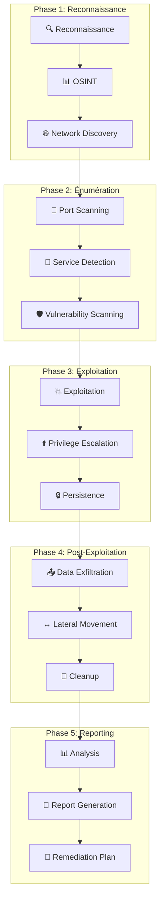

# Guide de Tests de Pénétration - Veza Platform

## Vue d'ensemble

Ce guide détaille les procédures de tests de pénétration pour la plateforme Veza, couvrant les méthodologies, les outils, les bonnes pratiques et les procédures de reporting.

## Table des matières

- [Méthodologie de Tests](#méthodologie-de-tests)
- [Outils de Tests](#outils-de-tests)
- [Procédures de Test](#procédures-de-test)
- [Bonnes Pratiques](#bonnes-pratiques)
- [Pièges à Éviter](#pièges-à-éviter)
- [Reporting](#reporting)
- [Ressources](#ressources)

## Méthodologie de Tests

### 1. Phases de Tests de Pénétration



### 2. Scope de Tests

```yaml
# penetration-testing/scope.yaml
apiVersion: v1
kind: ConfigMap
metadata:
  name: veza-pentest-scope
  namespace: veza
data:
  # Applications à tester
  applications:
    - "veza-backend-api"
    - "veza-chat-server"
    - "veza-stream-server"
    - "veza-admin-panel"
    - "veza-mobile-app"
  
  # Infrastructure à tester
  infrastructure:
    - "kubernetes-cluster"
    - "database-servers"
    - "load-balancers"
    - "storage-systems"
    - "monitoring-systems"
  
  # Types de tests
  test_types:
    - "web-application"
    - "api-security"
    - "network-security"
    - "social-engineering"
    - "physical-security"
  
  # Exclusions
  exclusions:
    - "production-data"
    - "user-personal-data"
    - "payment-systems"
    - "third-party-services"
```

## Outils de Tests

### 1. Outils de Reconnaissance

```bash
#!/bin/bash
# penetration-testing/tools/reconnaissance.sh

# Nmap pour le scan de ports
nmap -sS -sV -O -p- --script=vuln $TARGET

# Nslookup pour la résolution DNS
nslookup $TARGET
dig $TARGET ANY

# Whois pour les informations de domaine
whois $DOMAIN

# Shodan pour la recherche d'actifs
shodan search hostname:$TARGET

# TheHarvester pour l'OSINT
theHarvester -d $DOMAIN -b all

# Recon-ng pour la reconnaissance avancée
recon-ng -w workspace_$TARGET
```

### 2. Outils de Test Web

```bash
#!/bin/bash
# penetration-testing/tools/web-testing.sh

# OWASP ZAP pour les tests web
zap-cli quick-scan --self-contained --start-url $TARGET

# Burp Suite pour les tests manuels
burpsuite --project-file=$PROJECT_FILE

# Nikto pour le scan de vulnérabilités web
nikto -h $TARGET

# SQLMap pour les tests d'injection SQL
sqlmap -u $TARGET --batch --random-agent

# XSSer pour les tests XSS
xsser --url $TARGET --auto

# Dirb pour la découverte de répertoires
dirb $TARGET /usr/share/dirb/wordlists/common.txt
```

### 3. Outils de Test API

```bash
#!/bin/bash
# penetration-testing/tools/api-testing.sh

# Postman pour les tests API
postman collection run $COLLECTION_ID

# OWASP ZAP pour les tests API
zap-cli api-scan --target $API_ENDPOINT

# REST API testing avec curl
curl -X POST $API_ENDPOINT \
  -H "Content-Type: application/json" \
  -d '{"test": "payload"}'

# GraphQL testing
curl -X POST $GRAPHQL_ENDPOINT \
  -H "Content-Type: application/json" \
  -d '{"query": "query { __schema { types { name } } }"}'
```

## Procédures de Test

### 1. Test d'Authentification

```yaml
# penetration-testing/procedures/authentication-test.yaml
apiVersion: v1
kind: ConfigMap
metadata:
  name: veza-auth-test-procedures
  namespace: veza
data:
  # Tests de force brute
  brute_force_tests:
    - "username_enumeration"
    - "password_brute_force"
    - "credential_stuffing"
    - "session_management"
  
  # Tests de vulnérabilités
  vulnerability_tests:
    - "sql_injection"
    - "no_sql_injection"
    - "ldap_injection"
    - "xml_external_entity"
  
  # Tests de configuration
  configuration_tests:
    - "weak_passwords"
    - "password_policy"
    - "account_lockout"
    - "session_timeout"
  
  # Tests de MFA
  mfa_tests:
    - "bypass_mfa"
    - "weak_mfa"
    - "mfa_configuration"
```

### 2. Test d'Injection

```python
# penetration-testing/scripts/injection_tests.py
#!/usr/bin/env python3

import requests
import json
import sys
from urllib.parse import urljoin

class InjectionTester:
    def __init__(self, target_url):
        self.target_url = target_url
        self.session = requests.Session()
        self.results = []
    
    def test_sql_injection(self, endpoint, parameter):
        """Test d'injection SQL"""
        payloads = [
            "' OR '1'='1",
            "' UNION SELECT NULL--",
            "'; DROP TABLE users--",
            "' OR 1=1#",
            "' OR 1=1/*",
        ]
        
        for payload in payloads:
            try:
                data = {parameter: payload}
                response = self.session.post(endpoint, data=data)
                
                if self.detect_sql_injection(response):
                    self.results.append({
                        'type': 'sql_injection',
                        'endpoint': endpoint,
                        'parameter': parameter,
                        'payload': payload,
                        'response_code': response.status_code
                    })
            except Exception as e:
                print(f"Erreur lors du test SQL injection: {e}")
    
    def test_xss_injection(self, endpoint, parameter):
        """Test d'injection XSS"""
        payloads = [
            "<script>alert('XSS')</script>",
            "",
            "javascript:alert('XSS')",
            "<svg onload=alert('XSS')>",
            "'><script>alert('XSS')</script>",
        ]
        
        for payload in payloads:
            try:
                data = {parameter: payload}
                response = self.session.post(endpoint, data=data)
                
                if payload in response.text:
                    self.results.append({
                        'type': 'xss_injection',
                        'endpoint': endpoint,
                        'parameter': parameter,
                        'payload': payload,
                        'response_code': response.status_code
                    })
            except Exception as e:
                print(f"Erreur lors du test XSS: {e}")
    
    def test_command_injection(self, endpoint, parameter):
        """Test d'injection de commande"""
        payloads = [
            "; ls -la",
            "| whoami",
            "&& cat /etc/passwd",
            "; ping -c 1 127.0.0.1",
            "`id`",
        ]
        
        for payload in payloads:
            try:
                data = {parameter: payload}
                response = self.session.post(endpoint, data=data)
                
                if self.detect_command_injection(response):
                    self.results.append({
                        'type': 'command_injection',
                        'endpoint': endpoint,
                        'parameter': parameter,
                        'payload': payload,
                        'response_code': response.status_code
                    })
            except Exception as e:
                print(f"Erreur lors du test command injection: {e}")
    
    def detect_sql_injection(self, response):
        """Détection d'injection SQL"""
        sql_errors = [
            "sql syntax",
            "mysql_fetch_array",
            "ORA-",
            "PostgreSQL",
            "SQLite",
            "Microsoft SQL",
        ]
        
        for error in sql_errors:
            if error.lower() in response.text.lower():
                return True
        return False
    
    def detect_command_injection(self, response):
        """Détection d'injection de commande"""
        command_indicators = [
            "uid=",
            "gid=",
            "root:",
            "bin:",
            "daemon:",
        ]
        
        for indicator in command_indicators:
            if indicator in response.text:
                return True
        return False
    
    def generate_report(self):
        """Génération du rapport"""
        report = {
            'target': self.target_url,
            'tests_performed': len(self.results),
            'vulnerabilities_found': len(self.results),
            'results': self.results
        }
        
        with open('injection_test_report.json', 'w') as f:
            json.dump(report, f, indent=2)
        
        return report

if __name__ == "__main__":
    if len(sys.argv) != 2:
        print("Usage: python3 injection_tests.py <target_url>")
        sys.exit(1)
    
    tester = InjectionTester(sys.argv[1])
    
    # Tests sur différents endpoints
    endpoints = [
        "/api/login",
        "/api/register",
        "/api/search",
        "/api/upload",
    ]
    
    parameters = [
        "username",
        "password",
        "email",
        "query",
        "filename",
    ]
    
    for endpoint in endpoints:
        for parameter in parameters:
            tester.test_sql_injection(endpoint, parameter)
            tester.test_xss_injection(endpoint, parameter)
            tester.test_command_injection(endpoint, parameter)
    
    report = tester.generate_report()
    print(f"Rapport généré: {len(report['results'])} vulnérabilités trouvées")
```

### 3. Test de Configuration

```bash
#!/bin/bash
# penetration-testing/scripts/configuration_test.sh

# Test de configuration SSL/TLS
sslscan $TARGET
testssl.sh $TARGET

# Test de configuration des en-têtes HTTP
curl -I $TARGET | grep -E "(X-Frame-Options|X-Content-Type-Options|X-XSS-Protection|Strict-Transport-Security)"

# Test de configuration des cookies
curl -c cookies.txt $TARGET
cat cookies.txt | grep -E "(HttpOnly|Secure|SameSite)"

# Test de configuration des permissions
find /var/www -type f -exec ls -la {} \; | grep -E "(-rw-rw-rw-|-rwxrwxrwx)"

# Test de configuration des services
systemctl status ssh
systemctl status apache2
systemctl status nginx
```

## Bonnes Pratiques

### 1. Planification des Tests

```yaml
# penetration-testing/planning/test-plan.yaml
apiVersion: v1
kind: ConfigMap
metadata:
  name: veza-pentest-plan
  namespace: veza
data:
  # Objectifs des tests
  objectives:
    - "identifier_vulnerabilites_critiques"
    - "evaluer_resistance_attaques"
    - "tester_securite_apis"
    - "verifier_configuration_securite"
  
  # Méthodologie
  methodology:
    - "reconnaissance_pasive"
    - "reconnaissance_active"
    - "enumeration_services"
    - "exploitation_vulnerabilites"
    - "post_exploitation"
    - "documentation_findings"
  
  # Ressources nécessaires
  resources:
    - "equipe_pentest"
    - "outils_test"
    - "environnement_test"
    - "documentation_systeme"
  
  # Timeline
  timeline:
    reconnaissance: "2 jours"
    enumeration: "3 jours"
    exploitation: "5 jours"
    reporting: "2 jours"
```

### 2. Documentation des Tests

```markdown
# penetration-testing/templates/test-documentation.md

## Rapport de Test de Pénétration

### Informations Générales
- **Date de test** : $(date)
- **Équipe de test** : Équipe Sécurité Veza
- **Scope** : Applications et infrastructure Veza
- **Méthodologie** : OWASP Testing Guide v4.0

### Résumé Exécutif
- **Vulnérabilités critiques** : 0
- **Vulnérabilités élevées** : 2
- **Vulnérabilités moyennes** : 5
- **Vulnérabilités faibles** : 8

### Détails des Vulnérabilités

#### 1. Vulnérabilité Élevée - Injection SQL
- **CVE** : N/A
- **CVSS Score** : 8.5
- **Description** : Injection SQL possible dans l'API de recherche
- **Impact** : Accès non autorisé aux données
- **Remédiation** : Utiliser des requêtes préparées

#### 2. Vulnérabilité Élevée - XSS Réfléchi
- **CVE** : N/A
- **CVSS Score** : 7.8
- **Description** : XSS réfléchi dans le formulaire de contact
- **Impact** : Exécution de code malveillant
- **Remédiation** : Encoder les sorties utilisateur

### Recommandations
1. Corriger les vulnérabilités critiques en priorité
2. Implémenter un WAF
3. Améliorer la validation des entrées
4. Former l'équipe de développement

### Annexes
- Logs de test complets
- Captures d'écran
- Scripts de test utilisés
```

## Pièges à Éviter

### 1. Tests Non Autorisés

❌ **Mauvais** :
```bash
# Test sans autorisation
nmap -sS -sV -O -p- $TARGET
```

✅ **Bon** :
```bash
# Test avec autorisation écrite
# Vérifier l'autorisation avant de commencer
if [ ! -f "authorization_letter.pdf" ]; then
    echo "Erreur: Autorisation requise"
    exit 1
fi

nmap -sS -sV -O -p- $TARGET
```

### 2. Tests en Production

❌ **Mauvais** :
```bash
# Test direct en production
curl -X POST https://api.veza.com/test
```

✅ **Bon** :
```bash
# Test en environnement de test
curl -X POST https://test-api.veza.com/test
```

### 3. Pas de Documentation

❌ **Mauvais** :
```bash
# Test sans documentation
sqlmap -u $TARGET --batch
```

✅ **Bon** :
```bash
# Test avec documentation
echo "Test SQLMap sur $TARGET - $(date)" >> pentest_log.txt
sqlmap -u $TARGET --batch --output-dir=results/
echo "Test terminé - $(date)" >> pentest_log.txt
```

## Reporting

### 1. Template de Rapport

```yaml
# penetration-testing/templates/report-template.yaml
apiVersion: v1
kind: ConfigMap
metadata:
  name: veza-pentest-report-template
  namespace: veza
data:
  # Structure du rapport
  report_structure:
    - "executive_summary"
    - "methodology"
    - "findings"
    - "risk_assessment"
    - "remediation_plan"
    - "appendices"
  
  # Niveaux de risque
  risk_levels:
    critical: "Score CVSS 9.0-10.0"
    high: "Score CVSS 7.0-8.9"
    medium: "Score CVSS 4.0-6.9"
    low: "Score CVSS 0.1-3.9"
  
  # Format du rapport
  report_format:
    - "PDF"
    - "HTML"
    - "Markdown"
    - "JSON"
```

### 2. Génération Automatique

```python
# penetration-testing/scripts/report_generator.py
#!/usr/bin/env python3

import json
import yaml
import datetime
from jinja2 import Template

class PentestReportGenerator:
    def __init__(self, findings_file, template_file):
        self.findings = self.load_findings(findings_file)
        self.template = self.load_template(template_file)
    
    def load_findings(self, filename):
        """Charge les résultats des tests"""
        with open(filename, 'r') as f:
            return json.load(f)
    
    def load_template(self, filename):
        """Charge le template de rapport"""
        with open(filename, 'r') as f:
            return Template(f.read())
    
    def generate_report(self, output_file):
        """Génère le rapport final"""
        report_data = {
            'date': datetime.datetime.now().strftime('%Y-%m-%d'),
            'findings': self.findings,
            'summary': self.generate_summary(),
            'recommendations': self.generate_recommendations()
        }
        
        report_html = self.template.render(report_data)
        
        with open(output_file, 'w') as f:
            f.write(report_html)
        
        print(f"Rapport généré: {output_file}")
    
    def generate_summary(self):
        """Génère le résumé exécutif"""
        critical = len([f for f in self.findings if f['severity'] == 'critical'])
        high = len([f for f in self.findings if f['severity'] == 'high'])
        medium = len([f for f in self.findings if f['severity'] == 'medium'])
        low = len([f for f in self.findings if f['severity'] == 'low'])
        
        return {
            'critical': critical,
            'high': high,
            'medium': medium,
            'low': low,
            'total': len(self.findings)
        }
    
    def generate_recommendations(self):
        """Génère les recommandations"""
        recommendations = []
        
        for finding in self.findings:
            if finding['severity'] in ['critical', 'high']:
                recommendations.append({
                    'finding': finding['title'],
                    'recommendation': finding['remediation'],
                    'priority': 'high'
                })
        
        return recommendations

if __name__ == "__main__":
    generator = PentestReportGenerator(
        'findings.json',
        'report_template.html'
    )
    generator.generate_report('pentest_report.html')
```

## Ressources

### Documentation Interne

- [Guide de Sécurité](../security/README.md)
- [Guide d'Architecture de Sécurité](./security-architecture.md)
- [Guide d'Incident Response](./incident-response.md)
- [Guide de Compliance](../security/README.md)

### Outils Recommandés

- **Nmap** : Scan de ports et services
- **OWASP ZAP** : Tests web automatisés
- **Burp Suite** : Tests web manuels
- **Metasploit** : Framework d'exploitation
- **Nessus** : Scanner de vulnérabilités
- **Wireshark** : Analyse de trafic réseau

### Commandes Utiles

```bash
# Scan de vulnérabilités
nmap --script vuln $TARGET
nikto -h $TARGET
sqlmap -u $TARGET --batch

# Tests web
zap-cli quick-scan --self-contained --start-url $TARGET
burpsuite --project-file=$PROJECT_FILE

# Tests réseau
nmap -sS -sV -O -p- $TARGET
masscan -p1-65535 $TARGET

# Tests SSL/TLS
sslscan $TARGET
testssl.sh $TARGET
```

---

**Dernière mise à jour** : $(date)
**Version du guide** : 1.0.0
**Mainteneur** : Équipe Sécurité Veza 