# Guide d'Architecture de Sécurité - Veza Platform

## Vue d'ensemble

Ce guide détaille l'architecture de sécurité de la plateforme Veza, couvrant les principes de sécurité, les composants, les bonnes pratiques et les stratégies de protection contre les menaces.

## Table des matières

- [Principes de Sécurité](#principes-de-sécurité)
- [Architecture de Sécurité Globale](#architecture-de-sécurité-globale)
- [Composants de Sécurité](#composants-de-sécurité)
- [Stratégies de Protection](#stratégies-de-protection)
- [Bonnes Pratiques](#bonnes-pratiques)
- [Pièges à Éviter](#pièges-à-éviter)
- [Monitoring de Sécurité](#monitoring-de-sécurité)
- [Ressources](#ressources)

## Principes de Sécurité

### 1. Zero Trust Architecture

```mermaid
graph TB
    subgraph "External Network"
        Internet[🌐 Internet]
        VPN[🔒 VPN Gateway]
    end
    
    subgraph "DMZ"
        WAF[🛡️ Web Application Firewall]
        LoadBalancer[⚖️ Load Balancer]
        IDS[🔍 Intrusion Detection System]
    end
    
    subgraph "Application Layer"
        Auth[🔐 Authentication Service]
        AuthZ[⚖️ Authorization Service]
        API[🔌 API Gateway]
        App[📱 Application]
    end
    
    subgraph "Data Layer"
        DB[🗄️ Database]
        Cache[⚡ Cache]
        Storage[☁️ Storage]
    end
    
    subgraph "Security Controls"
        IAM[👤 Identity Management]
        Encryption[🔒 Encryption Service]
        Audit[📝 Audit Logging]
        Monitoring[📊 Security Monitoring]
    end
    
    Internet --> VPN
    VPN --> WAF
    WAF --> LoadBalancer
    LoadBalancer --> IDS
    IDS --> Auth
    Auth --> AuthZ
    AuthZ --> API
    API --> App
    App --> DB
    App --> Cache
    App --> Storage
    
    IAM --> Auth
    IAM --> AuthZ
    Encryption --> DB
    Encryption --> Storage
    Audit --> Monitoring
```



### 2. Defense in Depth

```mermaid
graph LR
    subgraph "Layer 1: Network Security"
        Firewall[🔥 Firewall]
        VPN[🔒 VPN]
        DDoS[🛡️ DDoS Protection]
    end
    
    subgraph "Layer 2: Application Security"
        WAF[🛡️ WAF]
        Auth[🔐 Authentication]
        AuthZ[⚖️ Authorization]
    end
    
    subgraph "Layer 3: Data Security"
        Encryption[🔒 Encryption]
        Backup[💾 Backup]
        Audit[📝 Audit]
    end
    
    subgraph "Layer 4: Monitoring"
        SIEM[📊 SIEM]
        IDS[🔍 IDS/IPS]
        Logs[📝 Logs]
    end
    
    Firewall --> WAF
    WAF --> Auth
    Auth --> AuthZ
    AuthZ --> Encryption
    Encryption --> SIEM
    SIEM --> IDS
    IDS --> Logs
```



## Architecture de Sécurité Globale

### 1. Infrastructure de Sécurité

```yaml
# security/infrastructure.yaml
apiVersion: v1
kind: ConfigMap
metadata:
  name: veza-security-config
  namespace: veza
data:
  # Network Security
  network_security:
    vpc_enabled: "true"
    private_subnets: "true"
    nat_gateway: "true"
    vpc_peering: "true"
  
  # Application Security
  application_security:
    waf_enabled: "true"
    rate_limiting: "true"
    input_validation: "true"
    output_encoding: "true"
  
  # Data Security
  data_security:
    encryption_at_rest: "true"
    encryption_in_transit: "true"
    backup_encryption: "true"
    key_rotation: "true"
  
  # Access Control
  access_control:
    mfa_required: "true"
    least_privilege: "true"
    role_based_access: "true"
    session_timeout: "3600"
  
  # Monitoring
  security_monitoring:
    siem_enabled: "true"
    ids_enabled: "true"
    audit_logging: "true"
    alerting: "true"
```

### 2. Flux de Sécurité


## Composants de Sécurité

### 1. Authentication Service

```go
// internal/security/auth_service.go
package security

import (
    "context"
    "crypto/rand"
    "encoding/base64"
    "time"
    
    "github.com/golang-jwt/jwt/v5"
    "golang.org/x/crypto/bcrypt"
)

// AuthService gère l'authentification et l'autorisation
type AuthService struct {
    jwtSecret     []byte
    refreshSecret []byte
    userRepo      UserRepository
    auditLogger   AuditLogger
}

// LoginRequest représente une demande de connexion
type LoginRequest struct {
    Username string `json:"username" validate:"required"`
    Password string `json:"password" validate:"required"`
    MFA      string `json:"mfa,omitempty"`
}

// LoginResponse représente la réponse de connexion
type LoginResponse struct {
    AccessToken  string    `json:"access_token"`
    RefreshToken string    `json:"refresh_token"`
    ExpiresAt    time.Time `json:"expires_at"`
    User         User      `json:"user"`
}

// Login authentifie un utilisateur
func (s *AuthService) Login(ctx context.Context, req LoginRequest) (*LoginResponse, error) {
    // Validation des entrées
    if err := validateLoginRequest(req); err != nil {
        s.auditLogger.LogFailedLogin(ctx, req.Username, "validation_error")
        return nil, err
    }
    
    // Récupération de l'utilisateur
    user, err := s.userRepo.GetByUsername(ctx, req.Username)
    if err != nil {
        s.auditLogger.LogFailedLogin(ctx, req.Username, "user_not_found")
        return nil, ErrInvalidCredentials
    }
    
    // Vérification du mot de passe
    if err := bcrypt.CompareHashAndPassword([]byte(user.PasswordHash), []byte(req.Password)); err != nil {
        s.auditLogger.LogFailedLogin(ctx, req.Username, "invalid_password")
        return nil, ErrInvalidCredentials
    }
    
    // Vérification MFA si activé
    if user.MFAEnabled {
        if err := s.verifyMFA(ctx, user.ID, req.MFA); err != nil {
            s.auditLogger.LogFailedLogin(ctx, req.Username, "invalid_mfa")
            return nil, ErrInvalidMFA
        }
    }
    
    // Génération des tokens
    accessToken, err := s.generateAccessToken(user)
    if err != nil {
        return nil, err
    }
    
    refreshToken, err := s.generateRefreshToken(user.ID)
    if err != nil {
        return nil, err
    }
    
    // Audit de connexion réussie
    s.auditLogger.LogSuccessfulLogin(ctx, user.ID, user.Username)
    
    return &LoginResponse{
        AccessToken:  accessToken,
        RefreshToken: refreshToken,
        ExpiresAt:    time.Now().Add(15 * time.Minute),
        User:         user,
    }, nil
}

// generateAccessToken génère un token JWT d'accès
func (s *AuthService) generateAccessToken(user User) (string, error) {
    claims := jwt.MapClaims{
        "sub": user.ID,
        "username": user.Username,
        "roles": user.Roles,
        "iat": time.Now().Unix(),
        "exp": time.Now().Add(15 * time.Minute).Unix(),
        "jti": generateTokenID(),
    }
    
    token := jwt.NewWithClaims(jwt.SigningMethodHS256, claims)
    return token.SignedString(s.jwtSecret)
}

// generateRefreshToken génère un token de rafraîchissement
func (s *AuthService) generateRefreshToken(userID string) (string, error) {
    tokenBytes := make([]byte, 32)
    if _, err := rand.Read(tokenBytes); err != nil {
        return "", err
    }
    
    token := base64.URLEncoding.EncodeToString(tokenBytes)
    
    // Stockage du token de rafraîchissement
    if err := s.userRepo.StoreRefreshToken(userID, token); err != nil {
        return "", err
    }
    
    return token, nil
}

// generateTokenID génère un ID unique pour le token
func generateTokenID() string {
    bytes := make([]byte, 16)
    rand.Read(bytes)
    return base64.URLEncoding.EncodeToString(bytes)
}
```

### 2. Authorization Service

```go
// internal/security/authorization_service.go
package security

import (
    "context"
    "fmt"
    "strings"
)

// AuthorizationService gère les autorisations
type AuthorizationService struct {
    roleRepo    RoleRepository
    policyRepo  PolicyRepository
    auditLogger AuditLogger
}

// Permission représente une permission
type Permission struct {
    Resource string `json:"resource"`
    Action   string `json:"action"`
    Effect   string `json:"effect"` // allow, deny
}

// Role représente un rôle
type Role struct {
    ID          string       `json:"id"`
    Name        string       `json:"name"`
    Permissions []Permission `json:"permissions"`
    Inherits    []string     `json:"inherits"`
}

// CheckPermission vérifie si un utilisateur a une permission
func (s *AuthorizationService) CheckPermission(ctx context.Context, userID, resource, action string) (bool, error) {
    // Récupération des rôles de l'utilisateur
    userRoles, err := s.getUserRoles(ctx, userID)
    if err != nil {
        return false, err
    }
    
    // Vérification des permissions pour chaque rôle
    for _, role := range userRoles {
        if s.hasPermission(role, resource, action) {
            s.auditLogger.LogPermissionGranted(ctx, userID, resource, action, role.Name)
            return true, nil
        }
    }
    
    s.auditLogger.LogPermissionDenied(ctx, userID, resource, action)
    return false, nil
}

// hasPermission vérifie si un rôle a une permission spécifique
func (s *AuthorizationService) hasPermission(role Role, resource, action string) bool {
    for _, permission := range role.Permissions {
        if s.matchesPermission(permission, resource, action) {
            return permission.Effect == "allow"
        }
    }
    
    // Vérification des rôles hérités
    for _, inheritedRoleName := range role.Inherits {
        if inheritedRole, err := s.roleRepo.GetByName(inheritedRoleName); err == nil {
            if s.hasPermission(*inheritedRole, resource, action) {
                return true
            }
        }
    }
    
    return false
}

// matchesPermission vérifie si une permission correspond
func (s *AuthorizationService) matchesPermission(permission Permission, resource, action string) bool {
    return s.matchesResource(permission.Resource, resource) && 
           s.matchesAction(permission.Action, action)
}

// matchesResource vérifie si une ressource correspond
func (s *AuthorizationService) matchesResource(pattern, resource string) bool {
    // Support des wildcards
    if pattern == "*" {
        return true
    }
    
    // Support des patterns avec wildcards
    if strings.Contains(pattern, "*") {
        return s.matchesWildcard(pattern, resource)
    }
    
    return pattern == resource
}

// matchesAction vérifie si une action correspond
func (s *AuthorizationService) matchesAction(pattern, action string) bool {
    if pattern == "*" {
        return true
    }
    
    return pattern == action
}

// matchesWildcard vérifie si un pattern avec wildcard correspond
func (s *AuthorizationService) matchesWildcard(pattern, resource string) bool {
    // Implémentation simple de wildcard matching
    // Peut être améliorée avec des expressions régulières
    return strings.HasPrefix(resource, strings.Replace(pattern, "*", "", -1))
}
```

### 3. Encryption Service

```go
// internal/security/encryption_service.go
package security

import (
    "crypto/aes"
    "crypto/cipher"
    "crypto/rand"
    "encoding/base64"
    "fmt"
    "io"
)

// EncryptionService gère le chiffrement et déchiffrement
type EncryptionService struct {
    key []byte
}

// NewEncryptionService crée un nouveau service de chiffrement
func NewEncryptionService(key []byte) (*EncryptionService, error) {
    if len(key) != 32 {
        return nil, fmt.Errorf("key must be 32 bytes")
    }
    
    return &EncryptionService{key: key}, nil
}

// Encrypt chiffre des données
func (s *EncryptionService) Encrypt(plaintext []byte) (string, error) {
    block, err := aes.NewCipher(s.key)
    if err != nil {
        return "", err
    }
    
    ciphertext := make([]byte, aes.BlockSize+len(plaintext))
    iv := ciphertext[:aes.BlockSize]
    if _, err := io.ReadFull(rand.Reader, iv); err != nil {
        return "", err
    }
    
    stream := cipher.NewCFBEncrypter(block, iv)
    stream.XORKeyStream(ciphertext[aes.BlockSize:], plaintext)
    
    return base64.URLEncoding.EncodeToString(ciphertext), nil
}

// Decrypt déchiffre des données
func (s *EncryptionService) Decrypt(encryptedData string) ([]byte, error) {
    ciphertext, err := base64.URLEncoding.DecodeString(encryptedData)
    if err != nil {
        return nil, err
    }
    
    block, err := aes.NewCipher(s.key)
    if err != nil {
        return nil, err
    }
    
    if len(ciphertext) < aes.BlockSize {
        return nil, fmt.Errorf("ciphertext too short")
    }
    
    iv := ciphertext[:aes.BlockSize]
    ciphertext = ciphertext[aes.BlockSize:]
    
    stream := cipher.NewCFBDecrypter(block, iv)
    stream.XORKeyStream(ciphertext, ciphertext)
    
    return ciphertext, nil
}
```

## Stratégies de Protection

### 1. Protection contre les Attaques Web

```yaml
# security/waf-rules.yaml
apiVersion: v1
kind: ConfigMap
metadata:
  name: veza-waf-rules
  namespace: veza
data:
  # Protection XSS
  xss_protection: |
    SecRule ARGS "@detectXSS" \
      "id:1001,\
       phase:2,\
       block,\
       msg:'XSS Attack Detected',\
       logdata:'Matched Data: %{MATCHED_VAR} found within %{MATCHED_VAR_NAME}'"
  
  # Protection SQL Injection
  sql_injection_protection: |
    SecRule ARGS "@detectSQLi" \
      "id:1002,\
       phase:2,\
       block,\
       msg:'SQL Injection Attack Detected',\
       logdata:'Matched Data: %{MATCHED_VAR} found within %{MATCHED_VAR_NAME}'"
  
  # Protection CSRF
  csrf_protection: |
    SecRule &ARGS:csrf_token "@eq 0" \
      "id:1003,\
       phase:2,\
       block,\
       msg:'CSRF Token Missing',\
       logdata:'Request without CSRF token'"
  
  # Rate Limiting
  rate_limiting: |
    SecRule &ARGS "@gt 100" \
      "id:1004,\
       phase:1,\
       block,\
       msg:'Rate Limit Exceeded',\
       logdata:'Too many requests from %{REMOTE_ADDR}'"
```

### 2. Protection des Données

```yaml
# security/data-protection.yaml
apiVersion: v1
kind: ConfigMap
metadata:
  name: veza-data-protection
  namespace: veza
data:
  # Chiffrement des données sensibles
  sensitive_fields: |
    - "password"
    - "credit_card"
    - "ssn"
    - "email"
    - "phone"
  
  # Masquage des données
  data_masking: |
    email: "***@***.***"
    phone: "***-***-****"
    ssn: "***-**-****"
  
  # Rétention des données
  data_retention: |
    logs: "90 days"
    audit_logs: "7 years"
    user_data: "until deletion"
    backup_data: "30 days"
```

## Bonnes Pratiques

### 1. Gestion des Secrets

```yaml
# k8s/security/secrets.yaml
apiVersion: v1
kind: Secret
metadata:
  name: veza-secrets
  namespace: veza
type: Opaque
data:
  # Base64 encoded secrets
  db_password: <base64-encoded-password>
  jwt_secret: <base64-encoded-jwt-secret>
  encryption_key: <base64-encoded-encryption-key>
  api_key: <base64-encoded-api-key>
---
# k8s/security/secret-management.yaml
apiVersion: v1
kind: ConfigMap
metadata:
  name: veza-secret-management
  namespace: veza
data:
  # Rotation automatique des secrets
  secret_rotation:
    enabled: "true"
    interval: "30 days"
    grace_period: "7 days"
  
  # Chiffrement des secrets
  secret_encryption:
    enabled: "true"
    algorithm: "AES-256"
    key_rotation: "true"
```

### 2. Audit et Logging

```go
// internal/security/audit_logger.go
package security

import (
    "context"
    "encoding/json"
    "time"
)

// AuditEvent représente un événement d'audit
type AuditEvent struct {
    ID          string                 `json:"id"`
    Timestamp   time.Time              `json:"timestamp"`
    UserID      string                 `json:"user_id"`
    Username    string                 `json:"username"`
    Action      string                 `json:"action"`
    Resource    string                 `json:"resource"`
    Details     map[string]interface{} `json:"details"`
    IPAddress   string                 `json:"ip_address"`
    UserAgent   string                 `json:"user_agent"`
    SessionID   string                 `json:"session_id"`
    Success     bool                   `json:"success"`
    Error       string                 `json:"error,omitempty"`
}

// AuditLogger gère les logs d'audit
type AuditLogger struct {
    storage AuditStorage
    queue   AuditQueue
}

// LogSecurityEvent enregistre un événement de sécurité
func (l *AuditLogger) LogSecurityEvent(ctx context.Context, event AuditEvent) error {
    // Validation de l'événement
    if err := l.validateEvent(event); err != nil {
        return err
    }
    
    // Enrichissement avec le contexte
    event.Timestamp = time.Now()
    event.ID = l.generateEventID()
    
    // Stockage de l'événement
    if err := l.storage.Store(ctx, event); err != nil {
        return err
    }
    
    // Envoi vers la queue pour traitement asynchrone
    if err := l.queue.Publish(ctx, event); err != nil {
        return err
    }
    
    return nil
}

// LogFailedLogin enregistre une tentative de connexion échouée
func (l *AuditLogger) LogFailedLogin(ctx context.Context, username, reason string) error {
    event := AuditEvent{
        Action:    "login_failed",
        Username:  username,
        Success:   false,
        Details: map[string]interface{}{
            "reason": reason,
        },
    }
    
    return l.LogSecurityEvent(ctx, event)
}

// LogSuccessfulLogin enregistre une connexion réussie
func (l *AuditLogger) LogSuccessfulLogin(ctx context.Context, userID, username string) error {
    event := AuditEvent{
        UserID:   userID,
        Username: username,
        Action:   "login_successful",
        Success:  true,
    }
    
    return l.LogSecurityEvent(ctx, event)
}

// LogPermissionDenied enregistre un accès refusé
func (l *AuditLogger) LogPermissionDenied(ctx context.Context, userID, resource, action string) error {
    event := AuditEvent{
        UserID:   userID,
        Action:   "permission_denied",
        Resource: resource,
        Success:  false,
        Details: map[string]interface{}{
            "action": action,
        },
    }
    
    return l.LogSecurityEvent(ctx, event)
}
```

## Pièges à Éviter

### 1. Stockage de Secrets en Clair

❌ **Mauvais** :
```yaml
# Configuration avec secrets en clair
database:
  password: "mysecretpassword"
  api_key: "sk-1234567890abcdef"
```

✅ **Bon** :
```yaml
# Configuration avec secrets chiffrés
database:
  password: "${DB_PASSWORD}"
  api_key: "${API_KEY}"
```

### 2. Pas de Validation des Entrées

❌ **Mauvais** :
```go
// Pas de validation
func CreateUser(username, email string) error {
    query := fmt.Sprintf("INSERT INTO users VALUES ('%s', '%s')", username, email)
    return db.Exec(query)
}
```

✅ **Bon** :
```go
// Validation complète
func CreateUser(username, email string) error {
    // Validation des entrées
    if err := validateUsername(username); err != nil {
        return err
    }
    if err := validateEmail(email); err != nil {
        return err
    }
    
    // Requête préparée
    query := "INSERT INTO users (username, email) VALUES (?, ?)"
    return db.Exec(query, username, email)
}
```

### 3. Pas de Chiffrement des Données

❌ **Mauvais** :
```go
// Données en clair
type User struct {
    ID       string `json:"id"`
    Password string `json:"password"` // En clair !
    Email    string `json:"email"`
}
```

✅ **Bon** :
```go
// Données chiffrées
type User struct {
    ID       string `json:"id"`
    Password string `json:"-"` // Jamais exposé
    Email    string `json:"email"`
}

func (u *User) SetPassword(password string) error {
    hash, err := bcrypt.GenerateFromPassword([]byte(password), bcrypt.DefaultCost)
    if err != nil {
        return err
    }
    u.Password = string(hash)
    return nil
}
```

## Monitoring de Sécurité

### 1. SIEM Configuration

```yaml
# security/siem-config.yaml
apiVersion: v1
kind: ConfigMap
metadata:
  name: veza-siem-config
  namespace: veza
data:
  # Sources de logs
  log_sources:
    - "application_logs"
    - "audit_logs"
    - "system_logs"
    - "network_logs"
    - "database_logs"
  
  # Règles d'alerte
  alert_rules:
    failed_login_threshold: "5"
    suspicious_activity_threshold: "10"
    data_access_threshold: "100"
  
  # Corrélation d'événements
  event_correlation:
    enabled: "true"
    time_window: "5 minutes"
    threshold: "3 events"
```

### 2. IDS/IPS Configuration

```yaml
# security/ids-config.yaml
apiVersion: v1
kind: ConfigMap
metadata:
  name: veza-ids-config
  namespace: veza
data:
  # Règles de détection
  detection_rules:
    - "sql_injection"
    - "xss_attack"
    - "path_traversal"
    - "command_injection"
    - "file_upload_attack"
  
  # Actions de réponse
  response_actions:
    - "block_ip"
    - "rate_limit"
    - "alert_admin"
    - "log_event"
  
  # Whitelist
  whitelist:
    - "trusted_ips"
    - "admin_users"
    - "monitoring_services"
```

## Ressources

### Documentation Interne

- [Guide d'Authentification](../security/authentication/README.md)
- [Guide d'Autorisation](../security/authorization/README.md)
- [Guide d'Audit](../security/audit/README.md)
- [Guide de Compliance](../security/README.md)

### Outils Recommandés

- **WAF** : ModSecurity, AWS WAF
- **IDS/IPS** : Snort, Suricata
- **SIEM** : ELK Stack, Splunk
- **Vault** : Gestion des secrets
- **OpenVPN** : VPN sécurisé
- **Fail2ban** : Protection contre les attaques

### Commandes Utiles

```bash
# Audit des permissions
kubectl auth can-i --list --namespace=veza
kubectl get roles --all-namespaces
kubectl get rolebindings --all-namespaces

# Vérification des secrets
kubectl get secrets --all-namespaces
kubectl describe secret veza-secrets -n veza

# Logs de sécurité
kubectl logs -f deployment/veza-audit-logger
kubectl logs -f deployment/veza-waf

# Monitoring de sécurité
kubectl top pods --all-namespaces
kubectl get events --sort-by='.lastTimestamp'
```

---

**Dernière mise à jour** : $(date)
**Version du guide** : 1.0.0
**Mainteneur** : Équipe Sécurité Veza 