# Guide d'Onboarding d'Équipe - Veza Platform

## Vue d'ensemble

Ce guide détaille le processus d'onboarding pour les nouveaux membres de l'équipe Veza, couvrant l'intégration technique, culturelle et organisationnelle.

## Table des matières

- [Processus d'Onboarding](#processus-donboarding)
- [Ressources d'Intégration](#ressources-dintégration)
- [Formation Technique](#formation-technique)
- [Bonnes Pratiques](#bonnes-pratiques)
- [Pièges à Éviter](#pièges-à-éviter)
- [Suivi et Évaluation](#suivi-et-évaluation)
- [Ressources](#ressources)

## Processus d'Onboarding

### 1. Workflow d'Onboarding

```mermaid
graph TB
    subgraph "Phase 1: Pré-Arrivée"
        Offer[📋 Offre Acceptée]
        Welcome_Kit[📦 Kit de Bienvenue]
        Setup_Accounts[🔐 Configuration Comptes]
        Pre_Reading[📚 Lecture Préparatoire]
    end
    
    subgraph "Phase 2: Premier Jour"
        Welcome_Meeting[👋 Réunion de Bienvenue]
        Office_Tour[🏢 Visite des Locaux]
        Team_Introduction[👥 Introduction Équipe]
        Equipment_Setup[💻 Configuration Équipement]
    end
    
    subgraph "Phase 3: Première Semaine"
        Technical_Setup[🔧 Setup Technique]
        Process_Overview[📋 Vue d'Ensemble Processus]
        Culture_Immersion[🎭 Immersion Culturelle]
        Mentor_Assignment[🎓 Attribution Mentor]
    end
    
    subgraph "Phase 4: Premier Mois"
        Project_Assignment[📁 Attribution Projet]
        Skill_Assessment[📊 Évaluation Compétences]
        Training_Plan[📚 Plan de Formation]
        Feedback_Sessions[💬 Sessions Feedback]
    end
    
    subgraph "Phase 5: Intégration Complète"
        Performance_Review[📈 Revue Performance]
        Career_Planning[🎯 Planification Carrière]
        Team_Integration[🤝 Intégration Équipe]
        Continuous_Learning[📖 Apprentissage Continu]
    end
    
    Offer --> Welcome_Kit
    Welcome_Kit --> Setup_Accounts
    Setup_Accounts --> Pre_Reading
    Pre_Reading --> Welcome_Meeting
    Welcome_Meeting --> Office_Tour
    Office_Tour --> Team_Introduction
    Team_Introduction --> Equipment_Setup
    Equipment_Setup --> Technical_Setup
    Technical_Setup --> Process_Overview
    Process_Overview --> Culture_Immersion
    Culture_Immersion --> Mentor_Assignment
    Mentor_Assignment --> Project_Assignment
    Project_Assignment --> Skill_Assessment
    Skill_Assessment --> Training_Plan
    Training_Plan --> Feedback_Sessions
    Feedback_Sessions --> Performance_Review
    Performance_Review --> Career_Planning
    Career_Planning --> Team_Integration
    Team_Integration --> Continuous_Learning
```



### 2. Checklist d'Onboarding

```yaml
# team-onboarding/checklist/onboarding-checklist.yaml
apiVersion: v1
kind: ConfigMap
metadata:
  name: veza-onboarding-checklist
  namespace: veza
data:
  # Checklist pré-arrivée
  pre_arrival_checklist:
    hr_tasks:
      - "Envoi du contrat"
      - "Configuration des avantages"
      - "Préparation du kit de bienvenue"
      - "Planification de la première semaine"
    
    it_tasks:
      - "Création des comptes utilisateur"
      - "Configuration de l'équipement"
      - "Préparation des accès"
      - "Installation des logiciels"
    
    team_tasks:
      - "Préparation de l'espace de travail"
      - "Planification des présentations"
      - "Attribution du mentor"
      - "Préparation du projet d'intégration"
  
  # Checklist premier jour
  first_day_checklist:
    welcome:
      - "Réunion de bienvenue avec le manager"
      - "Présentation de l'équipe"
      - "Tour des locaux"
      - "Explication des règles de base"
    
    setup:
      - "Configuration de l'équipement"
      - "Test des accès"
      - "Installation des outils"
      - "Configuration de l'environnement de développement"
    
    introduction:
      - "Présentation de la culture d'entreprise"
      - "Explication des valeurs"
      - "Présentation de la mission"
      - "Introduction aux processus"
  
  # Checklist première semaine
  first_week_checklist:
    technical:
      - "Setup complet de l'environnement"
      - "Formation sur les outils"
      - "Premier commit"
      - "Première revue de code"
    
    process:
      - "Formation sur les processus"
      - "Explication des workflows"
      - "Présentation des méthodologies"
      - "Introduction aux outils de collaboration"
    
    culture:
      - "Participation aux réunions d'équipe"
      - "Introduction aux rituels"
      - "Présentation des événements"
      - "Explication des traditions"
  
  # Checklist premier mois
  first_month_checklist:
    project:
      - "Attribution d'un premier projet"
      - "Participation active au développement"
      - "Contribution aux revues de code"
      - "Présentation d'un travail"
    
    learning:
      - "Formation technique"
      - "Formation sur les processus"
      - "Formation sur la sécurité"
      - "Formation sur les outils"
    
    integration:
      - "Participation aux événements d'équipe"
      - "Contribution aux discussions"
      - "Présentation de soi"
      - "Création de liens"
```

## Ressources d'Intégration

### 1. Kit de Bienvenue

```yaml
# team-onboarding/resources/welcome-kit.yaml
apiVersion: v1
kind: ConfigMap
metadata:
  name: veza-welcome-kit
  namespace: veza
data:
  # Contenu du kit de bienvenue
  welcome_kit_contents:
    physical_items:
      - "Ordinateur portable"
      - "Écran secondaire"
      - "Clavier et souris"
      - "Badge d'accès"
      - "Carte de visite"
      - "Stylo et bloc-notes"
      - "Mug Veza"
      - "T-shirt Veza"
    
    digital_resources:
      - "Guide d'onboarding"
      - "Documentation technique"
      - "Accès aux outils"
      - "Calendrier d'événements"
      - "Annuaire de l'équipe"
      - "Règles et procédures"
    
    accounts:
      - "Email professionnel"
      - "Compte GitHub"
      - "Compte Slack"
      - "Compte Jira"
      - "Compte Confluence"
      - "Compte AWS"
      - "Compte VPN"
      - "Compte monitoring"
  
  # Message de bienvenue
  welcome_message: |
    Bienvenue dans l'équipe Veza !
    
    Nous sommes ravis de vous accueillir et nous espérons que vous vous sentirez rapidement à l'aise dans notre équipe.
    
    Ce kit contient tout ce dont vous avez besoin pour commencer votre aventure avec nous.
    
    N'hésitez pas à poser des questions et à demander de l'aide - nous sommes là pour vous soutenir !
    
    Bonne intégration !
    L'équipe Veza
```

### 2. Plan de Formation

```python
# team-onboarding/scripts/training_plan_generator.py
#!/usr/bin/env python3

import json
import logging
from datetime import datetime, timedelta
from typing import Dict, List, Optional

class TrainingPlanGenerator:
    def __init__(self):
        self.logger = self.setup_logger()
    
    def setup_logger(self) -> logging.Logger:
        """Configure le logger"""
        logging.basicConfig(
            level=logging.INFO,
            format='%(asctime)s - %(levelname)s - %(message)s',
            handlers=[
                logging.FileHandler('training_plan_generator.log'),
                logging.StreamHandler()
            ]
        )
        return logging.getLogger(__name__)
    
    def create_training_plan(self, employee_data: Dict) -> Dict:
        """Crée un plan de formation personnalisé"""
        plan = {
            'employee_id': employee_data['employee_id'],
            'role': employee_data['role'],
            'experience_level': employee_data.get('experience_level', 'mid'),
            'start_date': employee_data['start_date'],
            'training_modules': self.generate_training_modules(employee_data),
            'timeline': self.create_training_timeline(),
            'assessments': self.create_assessments(),
            'resources': self.get_training_resources(employee_data)
        }
        
        return plan
    
    def generate_training_modules(self, employee_data: Dict) -> List[Dict]:
        """Génère les modules de formation"""
        modules = []
        
        # Modules techniques
        technical_modules = [
            {
                'category': 'technical',
                'title': 'Architecture Veza',
                'description': 'Comprendre l\'architecture de la plateforme Veza',
                'duration': '2 days',
                'format': 'workshop',
                'instructor': 'Senior Architect',
                'resources': [
                    'Architecture documentation',
                    'System diagrams',
                    'Code walkthrough'
                ]
            },
            {
                'category': 'technical',
                'title': 'Outils de Développement',
                'description': 'Maîtriser les outils de développement utilisés',
                'duration': '1 day',
                'format': 'hands-on',
                'instructor': 'Tech Lead',
                'resources': [
                    'Git workflow',
                    'Docker setup',
                    'CI/CD pipeline'
                ]
            },
            {
                'category': 'technical',
                'title': 'Sécurité et Conformité',
                'description': 'Comprendre les aspects sécurité et conformité',
                'duration': '1 day',
                'format': 'presentation',
                'instructor': 'Security Engineer',
                'resources': [
                    'Security guidelines',
                    'Compliance requirements',
                    'Best practices'
                ]
            }
        ]
        
        # Modules processus
        process_modules = [
            {
                'category': 'process',
                'title': 'Méthodologies de Développement',
                'description': 'Comprendre les méthodologies utilisées',
                'duration': '1 day',
                'format': 'workshop',
                'instructor': 'Scrum Master',
                'resources': [
                    'Agile principles',
                    'Scrum framework',
                    'Kanban board'
                ]
            },
            {
                'category': 'process',
                'title': 'Code Review et Qualité',
                'description': 'Maîtriser les processus de revue de code',
                'duration': '1 day',
                'format': 'hands-on',
                'instructor': 'Senior Developer',
                'resources': [
                    'Code review guidelines',
                    'Quality standards',
                    'Testing practices'
                ]
            }
        ]
        
        # Modules culture
        culture_modules = [
            {
                'category': 'culture',
                'title': 'Culture d\'Entreprise',
                'description': 'Comprendre la culture et les valeurs',
                'duration': '0.5 day',
                'format': 'presentation',
                'instructor': 'HR Manager',
                'resources': [
                    'Company values',
                    'Mission statement',
                    'Team culture'
                ]
            },
            {
                'category': 'culture',
                'title': 'Communication et Collaboration',
                'description': 'Maîtriser les outils de communication',
                'duration': '0.5 day',
                'format': 'hands-on',
                'instructor': 'Team Lead',
                'resources': [
                    'Slack usage',
                    'Meeting etiquette',
                    'Collaboration tools'
                ]
            }
        ]
        
        modules.extend(technical_modules)
        modules.extend(process_modules)
        modules.extend(culture_modules)
        
        return modules
    
    def create_training_timeline(self) -> List[Dict]:
        """Crée un planning de formation"""
        timeline = []
        
        # Semaine 1
        week1 = {
            'week': 1,
            'focus': 'Introduction et Setup',
            'modules': [
                'Architecture Veza',
                'Culture d\'Entreprise',
                'Outils de Développement'
            ],
            'activities': [
                'Setup de l\'environnement',
                'Première réunion d\'équipe',
                'Premier commit'
            ]
        }
        timeline.append(week1)
        
        # Semaine 2
        week2 = {
            'week': 2,
            'focus': 'Processus et Méthodologies',
            'modules': [
                'Méthodologies de Développement',
                'Code Review et Qualité',
                'Communication et Collaboration'
            ],
            'activities': [
                'Participation aux sprints',
                'Première revue de code',
                'Présentation de soi'
            ]
        }
        timeline.append(week2)
        
        # Semaine 3
        week3 = {
            'week': 3,
            'focus': 'Sécurité et Intégration',
            'modules': [
                'Sécurité et Conformité'
            ],
            'activities': [
                'Contribution active',
                'Participation aux événements',
                'Feedback session'
            ]
        }
        timeline.append(week3)
        
        # Semaine 4
        week4 = {
            'week': 4,
            'focus': 'Autonomie et Projet',
            'modules': [],
            'activities': [
                'Attribution d\'un projet',
                'Présentation de travail',
                'Évaluation de formation'
            ]
        }
        timeline.append(week4)
        
        return timeline
    
    def create_assessments(self) -> List[Dict]:
        """Crée les évaluations de formation"""
        assessments = [
            {
                'type': 'technical_assessment',
                'title': 'Évaluation Technique',
                'description': 'Évaluation des compétences techniques',
                'timing': 'end of week 2',
                'format': 'practical_test',
                'criteria': [
                    'Setup de l\'environnement',
                    'Premier commit',
                    'Compréhension de l\'architecture',
                    'Utilisation des outils'
                ]
            },
            {
                'type': 'process_assessment',
                'title': 'Évaluation des Processus',
                'description': 'Évaluation de la compréhension des processus',
                'timing': 'end of week 3',
                'format': 'observation',
                'criteria': [
                    'Participation aux réunions',
                    'Respect des méthodologies',
                    'Qualité du code',
                    'Collaboration'
                ]
            },
            {
                'type': 'culture_assessment',
                'title': 'Évaluation Culturelle',
                'description': 'Évaluation de l\'intégration culturelle',
                'timing': 'end of week 4',
                'format': 'feedback_session',
                'criteria': [
                    'Adhésion aux valeurs',
                    'Intégration dans l\'équipe',
                    'Communication',
                    'Initiative'
                ]
            }
        ]
        
        return assessments
    
    def get_training_resources(self, employee_data: Dict) -> Dict:
        """Obtient les ressources de formation"""
        resources = {
            'documentation': [
                'Guide d\'onboarding',
                'Documentation technique',
                'Procédures et processus',
                'Standards de code'
            ],
            'tools': [
                'GitHub',
                'Slack',
                'Jira',
                'Confluence',
                'Docker',
                'AWS Console'
            ],
            'courses': [
                'Architecture patterns',
                'Security fundamentals',
                'Agile methodologies',
                'Communication skills'
            ],
            'mentors': [
                'Senior Developer',
                'Tech Lead',
                'Scrum Master',
                'HR Manager'
            ]
        }
        
        return resources
    
    def generate_report(self, training_plan: Dict) -> str:
        """Génère un rapport de formation"""
        report = f"""# Plan de Formation - {training_plan['employee_id']}

## Informations Générales
- **Rôle**: {training_plan['role']}
- **Niveau d'expérience**: {training_plan['experience_level']}
- **Date de début**: {training_plan['start_date']}

## Modules de Formation

### Modules Techniques
"""
        
        for module in training_plan['training_modules']:
            if module['category'] == 'technical':
                report += f"- **{module['title']}**: {module['description']} ({module['duration']})\n"
        
        report += "\n### Modules Processus\n"
        
        for module in training_plan['training_modules']:
            if module['category'] == 'process':
                report += f"- **{module['title']}**: {module['description']} ({module['duration']})\n"
        
        report += "\n### Modules Culture\n"
        
        for module in training_plan['training_modules']:
            if module['category'] == 'culture':
                report += f"- **{module['title']}**: {module['description']} ({module['duration']})\n"
        
        report += "\n## Planning de Formation\n"
        
        for week in training_plan['timeline']:
            report += f"\n### Semaine {week['week']}: {week['focus']}\n"
            report += "**Modules**:\n"
            for module in week['modules']:
                report += f"- {module}\n"
            report += "**Activités**:\n"
            for activity in week['activities']:
                report += f"- {activity}\n"
        
        report += "\n## Évaluations\n"
        
        for assessment in training_plan['assessments']:
            report += f"- **{assessment['title']}**: {assessment['description']} ({assessment['timing']})\n"
        
        report += "\n## Ressources\n"
        
        report += "**Documentation**:\n"
        for doc in training_plan['resources']['documentation']:
            report += f"- {doc}\n"
        
        report += "\n**Outils**:\n"
        for tool in training_plan['resources']['tools']:
            report += f"- {tool}\n"
        
        report += "\n**Formations**:\n"
        for course in training_plan['resources']['courses']:
            report += f"- {course}\n"
        
        report += "\n**Mentors**:\n"
        for mentor in training_plan['resources']['mentors']:
            report += f"- {mentor}\n"
        
        return report

if __name__ == "__main__":
    # Données d'exemple
    employee_data = {
        'employee_id': 'EMP001',
        'role': 'Software Engineer',
        'experience_level': 'mid',
        'start_date': '2024-02-01'
    }
    
    generator = TrainingPlanGenerator()
    training_plan = generator.create_training_plan(employee_data)
    report = generator.generate_report(training_plan)
    
    with open(f'training_plan_{employee_data["employee_id"]}.md', 'w') as f:
        f.write(report)
    
    print(f"Plan de formation généré: training_plan_{employee_data['employee_id']}.md")
```

## Formation Technique

### 1. Modules de Formation Technique

```yaml
# team-onboarding/training/technical-modules.yaml
apiVersion: v1
kind: ConfigMap
metadata:
  name: veza-technical-training-modules
  namespace: veza
data:
  # Modules d'architecture
  architecture_modules:
    - "Architecture générale de la plateforme"
    - "Microservices et communication"
    - "Base de données et persistance"
    - "API design et documentation"
    - "Sécurité et authentification"
    - "Monitoring et observabilité"
  
  # Modules de développement
  development_modules:
    - "Environnement de développement"
    - "Workflow Git et collaboration"
    - "Tests unitaires et d'intégration"
    - "CI/CD et déploiement"
    - "Code review et qualité"
    - "Debugging et profiling"
  
  # Modules d'outils
  tools_modules:
    - "IDE et extensions"
    - "Docker et conteneurisation"
    - "AWS et services cloud"
    - "Monitoring et alerting"
    - "Logging et tracing"
    - "Performance et optimisation"
  
  # Modules de processus
  process_modules:
    - "Méthodologies Agile"
    - "Gestion de projet"
    - "Communication d'équipe"
    - "Documentation technique"
    - "Gestion des incidents"
    - "Amélioration continue"
```

### 2. Exercices Pratiques

```python
# team-onboarding/exercises/practical_exercises.py
#!/usr/bin/env python3

import json
import logging
from typing import Dict, List, Optional

class PracticalExercises:
    def __init__(self):
        self.logger = self.setup_logger()
    
    def setup_logger(self) -> logging.Logger:
        """Configure le logger"""
        logging.basicConfig(
            level=logging.INFO,
            format='%(asctime)s - %(levelname)s - %(message)s',
            handlers=[
                logging.FileHandler('practical_exercises.log'),
                logging.StreamHandler()
            ]
        )
        return logging.getLogger(__name__)
    
    def get_onboarding_exercises(self) -> List[Dict]:
        """Obtient les exercices d'onboarding"""
        exercises = [
            {
                'category': 'setup',
                'title': 'Setup de l\'Environnement',
                'description': 'Configurer l\'environnement de développement',
                'difficulty': 'beginner',
                'duration': '2 hours',
                'steps': [
                    'Installer les outils de développement',
                    'Configurer Git et SSH',
                    'Cloner les repositories',
                    'Installer Docker',
                    'Configurer l\'IDE',
                    'Tester l\'environnement'
                ],
                'success_criteria': [
                    'Premier commit réussi',
                    'Build local fonctionnel',
                    'Tests unitaires passants'
                ]
            },
            {
                'category': 'development',
                'title': 'Premier Feature',
                'description': 'Implémenter une fonctionnalité simple',
                'difficulty': 'beginner',
                'duration': '1 day',
                'steps': [
                    'Analyser les besoins',
                    'Créer une branche feature',
                    'Implémenter la fonctionnalité',
                    'Écrire les tests',
                    'Faire une revue de code',
                    'Merger la feature'
                ],
                'success_criteria': [
                    'Feature implémentée',
                    'Tests couvrant la feature',
                    'Revue de code approuvée',
                    'Déploiement réussi'
                ]
            },
            {
                'category': 'architecture',
                'title': 'Comprendre l\'Architecture',
                'description': 'Analyser et documenter l\'architecture',
                'difficulty': 'intermediate',
                'duration': '3 days',
                'steps': [
                    'Explorer les composants',
                    'Tracer les flux de données',
                    'Identifier les patterns',
                    'Documenter l\'architecture',
                    'Présenter les découvertes'
                ],
                'success_criteria': [
                    'Documentation d\'architecture',
                    'Diagrammes de flux',
                    'Présentation claire',
                    'Questions pertinentes'
                ]
            },
            {
                'category': 'collaboration',
                'title': 'Participation à un Sprint',
                'description': 'Participer activement à un sprint',
                'difficulty': 'intermediate',
                'duration': '2 weeks',
                'steps': [
                    'Participer au planning',
                    'Prendre des stories',
                    'Développer les features',
                    'Participer aux daily standups',
                    'Faire des revues de code',
                    'Participer à la rétrospective'
                ],
                'success_criteria': [
                    'Stories complétées',
                    'Participation active',
                    'Feedback positif',
                    'Amélioration continue'
                ]
            },
            {
                'category': 'production',
                'title': 'Déploiement en Production',
                'description': 'Déployer une feature en production',
                'difficulty': 'advanced',
                'duration': '1 week',
                'steps': [
                    'Préparer le déploiement',
                    'Tester en staging',
                    'Planifier le déploiement',
                    'Exécuter le déploiement',
                    'Monitorer la production',
                    'Valider le déploiement'
                ],
                'success_criteria': [
                    'Déploiement réussi',
                    'Monitoring en place',
                    'Performance acceptable',
                    'Aucun incident'
                ]
            }
        ]
        
        return exercises
    
    def generate_exercise_plan(self, employee_data: Dict) -> Dict:
        """Génère un plan d'exercices personnalisé"""
        exercises = self.get_onboarding_exercises()
        
        # Filtrer les exercices selon le niveau
        experience_level = employee_data.get('experience_level', 'mid')
        
        if experience_level == 'junior':
            filtered_exercises = [ex for ex in exercises if ex['difficulty'] in ['beginner', 'intermediate']]
        elif experience_level == 'senior':
            filtered_exercises = exercises  # Tous les exercices
        else:  # mid level
            filtered_exercises = [ex for ex in exercises if ex['difficulty'] != 'beginner']
        
        plan = {
            'employee_id': employee_data['employee_id'],
            'experience_level': experience_level,
            'exercises': filtered_exercises,
            'timeline': self.create_exercise_timeline(filtered_exercises),
            'mentor_assignments': self.assign_mentors(filtered_exercises),
            'success_metrics': self.define_success_metrics()
        }
        
        return plan
    
    def create_exercise_timeline(self, exercises: List[Dict]) -> List[Dict]:
        """Crée un planning d'exercices"""
        timeline = []
        
        for i, exercise in enumerate(exercises):
            week = {
                'week': i + 1,
                'exercise': exercise['title'],
                'category': exercise['category'],
                'duration': exercise['duration'],
                'mentor': f"Mentor {i + 1}",
                'deliverables': exercise['success_criteria']
            }
            timeline.append(week)
        
        return timeline
    
    def assign_mentors(self, exercises: List[Dict]) -> Dict:
        """Assigne des mentors aux exercices"""
        mentors = {
            'setup': 'Senior Developer',
            'development': 'Tech Lead',
            'architecture': 'Principal Engineer',
            'collaboration': 'Scrum Master',
            'production': 'DevOps Engineer'
        }
        
        assignments = {}
        for exercise in exercises:
            category = exercise['category']
            assignments[exercise['title']] = mentors.get(category, 'Senior Developer')
        
        return assignments
    
    def define_success_metrics(self) -> Dict:
        """Définit les métriques de succès"""
        metrics = {
            'technical_competency': {
                'code_quality': 'Score > 8/10',
                'test_coverage': '> 80%',
                'performance': 'Pas de régression',
                'security': 'Aucune vulnérabilité'
            },
            'collaboration': {
                'communication': 'Feedback positif',
                'participation': 'Active dans les réunions',
                'knowledge_sharing': 'Contribution aux discussions',
                'teamwork': 'Support des collègues'
            },
            'productivity': {
                'velocity': 'Stories complétées',
                'quality': 'Moins de bugs',
                'initiative': 'Propositions d\'amélioration',
                'learning': 'Progression des compétences'
            }
        }
        
        return metrics

if __name__ == "__main__":
    # Données d'exemple
    employee_data = {
        'employee_id': 'EMP001',
        'experience_level': 'mid'
    }
    
    exercises = PracticalExercises()
    exercise_plan = exercises.generate_exercise_plan(employee_data)
    
    with open('exercise_plan.json', 'w') as f:
        json.dump(exercise_plan, f, indent=2)
    
    print("Plan d'exercices généré: exercise_plan.json")
```

## Bonnes Pratiques

### 1. Principes d'Onboarding

```yaml
# team-onboarding/best-practices/onboarding-principles.yaml
apiVersion: v1
kind: ConfigMap
metadata:
  name: veza-onboarding-principles
  namespace: veza
data:
  # Principes fondamentaux
  fundamental_principles:
    - "Bienvenue chaleureuse et personnalisée"
    - "Formation progressive et adaptée"
    - "Support continu et mentorat"
    - "Intégration culturelle et sociale"
    - "Feedback régulier et constructif"
    - "Autonomie progressive"
  
  # Principes de formation
  training_principles:
    - "Apprentissage par la pratique"
    - "Formation personnalisée"
    - "Ressources accessibles"
    - "Support disponible"
    - "Évaluation continue"
    - "Amélioration continue"
  
  # Principes d'intégration
  integration_principles:
    - "Inclusion dès le premier jour"
    - "Participation active"
    - "Création de liens"
    - "Partage de connaissances"
    - "Respect de la diversité"
    - "Culture d'équipe"
```

### 2. Checklist de Suivi

```yaml
# team-onboarding/checklist/follow-up-checklist.yaml
apiVersion: v1
kind: ConfigMap
metadata:
  name: veza-follow-up-checklist
  namespace: veza
data:
  # Suivi quotidien (première semaine)
  daily_follow_up:
    - "Vérification du bien-être"
    - "Réponses aux questions"
    - "Ajustement du planning"
    - "Feedback immédiat"
  
  # Suivi hebdomadaire (premier mois)
  weekly_follow_up:
    - "Réunion de suivi"
    - "Évaluation des progrès"
    - "Ajustement des objectifs"
    - "Planification de la semaine"
  
  # Suivi mensuel
  monthly_follow_up:
    - "Évaluation complète"
    - "Feedback détaillé"
    - "Planification de carrière"
    - "Objectifs pour le mois suivant"
  
  # Suivi trimestriel
  quarterly_follow_up:
    - "Évaluation de performance"
    - "Feedback 360°"
    - "Plan de développement"
    - "Objectifs de carrière"
```

## Pièges à Éviter

### 1. Onboarding Incomplet

❌ **Mauvais** :
```yaml
# Onboarding incomplet
onboarding_process:
  duration: "1 day"
  training: "minimal"
  support: "none"
  follow_up: "none"
```

✅ **Bon** :
```yaml
# Onboarding complet
onboarding_process:
  duration: "3 months"
  training: "comprehensive"
  support: "continuous"
  follow_up: "regular"
```

### 2. Pas de Mentorat

❌ **Mauvais** :
```yaml
# Pas de mentorat
mentoring:
  assigned: false
  support: "none"
  guidance: "none"
```

✅ **Bon** :
```yaml
# Mentorat actif
mentoring:
  assigned: true
  support: "regular"
  guidance: "comprehensive"
  feedback: "continuous"
```

### 3. Pas de Feedback

❌ **Mauvais** :
```yaml
# Pas de feedback
feedback:
  frequency: "never"
  quality: "none"
  action_items: "none"
```

✅ **Bon** :
```yaml
# Feedback régulier
feedback:
  frequency: "weekly"
  quality: "constructive"
  action_items: "tracked"
  improvement: "monitored"
```

## Suivi et Évaluation

### 1. Métriques d'Onboarding

```yaml
# team-onboarding/metrics/onboarding-metrics.yaml
apiVersion: v1
kind: ConfigMap
metadata:
  name: veza-onboarding-metrics
  namespace: veza
data:
  # Métriques de satisfaction
  satisfaction_metrics:
    - "Satisfaction globale"
    - "Qualité de la formation"
    - "Support reçu"
    - "Intégration culturelle"
    - "Préparation au rôle"
  
  # Métriques de performance
  performance_metrics:
    - "Temps de productivité"
    - "Qualité du travail"
    - "Contribution à l'équipe"
    - "Initiative et autonomie"
    - "Apprentissage continu"
  
  # Métriques de rétention
  retention_metrics:
    - "Taux de rétention"
    - "Satisfaction à long terme"
    - "Développement de carrière"
    - "Engagement envers l'entreprise"
    - "Recommandation à d'autres"
```

### 2. Template d'Évaluation

```python
# team-onboarding/evaluation/onboarding_evaluation.py
#!/usr/bin/env python3

import json
import logging
from datetime import datetime
from typing import Dict, List, Optional

class OnboardingEvaluator:
    def __init__(self):
        self.logger = self.setup_logger()
    
    def setup_logger(self) -> logging.Logger:
        """Configure le logger"""
        logging.basicConfig(
            level=logging.INFO,
            format='%(asctime)s - %(levelname)s - %(message)s',
            handlers=[
                logging.FileHandler('onboarding_evaluation.log'),
                logging.StreamHandler()
            ]
        )
        return logging.getLogger(__name__)
    
    def evaluate_onboarding(self, employee_data: Dict) -> Dict:
        """Évalue le processus d'onboarding"""
        evaluation = {
            'employee_id': employee_data['employee_id'],
            'evaluation_date': datetime.now().isoformat(),
            'onboarding_period': employee_data.get('onboarding_period', '3 months'),
            'scores': self.calculate_scores(employee_data),
            'feedback': self.collect_feedback(employee_data),
            'recommendations': self.generate_recommendations(employee_data),
            'next_steps': self.define_next_steps(employee_data)
        }
        
        return evaluation
    
    def calculate_scores(self, employee_data: Dict) -> Dict:
        """Calcule les scores d'évaluation"""
        scores = {
            'technical_competency': {
                'architecture_understanding': 8,
                'tool_mastery': 7,
                'code_quality': 8,
                'problem_solving': 9
            },
            'collaboration': {
                'team_integration': 9,
                'communication': 8,
                'knowledge_sharing': 7,
                'support_colleagues': 8
            },
            'productivity': {
                'velocity': 8,
                'quality': 9,
                'initiative': 8,
                'learning_speed': 9
            },
            'culture_fit': {
                'values_alignment': 9,
                'adaptation': 8,
                'contribution': 8,
                'engagement': 9
            }
        }
        
        return scores
    
    def collect_feedback(self, employee_data: Dict) -> Dict:
        """Collecte le feedback de l'onboarding"""
        feedback = {
            'employee_feedback': {
                'overall_satisfaction': 'Très satisfait',
                'training_quality': 'Excellente',
                'support_received': 'Très bon',
                'integration_experience': 'Positive',
                'suggestions': 'Plus de temps pour les exercices pratiques'
            },
            'manager_feedback': {
                'performance': 'Au-dessus des attentes',
                'integration': 'Excellente',
                'potential': 'Élevé',
                'areas_for_improvement': 'Aucune',
                'recommendations': 'Continuer le développement'
            },
            'team_feedback': {
                'collaboration': 'Excellente',
                'contribution': 'Valeur ajoutée',
                'communication': 'Claire et efficace',
                'teamwork': 'Très bon'
            }
        }
        
        return feedback
    
    def generate_recommendations(self, employee_data: Dict) -> List[str]:
        """Génère des recommandations"""
        recommendations = [
            'Continuer le développement technique',
            'Participer à des projets complexes',
            'Mentorer les nouveaux arrivants',
            'Contribuer aux décisions d\'architecture',
            'Présenter des sujets techniques'
        ]
        
        return recommendations
    
    def define_next_steps(self, employee_data: Dict) -> List[str]:
        """Définit les prochaines étapes"""
        next_steps = [
            'Attribution de projets plus complexes',
            'Participation aux décisions techniques',
            'Formation sur des technologies avancées',
            'Mentorat de nouveaux développeurs',
            'Présentation lors de réunions techniques'
        ]
        
        return next_steps
    
    def generate_report(self, evaluation: Dict) -> str:
        """Génère un rapport d'évaluation"""
        report = f"""# Rapport d'Évaluation d'Onboarding - {evaluation['employee_id']}

## Informations Générales
- **Date d'évaluation**: {evaluation['evaluation_date']}
- **Période d'onboarding**: {evaluation['onboarding_period']}

## Scores d'Évaluation

### Compétences Techniques
"""
        
        for skill, score in evaluation['scores']['technical_competency'].items():
            report += f"- {skill}: {score}/10\n"
        
        report += "\n### Collaboration\n"
        
        for skill, score in evaluation['scores']['collaboration'].items():
            report += f"- {skill}: {score}/10\n"
        
        report += "\n### Productivité\n"
        
        for skill, score in evaluation['scores']['productivity'].items():
            report += f"- {skill}: {score}/10\n"
        
        report += "\n### Adéquation Culturelle\n"
        
        for skill, score in evaluation['scores']['culture_fit'].items():
            report += f"- {skill}: {score}/10\n"
        
        report += "\n## Feedback\n"
        
        report += "\n### Feedback de l'Employé\n"
        for key, value in evaluation['feedback']['employee_feedback'].items():
            report += f"- {key}: {value}\n"
        
        report += "\n### Feedback du Manager\n"
        for key, value in evaluation['feedback']['manager_feedback'].items():
            report += f"- {key}: {value}\n"
        
        report += "\n### Feedback de l'Équipe\n"
        for key, value in evaluation['feedback']['team_feedback'].items():
            report += f"- {key}: {value}\n"
        
        report += "\n## Recommandations\n"
        
        for recommendation in evaluation['recommendations']:
            report += f"- {recommendation}\n"
        
        report += "\n## Prochaines Étapes\n"
        
        for step in evaluation['next_steps']:
            report += f"- {step}\n"
        
        return report

if __name__ == "__main__":
    # Données d'exemple
    employee_data = {
        'employee_id': 'EMP001',
        'onboarding_period': '3 months'
    }
    
    evaluator = OnboardingEvaluator()
    evaluation = evaluator.evaluate_onboarding(employee_data)
    report = evaluator.generate_report(evaluation)
    
    with open(f'onboarding_evaluation_{employee_data["employee_id"]}.md', 'w') as f:
        f.write(report)
    
    print(f"Rapport d'évaluation généré: onboarding_evaluation_{employee_data['employee_id']}.md")
```

## Ressources

### Documentation Interne

- [Guide de Leadership Technique](./technical-leadership.md)
- [Guide de Code Review](./code-review-leadership.md)
- [Guide de Développement](./development-guide.md)
- [Guide d'Architecture](../architecture/README.md)

### Outils Recommandés

- **Onboarding Platform** : Plateforme d'onboarding
- **Training Tools** : Outils de formation
- **Mentoring Tools** : Outils de mentorat
- **Feedback Tools** : Outils de feedback
- **Documentation Tools** : Outils de documentation

### Commandes Utiles

```bash
# Génération de plans de formation
python3 training_plan_generator.py
python3 practical_exercises.py

# Évaluation d'onboarding
python3 onboarding_evaluation.py

# Documentation
git add onboarding/
git commit -m "Update onboarding documentation"
git push origin main
```

---

**Dernière mise à jour** : $(date)
**Version du guide** : 1.0.0
**Mainteneur** : Équipe RH et Leadership Veza 