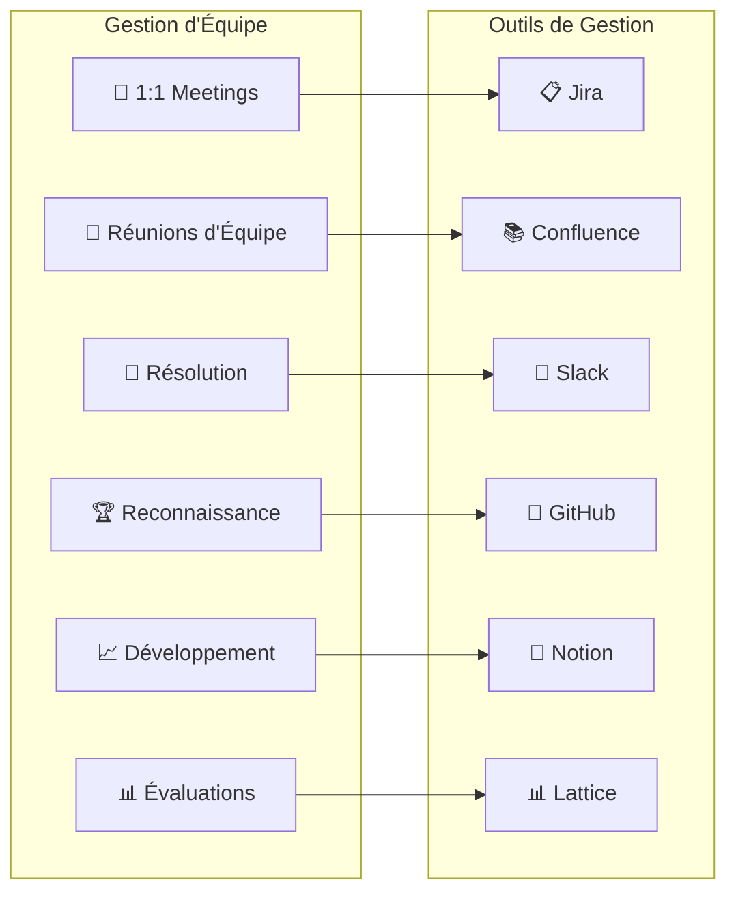
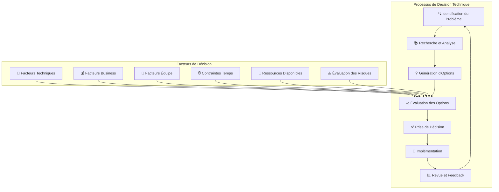
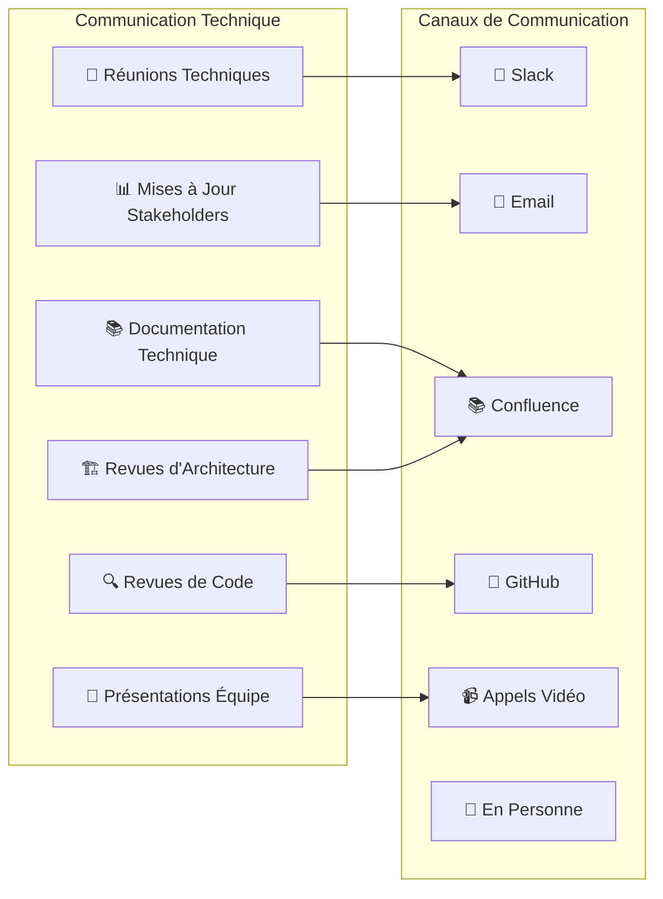

# Guide de Leadership Technique - Veza Platform

## Vue d'ensemble

Ce guide détaille les compétences et pratiques de leadership technique pour la plateforme Veza, couvrant la gestion d'équipe, l'architecture technique, la communication et le développement des talents.

## Table des matières

- [Compétences de Leadership](#compétences-de-leadership)
- [Gestion d'Équipe](#gestion-déquipe)
- [Architecture Technique](#architecture-technique)
- [Communication](#communication)
- [Bonnes Pratiques](#bonnes-pratiques)
- [Pièges à Éviter](#pièges-à-éviter)
- [Développement Personnel](#développement-personnel)
- [Ressources](#ressources)

## Compétences de Leadership

### 1. Modèle de Leadership Technique

```mermaid
graph TB
    subgraph "Leadership Technique"
        Technical_Expertise[🔧 Expertise Technique]
        Team_Management[👥 Gestion d'Équipe]
        Strategic_Thinking[🎯 Pensée Stratégique]
        Communication[💬 Communication]
        Mentoring[🎓 Mentorat]
        Decision_Making[⚖️ Prise de Décision]
    end
    
    subgraph "Compétences Clés"
        Architecture_Design[🏗️ Design d'Architecture]
        Code_Review[🔍 Revue de Code]
        Performance_Optimization[⚡ Optimisation]
        Security_Awareness[🛡️ Sécurité]
        Quality_Assurance[✅ Assurance Qualité]
        Innovation[💡 Innovation]
    end
    
    subgraph "Soft Skills"
        Empathy[❤️ Empathie]
        Active_Listening[👂 Écoute Active]
        Conflict_Resolution[🤝 Résolution de Conflits]
        Time_Management[⏰ Gestion du Temps]
        Stress_Management[😌 Gestion du Stress]
        Adaptability[🔄 Adaptabilité]
    end
    
    Technical_Expertise --> Architecture_Design
    Team_Management --> Empathy
    Strategic_Thinking --> Innovation
    Communication --> Active_Listening
    Mentoring --> Conflict_Resolution
    Decision_Making --> Time_Management
```



### 2. Rôles et Responsabilités

```yaml
# technical-leadership/roles-responsibilities.yaml
apiVersion: v1
kind: ConfigMap
metadata:
  name: veza-technical-leadership-roles
  namespace: veza
data:
  # Tech Lead
  tech_lead:
    responsibilities:
      - "Architecture technique"
      - "Revue de code"
      - "Mentorat technique"
      - "Décisions techniques"
      - "Optimisation des performances"
      - "Gestion de la dette technique"
    skills:
      - "Expertise technique approfondie"
      - "Communication claire"
      - "Pensée stratégique"
      - "Leadership d'équipe"
  
  # Engineering Manager
  engineering_manager:
    responsibilities:
      - "Gestion d'équipe"
      - "Recrutement"
      - "Performance management"
      - "Budget technique"
      - "Stratégie produit"
      - "Collaboration inter-équipes"
    skills:
      - "Gestion de projet"
      - "Communication interpersonnelle"
      - "Stratégie business"
      - "Développement de talents"
  
  # Principal Engineer
  principal_engineer:
    responsibilities:
      - "Architecture système"
      - "Standards techniques"
      - "Innovation technologique"
      - "Mentorat senior"
      - "Décisions stratégiques"
      - "Recherche et développement"
    skills:
      - "Expertise technique avancée"
      - "Vision stratégique"
      - "Influence technique"
      - "Mentorat expert"
```

## Gestion d'Équipe

### 1. Modèle de Gestion d'Équipe



### 2. Template de 1:1 Meeting

```yaml
# technical-leadership/templates/one-on-one-template.yaml
apiVersion: v1
kind: ConfigMap
metadata:
  name: veza-one-on-one-template
  namespace: veza
data:
  # Structure de la réunion 1:1
  meeting_structure:
    check_in: "Comment ça va ? (5 min)"
    work_update: "Mise à jour du travail (10 min)"
    challenges: "Défis et obstacles (10 min)"
    career_growth: "Développement de carrière (10 min)"
    feedback: "Feedback et suggestions (5 min)"
    action_items: "Actions à suivre (5 min)"
  
  # Questions de suivi
  follow_up_questions:
    check_in:
      - "Comment te sens-tu cette semaine ?"
      - "Y a-t-il quelque chose qui te préoccupe ?"
      - "Comment puis-je t'aider ?"
    
    work_update:
      - "Quels sont tes objectifs pour cette semaine ?"
      - "Quels progrès as-tu faits ?"
      - "Y a-t-il des blocages ?"
    
    challenges:
      - "Quels défis rencontres-tu ?"
      - "Comment puis-je t'aider à les surmonter ?"
      - "As-tu besoin de ressources supplémentaires ?"
    
    career_growth:
      - "Quels sont tes objectifs de carrière ?"
      - "Quelles compétences veux-tu développer ?"
      - "Comment puis-je t'aider à progresser ?"
    
    feedback:
      - "As-tu des feedbacks pour moi ?"
      - "Comment puis-je améliorer mon leadership ?"
      - "Y a-t-il des améliorations à apporter ?"
```

### 3. Plan de Développement de Carrière

```python
# technical-leadership/scripts/career-development.py
#!/usr/bin/env python3

import json
import logging
from datetime import datetime, timedelta
from typing import Dict, List, Optional

class CareerDevelopmentPlanner:
    def __init__(self, employee_id: str):
        self.employee_id = employee_id
        self.logger = self.setup_logger()
    
    def setup_logger(self) -> logging.Logger:
        """Configure le logger"""
        logging.basicConfig(
            level=logging.INFO,
            format='%(asctime)s - %(levelname)s - %(message)s',
            handlers=[
                logging.FileHandler(f'career_development_{self.employee_id}.log'),
                logging.StreamHandler()
            ]
        )
        return logging.getLogger(__name__)
    
    def create_development_plan(self, employee_data: Dict) -> Dict:
        """Crée un plan de développement de carrière"""
        plan = {
            'employee_id': self.employee_id,
            'created_date': datetime.now().isoformat(),
            'current_level': employee_data.get('current_level', 'mid'),
            'target_level': employee_data.get('target_level', 'senior'),
            'timeline': employee_data.get('timeline', '12 months'),
            'goals': self.generate_goals(employee_data),
            'skills_gap': self.analyze_skills_gap(employee_data),
            'learning_path': self.create_learning_path(employee_data),
            'milestones': self.create_milestones(employee_data),
            'mentorship': self.assign_mentor(employee_data)
        }
        
        return plan
    
    def generate_goals(self, employee_data: Dict) -> List[Dict]:
        """Génère les objectifs de développement"""
        goals = []
        
        # Objectifs techniques
        technical_goals = [
            {
                'category': 'technical',
                'goal': 'Maîtriser l\'architecture microservices',
                'timeline': '6 months',
                'success_criteria': [
                    'Designer une architecture microservices',
                    'Implémenter un service de communication',
                    'Documenter les patterns d\'architecture'
                ]
            },
            {
                'category': 'technical',
                'goal': 'Améliorer les compétences en sécurité',
                'timeline': '4 months',
                'success_criteria': [
                    'Passer une certification sécurité',
                    'Implémenter des contrôles de sécurité',
                    'Conduire un audit de sécurité'
                ]
            }
        ]
        
        # Objectifs de leadership
        leadership_goals = [
            {
                'category': 'leadership',
                'goal': 'Développer les compétences de mentorat',
                'timeline': '3 months',
                'success_criteria': [
                    'Mentorer 2 développeurs junior',
                    'Conduire des sessions de code review',
                    'Partager des connaissances techniques'
                ]
            },
            {
                'category': 'leadership',
                'goal': 'Améliorer la communication technique',
                'timeline': '2 months',
                'success_criteria': [
                    'Présenter des sujets techniques',
                    'Documenter des décisions d\'architecture',
                    'Faciliter des discussions techniques'
                ]
            }
        ]
        
        goals.extend(technical_goals)
        goals.extend(leadership_goals)
        
        return goals
    
    def analyze_skills_gap(self, employee_data: Dict) -> Dict:
        """Analyse l'écart de compétences"""
        current_skills = employee_data.get('current_skills', [])
        required_skills = employee_data.get('required_skills', [])
        
        missing_skills = [skill for skill in required_skills if skill not in current_skills]
        strong_skills = [skill for skill in current_skills if skill in required_skills]
        
        return {
            'missing_skills': missing_skills,
            'strong_skills': strong_skills,
            'priority_skills': missing_skills[:3]  # Top 3 prioritaires
        }
    
    def create_learning_path(self, employee_data: Dict) -> List[Dict]:
        """Crée un parcours d'apprentissage"""
        learning_path = []
        
        # Cours en ligne
        online_courses = [
            {
                'type': 'online_course',
                'title': 'Microservices Architecture',
                'platform': 'Coursera',
                'duration': '8 weeks',
                'priority': 'high'
            },
            {
                'type': 'online_course',
                'title': 'Security Fundamentals',
                'platform': 'edX',
                'duration': '6 weeks',
                'priority': 'high'
            }
        ]
        
        # Certifications
        certifications = [
            {
                'type': 'certification',
                'title': 'AWS Solutions Architect',
                'provider': 'Amazon',
                'duration': '3 months',
                'priority': 'medium'
            },
            {
                'type': 'certification',
                'title': 'CISSP',
                'provider': 'ISC2',
                'duration': '6 months',
                'priority': 'medium'
            }
        ]
        
        # Projets pratiques
        practical_projects = [
            {
                'type': 'project',
                'title': 'Refactoring Legacy System',
                'description': 'Moderniser un système legacy',
                'duration': '4 months',
                'priority': 'high'
            },
            {
                'type': 'project',
                'title': 'Security Audit Implementation',
                'description': 'Implémenter un audit de sécurité',
                'duration': '2 months',
                'priority': 'medium'
            }
        ]
        
        learning_path.extend(online_courses)
        learning_path.extend(certifications)
        learning_path.extend(practical_projects)
        
        return learning_path
    
    def create_milestones(self, employee_data: Dict) -> List[Dict]:
        """Crée des jalons de progression"""
        milestones = []
        
        # Jalons mensuels
        for month in range(1, 13):
            milestone = {
                'month': month,
                'description': f'Jalon {month}',
                'objectives': [],
                'review_date': (datetime.now() + timedelta(days=30*month)).isoformat()
            }
            
            if month == 3:
                milestone['objectives'] = [
                    'Compléter le cours Microservices',
                    'Commencer le mentorat',
                    'Améliorer la documentation'
                ]
            elif month == 6:
                milestone['objectives'] = [
                    'Passer la certification AWS',
                    'Conduire un audit de sécurité',
                    'Présenter une architecture'
                ]
            elif month == 9:
                milestone['objectives'] = [
                    'Compléter le projet de refactoring',
                    'Mentorer 2 développeurs',
                    'Améliorer les performances'
                ]
            elif month == 12:
                milestone['objectives'] = [
                    'Atteindre le niveau senior',
                    'Obtenir la certification CISSP',
                    'Devenir tech lead'
                ]
            
            milestones.append(milestone)
        
        return milestones
    
    def assign_mentor(self, employee_data: Dict) -> Dict:
        """Assigne un mentor"""
        available_mentors = [
            {
                'id': 'mentor_001',
                'name': 'Jean Dupont',
                'title': 'Senior Software Engineer',
                'expertise': ['microservices', 'security', 'architecture'],
                'availability': '2 hours/week'
            },
            {
                'id': 'mentor_002',
                'name': 'Marie Martin',
                'title': 'Principal Engineer',
                'expertise': ['system design', 'performance', 'leadership'],
                'availability': '1 hour/week'
            }
        ]
        
        # Sélection du mentor basée sur les besoins
        required_expertise = employee_data.get('required_skills', [])
        
        best_mentor = None
        best_match_score = 0
        
        for mentor in available_mentors:
            match_score = len(set(mentor['expertise']) & set(required_expertise))
            if match_score > best_match_score:
                best_match_score = match_score
                best_mentor = mentor
        
        return {
            'mentor': best_mentor,
            'meeting_frequency': 'weekly',
            'meeting_duration': '1 hour',
            'focus_areas': required_expertise[:3]
        }
    
    def generate_report(self, development_plan: Dict) -> str:
        """Génère un rapport de développement"""
        report = f"""
# Plan de Développement de Carrière - {self.employee_id}

## Informations Générales
- **Date de création** : {development_plan['created_date']}
- **Niveau actuel** : {development_plan['current_level']}
- **Niveau cible** : {development_plan['target_level']}
- **Timeline** : {development_plan['timeline']}

## Objectifs de Développement

### Objectifs Techniques
"""
        
        for goal in development_plan['goals']:
            if goal['category'] == 'technical':
                report += f"- {goal['goal']} ({goal['timeline']})\n"
        
        report += "\n### Objectifs de Leadership\n"
        
        for goal in development_plan['goals']:
            if goal['category'] == 'leadership':
                report += f"- {goal['goal']} ({goal['timeline']})\n"
        
        report += f"""
## Analyse des Compétences

### Compétences Manquantes
"""
        
        for skill in development_plan['skills_gap']['missing_skills']:
            report += f"- {skill}\n"
        
        report += f"""
### Compétences Fortes
"""
        
        for skill in development_plan['skills_gap']['strong_skills']:
            report += f"- {skill}\n"
        
        report += f"""
## Parcours d'Apprentissage

### Cours en Ligne
"""
        
        for item in development_plan['learning_path']:
            if item['type'] == 'online_course':
                report += f"- {item['title']} ({item['platform']}) - {item['duration']}\n"
        
        report += f"""
### Certifications
"""
        
        for item in development_plan['learning_path']:
            if item['type'] == 'certification':
                report += f"- {item['title']} ({item['provider']}) - {item['duration']}\n"
        
        report += f"""
### Projets Pratiques
"""
        
        for item in development_plan['learning_path']:
            if item['type'] == 'project':
                report += f"- {item['title']}: {item['description']} - {item['duration']}\n"
        
        report += f"""
## Mentorat

- **Mentor** : {development_plan['mentorship']['mentor']['name']}
- **Fréquence** : {development_plan['mentorship']['meeting_frequency']}
- **Durée** : {development_plan['mentorship']['meeting_duration']}
- **Domaines de focus** : {', '.join(development_plan['mentorship']['focus_areas'])}

## Jalons de Progression

"""
        
        for milestone in development_plan['milestones']:
            if milestone['objectives']:
                report += f"### Mois {milestone['month']}\n"
                for objective in milestone['objectives']:
                    report += f"- {objective}\n"
                report += "\n"
        
        return report

if __name__ == "__main__":
    import sys
    
    if len(sys.argv) != 2:
        print("Usage: python3 career_development.py <employee_id>")
        sys.exit(1)
    
    employee_id = sys.argv[1]
    
    # Données d'exemple
    employee_data = {
        'current_level': 'mid',
        'target_level': 'senior',
        'timeline': '12 months',
        'current_skills': ['python', 'javascript', 'docker'],
        'required_skills': ['microservices', 'security', 'architecture', 'leadership', 'mentoring']
    }
    
    planner = CareerDevelopmentPlanner(employee_id)
    development_plan = planner.create_development_plan(employee_data)
    report = planner.generate_report(development_plan)
    
    with open(f'career_development_plan_{employee_id}.md', 'w') as f:
        f.write(report)
    
    print(f"Plan de développement généré: career_development_plan_{employee_id}.md")
```

## Architecture Technique

### 1. Processus de Prise de Décision



### 2. Template de Décision Technique

```yaml
# technical-leadership/templates/technical-decision-template.yaml
apiVersion: v1
kind: ConfigMap
metadata:
  name: veza-technical-decision-template
  namespace: veza
data:
  # Structure de décision technique
  decision_structure:
    problem_statement: "Description claire du problème à résoudre"
    context: "Contexte et contraintes"
    options_evaluated: "Options considérées"
    decision: "Décision prise"
    rationale: "Justification de la décision"
    implementation_plan: "Plan d'implémentation"
    success_criteria: "Critères de succès"
    review_timeline: "Timeline de revue"
  
  # Critères d'évaluation
  evaluation_criteria:
    technical:
      - "Performance"
      - "Scalabilité"
      - "Maintenabilité"
      - "Sécurité"
      - "Complexité"
    
    business:
      - "Coût"
      - "ROI"
      - "Time to market"
      - "Risque"
      - "Alignement stratégique"
    
    team:
      - "Expertise disponible"
      - "Courbe d'apprentissage"
      - "Impact sur l'équipe"
      - "Formation nécessaire"
      - "Support requis"
```

## Communication

### 1. Modèle de Communication Technique



### 2. Template de Communication

```yaml
# technical-leadership/templates/communication-template.yaml
apiVersion: v1
kind: ConfigMap
metadata:
  name: veza-communication-template
  namespace: veza
data:
  # Template d'email technique
  technical_email_template: |
    Sujet: [TECH] $SUBJECT
    
    Bonjour $RECIPIENT,
    
    $INTRODUCTION
    
    **Contexte:**
    $CONTEXT
    
    **Détails Techniques:**
    $TECHNICAL_DETAILS
    
    **Impact:**
    $IMPACT
    
    **Prochaines Étapes:**
    $NEXT_STEPS
    
    **Questions/Discussion:**
    $QUESTIONS
    
    Cordialement,
    $SENDER
  
  # Template de présentation technique
  technical_presentation_template: |
    # $TITLE
    
    ## Contexte
    $CONTEXT
    
    ## Problème
    $PROBLEM
    
    ## Solution Proposée
    $SOLUTION
    
    ## Architecture
    $ARCHITECTURE
    
    ## Implémentation
    $IMPLEMENTATION
    
    ## Tests et Validation
    $TESTING
    
    ## Déploiement
    $DEPLOYMENT
    
    ## Monitoring
    $MONITORING
    
    ## Questions et Discussion
    $QUESTIONS
```

## Bonnes Pratiques

### 1. Leadership Technique Efficace

```yaml
# technical-leadership/best-practices/leadership-practices.yaml
apiVersion: v1
kind: ConfigMap
metadata:
  name: veza-leadership-best-practices
  namespace: veza
data:
  # Pratiques de leadership
  leadership_practices:
    - "Lead by example - Montrer l'exemple"
    - "Empower the team - Donner du pouvoir à l'équipe"
    - "Foster collaboration - Encourager la collaboration"
    - "Provide clear direction - Donner une direction claire"
    - "Encourage innovation - Encourager l'innovation"
    - "Build trust - Construire la confiance"
    - "Communicate effectively - Communiquer efficacement"
    - "Mentor and coach - Mentorer et coacher"
    - "Make data-driven decisions - Prendre des décisions basées sur les données"
    - "Continuous learning - Apprentissage continu"
  
  # Pratiques techniques
  technical_practices:
    - "Code review excellence - Excellence en revue de code"
    - "Architecture documentation - Documentation d'architecture"
    - "Performance optimization - Optimisation des performances"
    - "Security first - Sécurité en premier"
    - "Testing strategy - Stratégie de test"
    - "Monitoring and observability - Monitoring et observabilité"
    - "Incident response - Réponse aux incidents"
    - "Technical debt management - Gestion de la dette technique"
    - "Knowledge sharing - Partage de connaissances"
    - "Innovation culture - Culture d'innovation"
```

### 2. Gestion de la Performance

```python
# technical-leadership/scripts/performance-management.py
#!/usr/bin/env python3

import json
import logging
from datetime import datetime, timedelta
from typing import Dict, List, Optional

class PerformanceManager:
    def __init__(self):
        self.logger = self.setup_logger()
    
    def setup_logger(self) -> logging.Logger:
        """Configure le logger"""
        logging.basicConfig(
            level=logging.INFO,
            format='%(asctime)s - %(levelname)s - %(message)s',
            handlers=[
                logging.FileHandler('performance_management.log'),
                logging.StreamHandler()
            ]
        )
        return logging.getLogger(__name__)
    
    def create_performance_plan(self, employee_data: Dict) -> Dict:
        """Crée un plan de performance"""
        plan = {
            'employee_id': employee_data['employee_id'],
            'period': employee_data.get('period', 'Q1 2024'),
            'goals': self.generate_performance_goals(employee_data),
            'metrics': self.define_performance_metrics(employee_data),
            'feedback_schedule': self.create_feedback_schedule(),
            'development_areas': self.identify_development_areas(employee_data)
        }
        
        return plan
    
    def generate_performance_goals(self, employee_data: Dict) -> List[Dict]:
        """Génère les objectifs de performance"""
        goals = []
        
        # Objectifs techniques
        technical_goals = [
            {
                'category': 'technical',
                'goal': 'Améliorer la qualité du code',
                'metrics': ['code coverage > 80%', 'bug rate < 5%'],
                'timeline': '3 months',
                'priority': 'high'
            },
            {
                'category': 'technical',
                'goal': 'Optimiser les performances',
                'metrics': ['response time < 200ms', 'throughput > 1000 req/s'],
                'timeline': '2 months',
                'priority': 'medium'
            }
        ]
        
        # Objectifs de leadership
        leadership_goals = [
            {
                'category': 'leadership',
                'goal': 'Améliorer le mentorat',
                'metrics': ['mentor 2 junior developers', 'conduct 10 code reviews'],
                'timeline': '3 months',
                'priority': 'high'
            },
            {
                'category': 'leadership',
                'goal': 'Améliorer la communication',
                'metrics': ['present 3 technical topics', 'document 5 architectural decisions'],
                'timeline': '2 months',
                'priority': 'medium'
            }
        ]
        
        goals.extend(technical_goals)
        goals.extend(leadership_goals)
        
        return goals
    
    def define_performance_metrics(self, employee_data: Dict) -> Dict:
        """Définit les métriques de performance"""
        metrics = {
            'technical_metrics': {
                'code_quality': {
                    'code_coverage': 'target: 80%',
                    'bug_rate': 'target: < 5%',
                    'technical_debt': 'target: < 10%'
                },
                'productivity': {
                    'story_points_completed': 'target: 20/week',
                    'code_reviews_conducted': 'target: 5/week',
                    'documentation_quality': 'target: 4/5 rating'
                },
                'innovation': {
                    'new_ideas_proposed': 'target: 2/month',
                    'process_improvements': 'target: 1/month',
                    'knowledge_sharing_sessions': 'target: 1/month'
                }
            },
            'leadership_metrics': {
                'team_development': {
                    'mentoring_sessions': 'target: 4/week',
                    'team_feedback_score': 'target: 4.5/5',
                    'team_productivity': 'target: +10%'
                },
                'communication': {
                    'presentations_delivered': 'target: 2/month',
                    'documentation_created': 'target: 3/month',
                    'stakeholder_satisfaction': 'target: 4/5'
                },
                'strategic_contribution': {
                    'architectural_decisions': 'target: 5/quarter',
                    'technical_strategy_contributions': 'target: 3/quarter',
                    'innovation_projects': 'target: 1/quarter'
                }
            }
        }
        
        return metrics
    
    def create_feedback_schedule(self) -> List[Dict]:
        """Crée un planning de feedback"""
        schedule = []
        
        # Feedback hebdomadaire
        for week in range(1, 13):
            feedback = {
                'week': week,
                'type': 'weekly_check_in',
                'focus': 'progress_update',
                'duration': '30 minutes',
                'participants': ['employee', 'manager']
            }
            schedule.append(feedback)
        
        # Feedback mensuel
        for month in range(1, 4):
            feedback = {
                'month': month,
                'type': 'monthly_review',
                'focus': 'goal_progress',
                'duration': '1 hour',
                'participants': ['employee', 'manager', 'peers']
            }
            schedule.append(feedback)
        
        # Feedback trimestriel
        feedback = {
            'quarter': 1,
            'type': 'quarterly_review',
            'focus': 'comprehensive_assessment',
            'duration': '2 hours',
            'participants': ['employee', 'manager', 'stakeholders']
        }
        schedule.append(feedback)
        
        return schedule
    
    def identify_development_areas(self, employee_data: Dict) -> List[Dict]:
        """Identifie les domaines de développement"""
        development_areas = [
            {
                'area': 'Technical Leadership',
                'current_level': 'mid',
                'target_level': 'senior',
                'specific_skills': [
                    'Architecture design',
                    'System design',
                    'Performance optimization',
                    'Security best practices'
                ],
                'learning_resources': [
                    'Architecture patterns book',
                    'System design course',
                    'Performance optimization workshop',
                    'Security certification'
                ]
            },
            {
                'area': 'Team Leadership',
                'current_level': 'beginner',
                'target_level': 'intermediate',
                'specific_skills': [
                    'Mentoring',
                    'Conflict resolution',
                    'Team motivation',
                    'Stakeholder communication'
                ],
                'learning_resources': [
                    'Leadership workshop',
                    'Communication course',
                    'Mentoring program',
                    'Conflict resolution training'
                ]
            },
            {
                'area': 'Strategic Thinking',
                'current_level': 'beginner',
                'target_level': 'intermediate',
                'specific_skills': [
                    'Business alignment',
                    'Technology strategy',
                    'Risk assessment',
                    'Innovation management'
                ],
                'learning_resources': [
                    'Business strategy course',
                    'Technology strategy workshop',
                    'Risk management training',
                    'Innovation workshop'
                ]
            }
        ]
        
        return development_areas

if __name__ == "__main__":
    # Données d'exemple
    employee_data = {
        'employee_id': 'EMP001',
        'period': 'Q1 2024',
        'current_level': 'mid',
        'target_level': 'senior'
    }
    
    manager = PerformanceManager()
    performance_plan = manager.create_performance_plan(employee_data)
    
    with open('performance_plan.json', 'w') as f:
        json.dump(performance_plan, f, indent=2)
    
    print("Plan de performance généré: performance_plan.json")
```

## Pièges à Éviter

### 1. Micro-management

❌ **Mauvais** :
```yaml
# Micro-management
leadership_style:
  approach: "control_everything"
  decision_making: "centralized"
  team_autonomy: "minimal"
  communication: "command_and_control"
```

✅ **Bon** :
```yaml
# Empowerment
leadership_style:
  approach: "empower_team"
  decision_making: "decentralized"
  team_autonomy: "high"
  communication: "collaborative"
```

### 2. Pas de Feedback

❌ **Mauvais** :
```yaml
# Pas de feedback
feedback_practices:
  frequency: "never"
  format: "none"
  action_items: "none"
```

✅ **Bon** :
```yaml
# Feedback régulier
feedback_practices:
  frequency: "weekly"
  format: "structured"
  action_items: "tracked"
  follow_up: "scheduled"
```

### 3. Pas de Développement d'Équipe

❌ **Mauvais** :
```yaml
# Pas de développement
team_development:
  mentoring: "none"
  training: "none"
  career_growth: "none"
```

✅ **Bon** :
```yaml
# Développement actif
team_development:
  mentoring: "regular"
  training: "continuous"
  career_growth: "supported"
  skill_development: "planned"
```

## Développement Personnel

### 1. Plan de Développement du Leadership

```yaml
# technical-leadership/development/leadership-development.yaml
apiVersion: v1
kind: ConfigMap
metadata:
  name: veza-leadership-development
  namespace: veza
data:
  # Compétences de leadership
  leadership_skills:
    technical_leadership:
      - "Architecture design"
      - "System design"
      - "Performance optimization"
      - "Security expertise"
      - "Technology strategy"
    
    people_leadership:
      - "Team building"
      - "Mentoring"
      - "Conflict resolution"
      - "Communication"
      - "Motivation"
    
    strategic_leadership:
      - "Business alignment"
      - "Innovation management"
      - "Risk assessment"
      - "Change management"
      - "Stakeholder management"
  
  # Ressources de développement
  development_resources:
    books:
      - "The Phoenix Project"
      - "Team of Teams"
      - "The Goal"
      - "High Output Management"
    
    courses:
      - "Technical Leadership Course"
      - "People Management Course"
      - "Strategic Thinking Course"
      - "Communication Skills Course"
    
    certifications:
      - "AWS Solutions Architect"
      - "CISSP"
      - "PMP"
      - "Scrum Master"
```

## Ressources

### Documentation Interne

- [Guide d'Architecture](../architecture/README.md)
- [Guide de Développement](./development-guide.md)
- [Guide de Code Review](./code-review-leadership.md)
- [Guide d'Onboarding](./team-onboarding.md)

### Outils Recommandés

- **Jira** : Gestion de projet
- **Confluence** : Documentation
- **Slack** : Communication
- **GitHub** : Gestion de code
- **Lattice** : Performance management
- **Notion** : Knowledge management

### Commandes Utiles

```bash
# Gestion d'équipe
python3 career_development.py EMP001
python3 performance_management.py

# Communication
curl -X POST "https://hooks.slack.com/services/YOUR_WEBHOOK" \
  -H "Content-type: application/json" \
  -d "{\"text\":\"Meeting d'équipe programmé\"}"

# Documentation
git add .
git commit -m "Update technical documentation"
git push origin main
```

---

**Dernière mise à jour** : $(date)
**Version du guide** : 1.0.0
**Mainteneur** : Équipe Leadership Technique Veza 