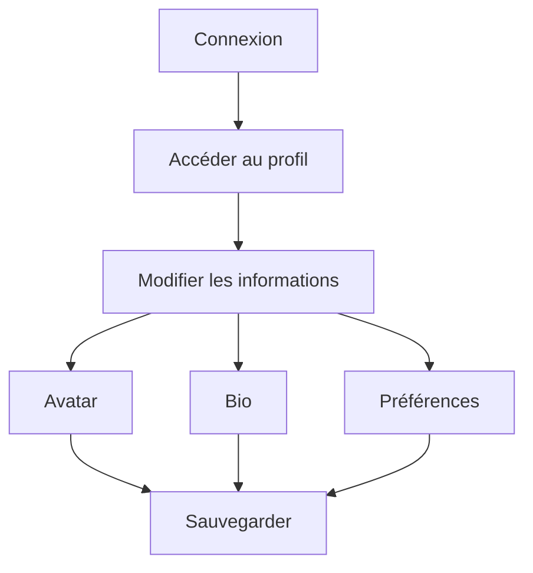

# 👥 Guide Utilisateur - Veza Platform

> **Guide complet pour utiliser la plateforme Veza**

## 📋 Table des Matières

- [Vue d'ensemble](#vue-densemble)
- [Premiers Pas](#premiers-pas)
- [Navigation](#navigation)
- [Chat et Messagerie](#chat-et-messagerie)
- [Streaming Audio](#streaming-audio)
- [Administration](#administration)
- [Analytics et Rapports](#analytics-et-rapports)
- [FAQ](#faq)

## 🎯 Vue d'ensemble

Veza Platform est une plateforme complète de communication et de streaming audio, conçue pour les créateurs de contenu, les communautés et les entreprises. Ce guide vous accompagne dans l'utilisation de toutes les fonctionnalités.

### 🌟 Fonctionnalités Principales

- **💬 Chat en Temps Réel** : Messagerie instantanée avec salons privés et publics
- **🎵 Streaming Audio** : Diffusion audio en direct avec qualité professionnelle
- **👥 Gestion des Utilisateurs** : Système de rôles et permissions avancé
- **📊 Analytics** : Tableaux de bord détaillés et métriques en temps réel
- **🔧 Administration** : Interface d'administration complète
- **📱 Multi-Plateforme** : Accessible sur web, mobile et desktop

## 🚀 Premiers Pas

### 1. 📝 Création de Compte

1. **Accédez à la plateforme** : Rendez-vous sur [veza.app](https://veza.app)
2. **Cliquez sur "S'inscrire"** : Bouton en haut à droite
3. **Remplissez le formulaire** :
   - Email valide
   - Nom d'utilisateur unique
   - Mot de passe fort (8 caractères minimum)
   - Acceptez les conditions d'utilisation
4. **Vérifiez votre email** : Cliquez sur le lien de confirmation
5. **Connectez-vous** : Utilisez vos identifiants

### 2. 🎨 Personnalisation du Profil



**Informations à personnaliser :**
- **Avatar** : Photo de profil (format JPG/PNG, max 2MB)
- **Bio** : Description personnelle (max 500 caractères)
- **Préférences** : Notifications, langue, fuseau horaire
- **Liens sociaux** : Twitter, Instagram, YouTube, etc.

### 3. 🏠 Découverte de l'Interface

L'interface Veza est organisée en plusieurs sections :

- **🎵 Dashboard** : Vue d'ensemble de vos activités
- **💬 Chat** : Messagerie et salons
- **🎤 Streaming** : Outils de diffusion audio
- **👥 Communauté** : Gestion des utilisateurs
- **📊 Analytics** : Statistiques et rapports
- **⚙️ Paramètres** : Configuration du compte

## 🧭 Navigation

### Barre de Navigation Principale

```
┌─────────────────────────────────────────────────────────────┐
│ 🏠 Dashboard │ 💬 Chat │ 🎤 Stream │ 👥 Users │ 📊 Analytics │
└─────────────────────────────────────────────────────────────┘
```

### Menu Utilisateur

```
┌─────────────────┐
│ 👤 Mon Profil   │
│ ⚙️ Paramètres   │
│ 🔔 Notifications│
│ 🚪 Déconnexion  │
└─────────────────┘
```

### Raccourcis Clavier

| Raccourci | Action |
|-----------|--------|
| `Ctrl + K` | Recherche globale |
| `Ctrl + N` | Nouveau message |
| `Ctrl + S` | Démarrer un stream |
| `Ctrl + M` | Ouvrir/fermer le chat |
| `Esc` | Fermer les modales |

## 💬 Chat et Messagerie

### 1. 📨 Envoyer un Message

**Étapes :**
1. Sélectionnez un salon ou un utilisateur
2. Tapez votre message dans la zone de texte
3. Utilisez les options de formatage :
   - **Gras** : `**texte**`
   - *Italique* : `*texte*`
   - `Code` : `` `code` ``
   - [Lien](https://example.com) : `[texte](https://example.com)`
4. Appuyez sur `Entrée` pour envoyer

### 2. 🎨 Messages Avancés

**Fichiers et Médias :**
- **Images** : Glissez-déposez ou cliquez sur 📎
- **Audio** : Enregistrement vocal direct
- **Documents** : PDF, DOC, TXT (max 10MB)
- **Emojis** : Sélecteur intégré 😊

**Réactions :**
- Cliquez sur un message pour voir les réactions
- Ajoutez 👍, ❤️, 😂, etc.
- Répondez avec @utilisateur

### 3. 🏠 Gestion des Salons

**Types de Salons :**
- **Public** : Visible par tous les utilisateurs
- **Privé** : Accès par invitation uniquement
- **Secret** : Invisible dans les listes

**Créer un Salon :**
1. Cliquez sur "Nouveau Salon"
2. Choisissez le type (public/privé/secret)
3. Définissez le nom et la description
4. Invitez des membres
5. Configurez les permissions

**Permissions des Salons :**
- **Lecture** : Voir les messages
- **Écriture** : Envoyer des messages
- **Modération** : Supprimer des messages
- **Administration** : Gérer le salon

### 4. 🔍 Recherche et Filtres

**Recherche de Messages :**
- Utilisez `Ctrl + K` pour la recherche globale
- Filtrez par date, utilisateur, contenu
- Recherche dans les fichiers joints

**Filtres Avancés :**
- Messages de l'utilisateur @moi
- Messages avec fichiers
- Messages avec réactions
- Messages épinglés

## 🎵 Streaming Audio

### 1. 🎤 Démarrer un Stream

**Configuration Initiale :**
1. Cliquez sur "Nouveau Stream"
2. Configurez les paramètres :
   - **Titre** : Nom du stream
   - **Description** : Détails du contenu
   - **Catégorie** : Musique, Talk, Gaming, etc.
   - **Visibilité** : Public, Privé, Non répertorié
3. Testez votre microphone
4. Cliquez sur "Démarrer"

**Paramètres Audio :**
- **Qualité** : 128kbps, 256kbps, 320kbps
- **Format** : MP3, AAC, OGG
- **Latence** : Faible (live), Standard, Haute qualité

### 2. 🎛️ Contrôles de Stream

**Pendant le Stream :**
- **🎤 Mute/Unmute** : Activer/désactiver le micro
- **🎵 Musique** : Ajouter des pistes audio
- **📊 Statistiques** : Auditeurs en temps réel
- **💬 Chat** : Interagir avec les auditeurs
- **📱 Partage** : Lien de diffusion

**Fonctionnalités Avancées :**
- **🎧 Monitoring** : Écouter votre stream
- **🎚️ Égaliseur** : Ajuster les fréquences
- **🎛️ Effets** : Réverbération, écho, etc.
- **📻 Playlist** : Programmer des musiques

### 3. 👥 Gestion des Auditeurs

**Modération :**
- **Bannir** : Exclure un auditeur
- **Timeout** : Suspension temporaire
- **Mute** : Empêcher les messages
- **Promouvoir** : Donner des privilèges

**Interactions :**
- **Questions** : Système de questions/réponses
- **Donations** : Support monétaire
- **Clips** : Moments marquants
- **Replay** : Rediffusion automatique

### 4. 📊 Analytics de Stream

**Métriques en Temps Réel :**
- **Auditeurs** : Nombre de personnes qui écoutent
- **Durée** : Temps d'écoute moyen
- **Engagement** : Messages, réactions, partages
- **Géographie** : Pays des auditeurs

**Rapports Post-Stream :**
- **Replay** : Écouter l'enregistrement
- **Statistiques** : Graphiques détaillés
- **Exports** : Données au format CSV/JSON

## 👥 Administration

### 1. 🛡️ Gestion des Utilisateurs

**Rôles et Permissions :**
- **👤 Utilisateur** : Accès de base
- **👨‍💼 Modérateur** : Modération des contenus
- **👨‍💻 Administrateur** : Gestion complète
- **👑 Super Admin** : Accès système

**Actions Administratives :**
- **Suspendre** : Désactiver temporairement un compte
- **Bannir** : Exclusion permanente
- **Promouvoir** : Changer le rôle
- **Auditer** : Voir l'historique des actions

### 2. 🏠 Gestion des Salons

**Configuration :**
- **Permissions** : Définir qui peut faire quoi
- **Modération** : Règles automatiques
- **Archivage** : Sauvegarder les conversations
- **Export** : Extraire les données

**Modération Automatique :**
- **Filtres** : Mots interdits, spam
- **Limites** : Messages par minute
- **Alertes** : Notifications de modération
- **Actions** : Bannissement automatique

### 3. ⚙️ Configuration Système

**Paramètres Généraux :**
- **Limites** : Utilisateurs, messages, fichiers
- **Sécurité** : Authentification, autorisation
- **Performance** : Cache, optimisation
- **Intégrations** : APIs externes

**Monitoring :**
- **Logs** : Journal des événements
- **Métriques** : Performance système
- **Alertes** : Problèmes détectés
- **Backup** : Sauvegardes automatiques

## 📊 Analytics et Rapports

### 1. 📈 Tableaux de Bord

**Vue d'Ensemble :**
- **Utilisateurs actifs** : Nombre de personnes connectées
- **Messages** : Volume de communication
- **Streams** : Diffusions en cours
- **Engagement** : Interactions utilisateurs

**Métriques Détaillées :**
- **Croissance** : Évolution dans le temps
- **Rétention** : Utilisateurs qui reviennent
- **Performance** : Temps de réponse, disponibilité
- **Qualité** : Satisfaction utilisateurs

### 2. 📊 Rapports Personnalisés

**Types de Rapports :**
- **Utilisateurs** : Inscriptions, activité, rétention
- **Contenu** : Messages, streams, fichiers
- **Performance** : Temps de réponse, erreurs
- **Sécurité** : Tentatives d'intrusion, violations

**Export de Données :**
- **Formats** : CSV, JSON, PDF
- **Périodes** : Jour, semaine, mois, année
- **Filtres** : Utilisateurs, salons, dates
- **Planification** : Rapports automatiques

### 3. 🔍 Recherche Avancée

**Recherche Globale :**
- **Messages** : Contenu, utilisateur, date
- **Utilisateurs** : Nom, email, activité
- **Fichiers** : Type, taille, date
- **Événements** : Actions, erreurs, alertes

**Filtres Avancés :**
- **Date** : Période spécifique
- **Utilisateur** : Personne particulière
- **Type** : Messages, fichiers, actions
- **Statut** : Actif, suspendu, banni

## ❓ FAQ

### 🔐 Sécurité et Confidentialité

**Q : Mes données sont-elles sécurisées ?**
R : Oui, Veza utilise un chiffrement de bout en bout et respecte le RGPD.

**Q : Qui peut voir mes messages privés ?**
R : Seuls vous et les destinataires peuvent voir vos messages privés.

**Q : Comment supprimer mon compte ?**
R : Allez dans Paramètres > Compte > Supprimer le compte.

### 💬 Chat et Messagerie

**Q : Comment créer un salon privé ?**
R : Nouveau Salon > Type : Privé > Inviter les membres.

**Q : Puis-je récupérer des messages supprimés ?**
R : Non, les messages supprimés ne peuvent pas être récupérés.

**Q : Comment bloquer un utilisateur ?**
R : Clic droit sur l'utilisateur > Bloquer.

### 🎵 Streaming

**Q : Quelle est la qualité audio maximale ?**
R : Jusqu'à 320kbps en qualité studio.

**Q : Puis-je streamer depuis mon téléphone ?**
R : Oui, l'application mobile supporte le streaming.

**Q : Comment enregistrer mon stream ?**
R : Activez l'enregistrement automatique dans les paramètres.

### 👥 Administration

**Q : Comment devenir modérateur ?**
R : Contactez un administrateur de votre communauté.

**Q : Que faire en cas de comportement abusif ?**
R : Signalez l'utilisateur via le bouton "Signaler".

**Q : Comment restaurer un utilisateur banni ?**
R : Administration > Utilisateurs > Gérer les bannissements.

### 📊 Analytics

**Q : Mes données sont-elles anonymisées ?**
R : Oui, les données personnelles sont anonymisées dans les rapports.

**Q : Puis-je exporter mes données ?**
R : Oui, dans Paramètres > Données > Exporter.

**Q : Les analytics sont-ils en temps réel ?**
R : Oui, avec un délai de quelques secondes.

---

## 🔗 Liens croisés

- [Architecture Globale](../architecture/global-architecture.md)
- [API Reference](../api/README.md)
- [Configuration Avancée](../guides/advanced-configuration.md)
- [Troubleshooting](../troubleshooting/README.md)

---

## Pour aller plus loin

- [Guide de Performance](../guides/performance-optimization.md)
- [Sécurité Avancée](../guides/advanced-security.md)
- [Déploiement](../deployment/README.md)
- [Tests](../testing/README.md) 