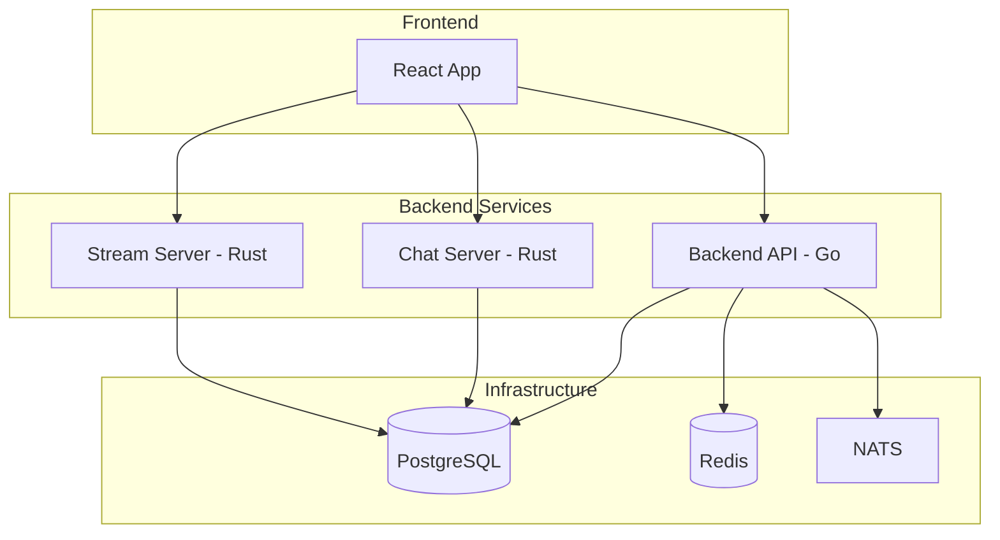

# 🎵 Documentation Veza

**Plateforme de streaming audio et chat en temps réel**

Bienvenue dans la documentation complète de Veza, une plateforme moderne de streaming audio avec chat en temps réel, construite avec des technologies de pointe.

## 🚀 Services Principaux

<div className="row">
  <div className="col col--4">
    <div className="card">
      <div className="card__header">
        <h3>🎯 Backend API</h3>
      </div>
      <div className="card__body">
        <p>API REST en Go avec Gin, gestion de l'authentification, base de données PostgreSQL et cache Redis.</p>
      </div>
      <div className="card__footer">
        <a href="/docs/backend-api/src/cmd-server-main" className="button button--primary button--block">
          Voir la documentation
        </a>
      </div>
    </div>
  </div>
  
  <div className="col col--4">
    <div className="card">
      <div className="card__header">
        <h3>💬 Chat Server</h3>
      </div>
      <div className="card__body">
        <p>Serveur de chat en Rust avec WebSocket, gestion des messages en temps réel et modération automatique.</p>
      </div>
      <div className="card__footer">
        <a href="/docs/chat-server/src/main" className="button button--primary button--block">
          Voir la documentation
        </a>
      </div>
    </div>
  </div>
  
  <div className="col col--4">
    <div className="card">
      <div className="card__header">
        <h3>🎵 Stream Server</h3>
      </div>
      <div className="card__body">
        <p>Serveur de streaming audio en Rust avec compression adaptative, analytics et gestion des fichiers.</p>
      </div>
      <div className="card__footer">
        <a href="/docs/stream-server/src/main" className="button button--primary button--block">
          Voir la documentation
        </a>
      </div>
    </div>
  </div>
</div>

## 🏗️ Architecture

Veza suit une architecture microservices moderne avec trois services principaux :



## 📚 Sections de Documentation

### 🏗️ Architecture
- [Architecture Backend API](/docs/architecture/backend-architecture)
- [Architecture Chat Server](/docs/architecture/chat-server-architecture)
- [Architecture Stream Server](/docs/architecture/stream-server-architecture)

### 🔌 API & Développement
- [Référence des Endpoints](/docs/api/endpoints-reference)
- [Documentation API Backend](/docs/api/backend-api)
- [Schéma de Base de Données](/docs/database/schema)

### 🚀 Déploiement
- [Guide de Déploiement](/docs/deployment/deployment-guide)
- [Configuration de Production](/docs/deployment/guide)

### 📊 Monitoring & Sécurité
- [Monitoring et Santé](monitoring/health)
- [Sécurité](security/overview)

## 🛠️ Technologies Utilisées

| Service | Langage | Framework | Base de Données |
|---------|---------|-----------|-----------------|
| Backend API | Go | Gin | PostgreSQL + Redis |
| Chat Server | Rust | Axum | PostgreSQL |
| Stream Server | Rust | Axum | PostgreSQL |
| Frontend | TypeScript | React | - |

## 🚀 Démarrage Rapide

### Prérequis
- Docker et Docker Compose
- Node.js 18+
- Go 1.21+
- Rust 1.70+

### Installation
```bash
# Cloner le repository
git clone https://github.com/okinrev/veza-full-stack.git
cd veza-full-stack

# Démarrer avec Docker Compose
docker-compose up -d

# Ou développement local
make dev
```

### Accès aux Services
- **Frontend**: http://localhost:3000
- **Backend API**: http://localhost:8080
- **Chat Server**: http://localhost:3001
- **Stream Server**: http://localhost:3002

## 📈 Fonctionnalités Principales

### 🎵 Streaming Audio
- **Formats Supportés**: MP3, AAC, OGG, FLAC
- **Qualité Adaptative**: Ajustement automatique selon la bande passante
- **Compression Intelligente**: Optimisation de la qualité et de la taille
- **Live Recording**: Enregistrement en direct avec gestion des métadonnées

### 💬 Chat en Temps Réel
- **WebSocket**: Communication bidirectionnelle instantanée
- **Salons Privés**: Création et gestion de salons de discussion
- **Messages Privés**: Communication directe entre utilisateurs
- **Modération**: Filtrage automatique et outils de modération

### 🔐 Authentification & Sécurité
- **JWT Tokens**: Authentification stateless sécurisée
- **OAuth2**: Intégration avec Google, GitHub
- **Magic Links**: Authentification sans mot de passe
- **Rate Limiting**: Protection contre les abus

### 📊 Analytics & Monitoring
- **Métriques Temps Réel**: Utilisateurs actifs, messages, streams
- **Health Checks**: Monitoring de la santé des services
- **Logs Structurés**: Traçabilité complète des opérations
- **Alertes**: Notifications automatiques en cas de problème

## 🤝 Contribution

Nous accueillons les contributions ! Consultez notre guide de contribution :

- [Guide de Développement](/docs/guides/development)
- [Guide de Déploiement](/docs/deployment/deployment-guide)
- [Troubleshooting](/docs/guides/troubleshooting)

## 📞 Support

- **GitHub Issues**: [Signaler un bug](https://github.com/okinrev/veza-full-stack/issues)
- **Discussions**: [Forum communautaire](https://github.com/okinrev/veza-full-stack/discussions)
- **Documentation**: Cette documentation complète

---

<div className="alert alert--info">
  <strong>💡 Conseil</strong> : Commencez par la section <a href="/docs/architecture/backend-architecture">Architecture</a> pour comprendre l'ensemble du système, puis explorez les services qui vous intéressent.
</div> 