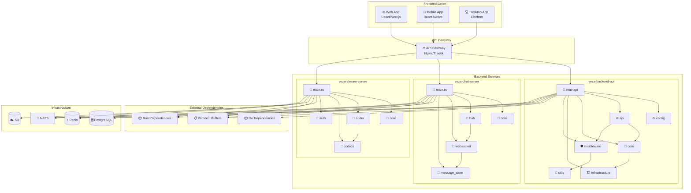
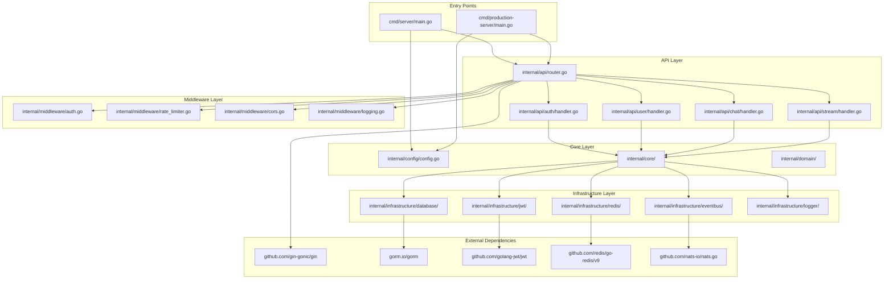
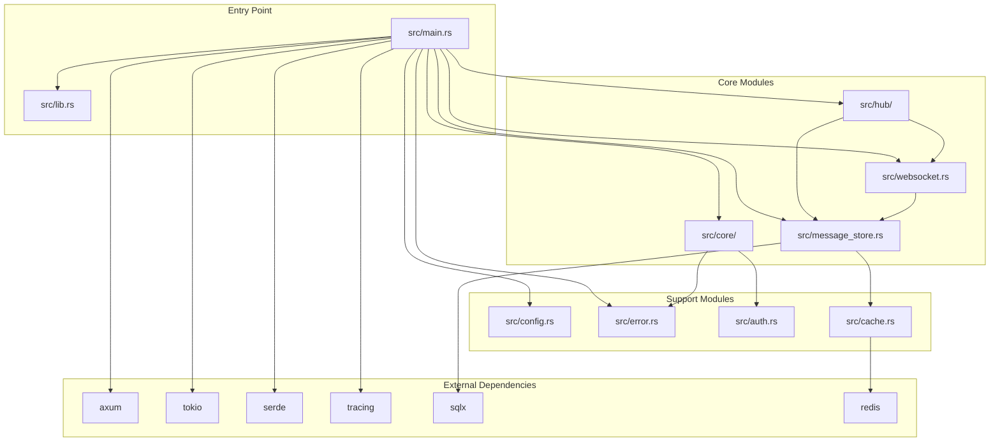
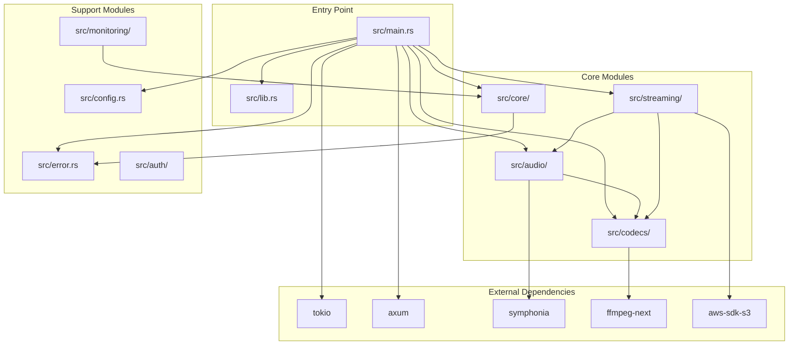
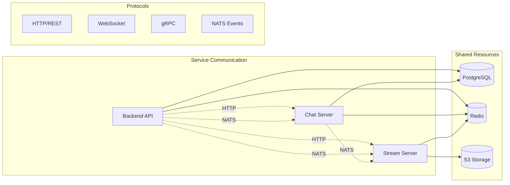
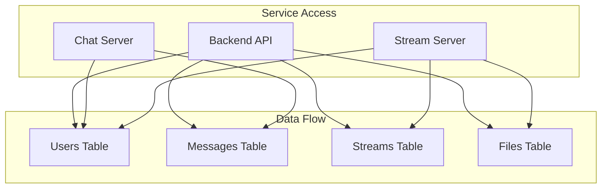
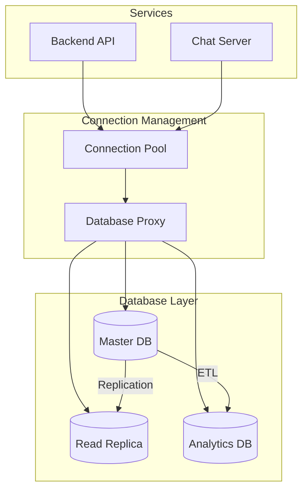
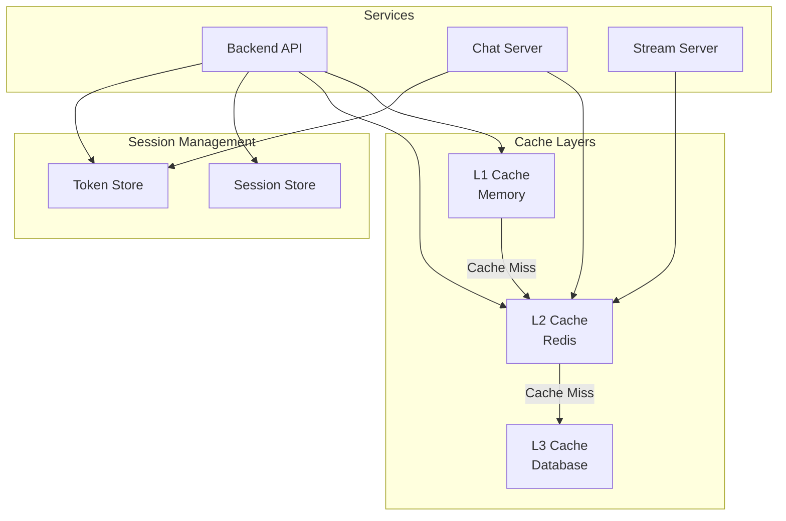
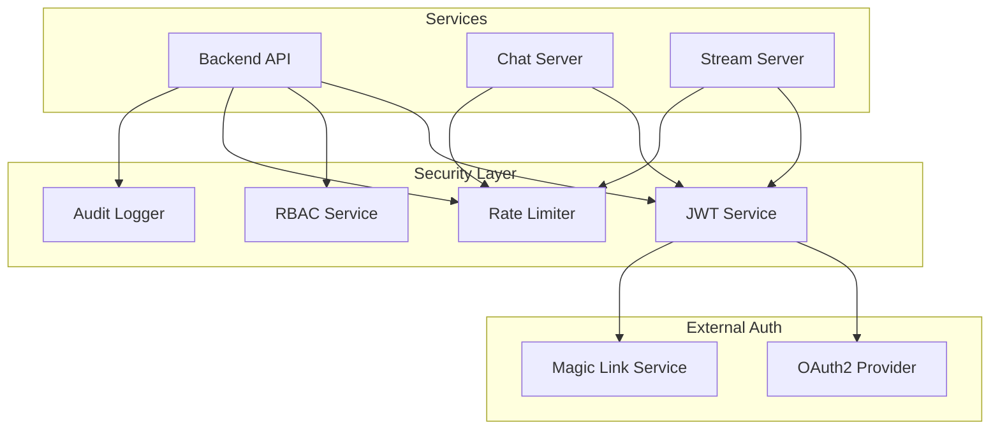
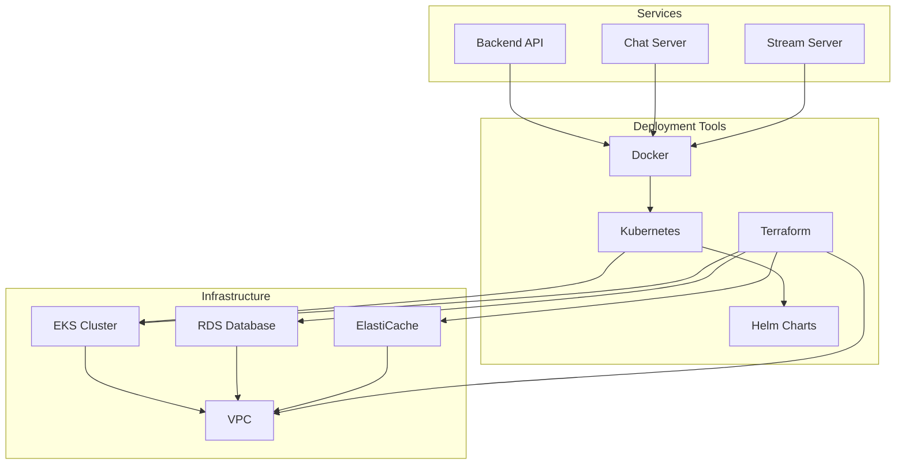

# Carte des Dépendances - Veza Platform

## Vue d'ensemble

Ce document mappe toutes les dépendances entre les modules et services de la plateforme Veza, permettant de comprendre les relations et l'architecture du système.

## Diagramme de Dépendances Principal


```mermaid
graph TB
    subgraph "Frontend Layer"
        Web[🌐 Web App<br/>React/Next.js]
        Mobile[📱 Mobile App<br/>React Native]
        Desktop[💻 Desktop App<br/>Electron]
    end
    
    subgraph "API Gateway"
        Gateway[⚖️ API Gateway<br/>Nginx/Traefik]
    end
    
    subgraph "Backend Services"
        subgraph "veza-backend-api"
            Main[🔧 main.go]
            Config[⚙️ config]
            API[🌐 api]
            Core[🧠 core]
            Infra[🏗️ infrastructure]
            Middleware[🛡️ middleware]
            Utils[🔧 utils]
        end
        
        subgraph "veza-chat-server"
            ChatMain[🔧 main.rs]
            ChatCore[🧠 core]
            ChatHub[🔄 hub]
            ChatWS[🔌 websocket]
            ChatStore[💾 message_store]
        end
        
        subgraph "veza-stream-server"
            StreamMain[🔧 main.rs]
            StreamCore[🧠 core]
            StreamAudio[🎵 audio]
            StreamCodecs[🎼 codecs]
            StreamAuth[🔐 auth]
        end
    end
    
    subgraph "External Dependencies"
        GoDeps[📦 Go Dependencies]
        RustDeps[📦 Rust Dependencies]
        Proto[📋 Protocol Buffers]
    end
    
    subgraph "Infrastructure"
        DB[(🗄️ PostgreSQL)]
        Redis[(⚡ Redis)]
        NATS[🔄 NATS]
        S3[(☁️ S3)]
    end
    
    %% Frontend to Gateway
    Web --> Gateway
    Mobile --> Gateway
    Desktop --> Gateway
    
    %% Gateway to Services
    Gateway --> Main
    Gateway --> ChatMain
    Gateway --> StreamMain
    
    %% Backend API Internal Dependencies
    Main --> Config
    Main --> API
    Main --> Core
    Main --> Infra
    Main --> Middleware
    API --> Core
    API --> Middleware
    Core --> Infra
    Middleware --> Utils
    
    %% Chat Server Internal Dependencies
    ChatMain --> ChatCore
    ChatMain --> ChatHub
    ChatMain --> ChatWS
    ChatMain --> ChatStore
    ChatHub --> ChatWS
    ChatWS --> ChatStore
    
    %% Stream Server Internal Dependencies
    StreamMain --> StreamCore
    StreamMain --> StreamAudio
    StreamMain --> StreamCodecs
    StreamMain --> StreamAuth
    StreamAudio --> StreamCodecs
    
    %% External Dependencies
    Main --> GoDeps
    ChatMain --> RustDeps
    StreamMain --> RustDeps
    Main --> Proto
    ChatMain --> Proto
    StreamMain --> Proto
    
    %% Infrastructure Dependencies
    Main --> DB
    Main --> Redis
    Main --> NATS
    ChatMain --> DB
    ChatMain --> Redis
    ChatMain --> NATS
    StreamMain --> S3
    StreamMain --> Redis
    StreamMain --> NATS
```

## Dépendances Détaillées par Service

### 1. Backend API (Go)

#### Structure des Dépendances


```mermaid
graph TD
    subgraph "Entry Points"
        Main[cmd/server/main.go]
        ProdMain[cmd/production-server/main.go]
    end
    
    subgraph "Core Layer"
        Config[internal/config/config.go]
        Core[internal/core/]
        Domain[internal/domain/]
    end
    
    subgraph "API Layer"
        Router[internal/api/router.go]
        AuthHandler[internal/api/auth/handler.go]
        UserHandler[internal/api/user/handler.go]
        ChatHandler[internal/api/chat/handler.go]
        StreamHandler[internal/api/stream/handler.go]
    end
    
    subgraph "Infrastructure Layer"
        Database[internal/infrastructure/database/]
        Redis[internal/infrastructure/redis/]
        NATS[internal/infrastructure/eventbus/]
        JWT[internal/infrastructure/jwt/]
        Logger[internal/infrastructure/logger/]
    end
    
    subgraph "Middleware Layer"
        Auth[internal/middleware/auth.go]
        RateLimit[internal/middleware/rate_limiter.go]
        CORS[internal/middleware/cors.go]
        Logging[internal/middleware/logging.go]
    end
    
    subgraph "External Dependencies"
        Gin[github.com/gin-gonic/gin]
        GORM[gorm.io/gorm]
        JWTGo[github.com/golang-jwt/jwt]
        RedisGo[github.com/redis/go-redis/v9]
        NATSGo[github.com/nats-io/nats.go]
    end
    
    %% Entry Points
    Main --> Config
    Main --> Router
    ProdMain --> Config
    ProdMain --> Router
    
    %% API Layer
    Router --> AuthHandler
    Router --> UserHandler
    Router --> ChatHandler
    Router --> StreamHandler
    Router --> Auth
    Router --> RateLimit
    Router --> CORS
    Router --> Logging
    
    %% Handlers to Core
    AuthHandler --> Core
    UserHandler --> Core
    ChatHandler --> Core
    StreamHandler --> Core
    
    %% Core to Infrastructure
    Core --> Database
    Core --> Redis
    Core --> NATS
    Core --> JWT
    Core --> Logger
    
    %% Infrastructure to External
    Database --> GORM
    Redis --> RedisGo
    NATS --> NATSGo
    JWT --> JWTGo
    Router --> Gin
```

#### Dépendances Externes Go

```go
// go.mod dependencies
require (
    github.com/gin-gonic/gin v1.9.1
    gorm.io/gorm v1.25.5
    gorm.io/driver/postgres v1.5.4
    github.com/golang-jwt/jwt/v5 v5.2.0
    github.com/redis/go-redis/v9 v9.3.1
    github.com/nats-io/nats.go v1.31.0
    github.com/joho/godotenv v1.5.1
    github.com/google/uuid v1.5.0
    golang.org/x/crypto v0.17.0
    github.com/prometheus/client_golang v1.17.0
)
```

### 2. Chat Server (Rust)

#### Structure des Dépendances


```mermaid
graph TD
    subgraph "Entry Point"
        Main[src/main.rs]
        Lib[src/lib.rs]
    end
    
    subgraph "Core Modules"
        Core[src/core/]
        Hub[src/hub/]
        WebSocket[src/websocket.rs]
        MessageStore[src/message_store.rs]
    end
    
    subgraph "Support Modules"
        Config[src/config.rs]
        Error[src/error.rs]
        Auth[src/auth.rs]
        Cache[src/cache.rs]
    end
    
    subgraph "External Dependencies"
        Axum[axum]
        Tokio[tokio]
        Serde[serde]
        Tracing[tracing]
        SQLx[sqlx]
        Redis[redis]
    end
    
    %% Entry Points
    Main --> Lib
    Main --> Core
    Main --> Hub
    Main --> WebSocket
    Main --> MessageStore
    Main --> Config
    Main --> Error
    
    %% Core Dependencies
    Core --> Error
    Core --> Auth
    Hub --> WebSocket
    Hub --> MessageStore
    WebSocket --> MessageStore
    MessageStore --> Cache
    
    %% External Dependencies
    Main --> Axum
    Main --> Tokio
    Main --> Serde
    Main --> Tracing
    MessageStore --> SQLx
    Cache --> Redis
```

#### Dépendances Externes Rust

```toml
# Cargo.toml dependencies
[dependencies]
axum = "0.7"
tokio = { version = "1.0", features = ["full"] }
serde = { version = "1.0", features = ["derive"] }
serde_json = "1.0"
tracing = "0.1"
tracing-subscriber = "0.3"
sqlx = { version = "0.7", features = ["runtime-tokio-rustls", "postgres", "chrono", "uuid"] }
redis = { version = "0.23", features = ["tokio-comp"] }
uuid = { version = "1.0", features = ["v4", "serde"] }
chrono = { version = "0.4", features = ["serde"] }
futures-util = "0.3"
```

### 3. Stream Server (Rust)

#### Structure des Dépendances


```mermaid
graph TD
    subgraph "Entry Point"
        Main[src/main.rs]
        Lib[src/lib.rs]
    end
    
    subgraph "Core Modules"
        Core[src/core/]
        Audio[src/audio/]
        Codecs[src/codecs/]
        Streaming[src/streaming/]
    end
    
    subgraph "Support Modules"
        Config[src/config.rs]
        Error[src/error.rs]
        Auth[src/auth/]
        Monitoring[src/monitoring/]
    end
    
    subgraph "External Dependencies"
        Tokio[tokio]
        Axum[axum]
        Symphonia[symphonia]
        FFmpeg[ffmpeg-next]
        AWS[aws-sdk-s3]
    end
    
    %% Entry Points
    Main --> Lib
    Main --> Core
    Main --> Audio
    Main --> Codecs
    Main --> Streaming
    Main --> Config
    Main --> Error
    
    %% Core Dependencies
    Core --> Error
    Audio --> Codecs
    Streaming --> Audio
    Streaming --> Codecs
    Monitoring --> Core
    
    %% External Dependencies
    Main --> Tokio
    Main --> Axum
    Audio --> Symphonia
    Codecs --> FFmpeg
    Streaming --> AWS
```

## Dépendances Cross-Service

### Communication Inter-Services


```mermaid
graph LR
    subgraph "Service Communication"
        API[Backend API]
        Chat[Chat Server]
        Stream[Stream Server]
    end
    
    subgraph "Protocols"
        HTTP[HTTP/REST]
        WebSocket[WebSocket]
        gRPC[gRPC]
        NATS[NATS Events]
    end
    
    subgraph "Shared Resources"
        DB[(PostgreSQL)]
        Redis[(Redis)]
        S3[(S3 Storage)]
    end
    
    %% API to Chat
    API -.->|HTTP| Chat
    API -.->|NATS| Chat
    
    %% API to Stream
    API -.->|HTTP| Stream
    API -.->|NATS| Stream
    
    %% Chat to Stream
    Chat -.->|NATS| Stream
    
    %% Shared Resources
    API --> DB
    API --> Redis
    Chat --> DB
    Chat --> Redis
    Stream --> S3
    Stream --> Redis
```

### Dépendances de Données


```mermaid
graph TD
    subgraph "Data Flow"
        Users[Users Table]
        Messages[Messages Table]
        Streams[Streams Table]
        Files[Files Table]
    end
    
    subgraph "Service Access"
        API[Backend API]
        Chat[Chat Server]
        Stream[Stream Server]
    end
    
    %% API Access
    API --> Users
    API --> Messages
    API --> Streams
    API --> Files
    
    %% Chat Access
    Chat --> Users
    Chat --> Messages
    
    %% Stream Access
    Stream --> Users
    Stream --> Streams
    Stream --> Files
```

## Dépendances d'Infrastructure

### Base de Données


```mermaid
graph TD
    subgraph "Database Layer"
        Master[(Master DB)]
        Replica[(Read Replica)]
        Analytics[(Analytics DB)]
    end
    
    subgraph "Connection Management"
        Pool[Connection Pool]
        Proxy[Database Proxy]
    end
    
    subgraph "Services"
        API[Backend API]
        Chat[Chat Server]
    end
    
    %% Service Connections
    API --> Pool
    Chat --> Pool
    
    %% Pool to Database
    Pool --> Proxy
    Proxy --> Master
    Proxy --> Replica
    Proxy --> Analytics
    
    %% Replication
    Master -->|Replication| Replica
    Master -->|ETL| Analytics
```

### Cache et Session


```mermaid
graph TD
    subgraph "Cache Layers"
        L1[L1 Cache<br/>Memory]
        L2[L2 Cache<br/>Redis]
        L3[L3 Cache<br/>Database]
    end
    
    subgraph "Session Management"
        SessionStore[Session Store]
        TokenStore[Token Store]
    end
    
    subgraph "Services"
        API[Backend API]
        Chat[Chat Server]
        Stream[Stream Server]
    end
    
    %% Service to Cache
    API --> L1
    API --> L2
    Chat --> L2
    Stream --> L2
    
    %% Session Management
    API --> SessionStore
    API --> TokenStore
    Chat --> TokenStore
    
    %% Cache Hierarchy
    L1 -->|Cache Miss| L2
    L2 -->|Cache Miss| L3
```

## Dépendances de Sécurité

### Authentification et Autorisation


```mermaid
graph TD
    subgraph "Security Layer"
        JWT[JWT Service]
        RBAC[RBAC Service]
        RateLimit[Rate Limiter]
        Audit[Audit Logger]
    end
    
    subgraph "Services"
        API[Backend API]
        Chat[Chat Server]
        Stream[Stream Server]
    end
    
    subgraph "External Auth"
        OAuth[OAuth2 Provider]
        MagicLink[Magic Link Service]
    end
    
    %% Service Dependencies
    API --> JWT
    API --> RBAC
    API --> RateLimit
    API --> Audit
    
    Chat --> JWT
    Chat --> RateLimit
    
    Stream --> JWT
    Stream --> RateLimit
    
    %% External Dependencies
    JWT --> OAuth
    JWT --> MagicLink
```

## Dépendances de Monitoring

### Observabilité

```mermaid
graph TD
    subgraph "Monitoring Stack"
        Prometheus[Prometheus]
        Grafana[Grafana]
        Jaeger[Jaeger]
        ELK[ELK Stack]
    end
    
    subgraph "Services"
        API[Backend API]
        Chat[Chat Server]
        Stream[Stream Server]
    end
    
    subgraph "Metrics"
        Metrics[Custom Metrics]
        Logs[Structured Logs]
        Traces[Distributed Traces]
    end
    
    %% Service to Monitoring
    API --> Metrics
    API --> Logs
    API --> Traces
    
    Chat --> Metrics
    Chat --> Logs
    Chat --> Traces
    
    Stream --> Metrics
    Stream --> Logs
    Stream --> Traces
    
    %% Monitoring Stack
    Metrics --> Prometheus
    Logs --> ELK
    Traces --> Jaeger
    
    Prometheus --> Grafana
    ELK --> Grafana
    Jaeger --> Grafana
```

## Dépendances de Déploiement

### Infrastructure as Code


```mermaid
graph TD
    subgraph "Deployment Tools"
        Docker[Docker]
        K8s[Kubernetes]
        Terraform[Terraform]
        Helm[Helm Charts]
    end
    
    subgraph "Services"
        API[Backend API]
        Chat[Chat Server]
        Stream[Stream Server]
    end
    
    subgraph "Infrastructure"
        VPC[VPC]
        EKS[EKS Cluster]
        RDS[RDS Database]
        ElastiCache[ElastiCache]
    end
    
    %% Service Containers
    API --> Docker
    Chat --> Docker
    Stream --> Docker
    
    %% Orchestration
    Docker --> K8s
    K8s --> Helm
    
    %% Infrastructure
    K8s --> EKS
    EKS --> VPC
    RDS --> VPC
    ElastiCache --> VPC
    
    %% IaC
    Terraform --> VPC
    Terraform --> EKS
    Terraform --> RDS
    Terraform --> ElastiCache
```

## Analyse des Dépendances

### Métriques de Couplage

| Service | Dépendances Internes | Dépendances Externes | Couplage |
|---------|---------------------|---------------------|----------|
| Backend API | 15 modules | 8 packages | Faible |
| Chat Server | 8 modules | 12 crates | Moyen |
| Stream Server | 6 modules | 10 crates | Moyen |

### Points de Défaillance

1. **Base de Données** : Point de défaillance unique pour API et Chat
2. **Redis** : Cache partagé entre tous les services
3. **NATS** : Bus d'événements centralisé
4. **JWT Service** : Authentification centralisée

### Recommandations d'Optimisation

1. **Circuit Breakers** : Implémenter pour les dépendances externes
2. **Fallbacks** : Cache local pour les services critiques
3. **Monitoring** : Surveillance des dépendances
4. **Documentation** : Mise à jour automatique des dépendances

---

**Dernière mise à jour** : $(date)
**Version de la carte** : 1.0.0 