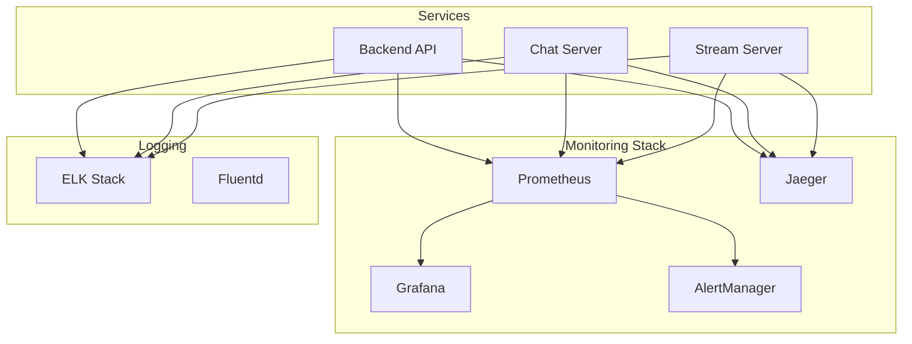

# 📊 Monitoring et Observabilité - Veza Platform

## Vue d'ensemble

Le système de monitoring de Veza est basé sur Prometheus, Grafana et Jaeger pour assurer une observabilité complète de la plateforme de streaming audio et chat en temps réel.

---

## Architecture du monitoring



---

## Métriques principales

### Métriques d'application

```go
// internal/monitoring/metrics.go
package monitoring

import (
    "github.com/prometheus/client_golang/prometheus"
    "github.com/prometheus/client_golang/prometheus/promauto"
)

var (
    // Métriques HTTP
    HTTPRequestsTotal = promauto.NewCounterVec(
        prometheus.CounterOpts{
            Name: "http_requests_total",
            Help: "Total number of HTTP requests",
        },
        []string{"method", "endpoint", "status"},
    )

    HTTPRequestDuration = promauto.NewHistogramVec(
        prometheus.HistogramOpts{
            Name:    "http_request_duration_seconds",
            Help:    "HTTP request duration in seconds",
            Buckets: prometheus.DefBuckets,
        },
        []string{"method", "endpoint"},
    )

    // Métriques de base de données
    DatabaseConnections = promauto.NewGauge(
        prometheus.GaugeOpts{
            Name: "database_connections_active",
            Help: "Number of active database connections",
        },
    )

    DatabaseQueryDuration = promauto.NewHistogramVec(
        prometheus.HistogramOpts{
            Name:    "database_query_duration_seconds",
            Help:    "Database query duration in seconds",
            Buckets: prometheus.DefBuckets,
        },
        []string{"query_type"},
    )

    // Métriques Redis
    RedisConnections = promauto.NewGauge(
        prometheus.GaugeOpts{
            Name: "redis_connections_active",
            Help: "Number of active Redis connections",
        },
    )

    RedisMemoryUsage = promauto.NewGauge(
        prometheus.GaugeOpts{
            Name: "redis_memory_usage_bytes",
            Help: "Redis memory usage in bytes",
        },
    )

    // Métriques WebSocket
    WebSocketConnections = promauto.NewGauge(
        prometheus.GaugeOpts{
            Name: "websocket_connections_active",
            Help: "Number of active WebSocket connections",
        },
    )

    WebSocketMessagesTotal = promauto.NewCounterVec(
        prometheus.CounterOpts{
            Name: "websocket_messages_total",
            Help: "Total number of WebSocket messages",
        },
        []string{"message_type"},
    )

    // Métriques de streaming
    StreamSessions = promauto.NewGauge(
        prometheus.GaugeOpts{
            Name: "stream_sessions_active",
            Help: "Number of active streaming sessions",
        },
    )

    StreamBitrate = promauto.NewGaugeVec(
        prometheus.GaugeOpts{
            Name: "stream_bitrate_bps",
            Help: "Stream bitrate in bits per second",
        },
        []string{"stream_id"},
    )
)
```

### Métriques de business

```go
// internal/monitoring/business_metrics.go
package monitoring

import (
    "github.com/prometheus/client_golang/prometheus"
    "github.com/prometheus/client_golang/prometheus/promauto"
)

var (
    // Métriques utilisateurs
    ActiveUsers = promauto.NewGauge(
        prometheus.GaugeOpts{
            Name: "active_users_total",
            Help: "Total number of active users",
        },
    )

    UserRegistrations = promauto.NewCounter(
        prometheus.CounterOpts{
            Name: "user_registrations_total",
            Help: "Total number of user registrations",
        },
    )

    UserLogins = promauto.NewCounter(
        prometheus.CounterOpts{
            Name: "user_logins_total",
            Help: "Total number of user logins",
        },
    )

    // Métriques de contenu
    TracksUploaded = promauto.NewCounter(
        prometheus.CounterOpts{
            Name: "tracks_uploaded_total",
            Help: "Total number of tracks uploaded",
        },
    )

    PlaylistsCreated = promauto.NewCounter(
        prometheus.CounterOpts{
            Name: "playlists_created_total",
            Help: "Total number of playlists created",
        },
    )

    // Métriques de chat
    ChatMessagesSent = promauto.NewCounter(
        prometheus.CounterOpts{
            Name: "chat_messages_sent_total",
            Help: "Total number of chat messages sent",
        },
    )

    ChatRoomsActive = promauto.NewGauge(
        prometheus.GaugeOpts{
            Name: "chat_rooms_active",
            Help: "Number of active chat rooms",
        },
    )

    // Métriques de streaming
    StreamsStarted = promauto.NewCounter(
        prometheus.CounterOpts{
            Name: "streams_started_total",
            Help: "Total number of streams started",
        },
    )

    StreamDuration = promauto.NewHistogram(
        prometheus.HistogramOpts{
            Name:    "stream_duration_seconds",
            Help:    "Stream duration in seconds",
            Buckets: prometheus.DefBuckets,
        },
    )
)
```

---

## Configuration Prometheus

```yaml
# prometheus.yml
global:
  scrape_interval: 15s
  evaluation_interval: 15s

rule_files:
  - "alert_rules.yml"

scrape_configs:
  # Backend API
  - job_name: 'veza-backend-api'
    static_configs:
      - targets: ['localhost:8080']
    metrics_path: '/metrics'
    scrape_interval: 10s
    scrape_timeout: 5s

  # Chat Server
  - job_name: 'veza-chat-server'
    static_configs:
      - targets: ['localhost:3001']
    metrics_path: '/metrics'
    scrape_interval: 10s
    scrape_timeout: 5s

  # Stream Server
  - job_name: 'veza-stream-server'
    static_configs:
      - targets: ['localhost:3002']
    metrics_path: '/metrics'
    scrape_interval: 10s
    scrape_timeout: 5s

  # PostgreSQL
  - job_name: 'postgres'
    static_configs:
      - targets: ['localhost:9187']
    metrics_path: '/metrics'
    scrape_interval: 30s

  # Redis
  - job_name: 'redis'
    static_configs:
      - targets: ['localhost:9121']
    metrics_path: '/metrics'
    scrape_interval: 30s

  # Node Exporter
  - job_name: 'node'
    static_configs:
      - targets: ['localhost:9100']
    metrics_path: '/metrics'
    scrape_interval: 30s
```

---

## Alertes

### Règles d'alerte

```yaml
# alert_rules.yml
groups:
  - name: veza_alerts
    rules:
      # Alertes de disponibilité
      - alert: ServiceDown
        expr: up == 0
        for: 1m
        labels:
          severity: critical
        annotations:
          summary: "Service {{ $labels.job }} is down"
          description: "Service {{ $labels.job }} has been down for more than 1 minute"

      # Alertes de performance
      - alert: HighResponseTime
        expr: histogram_quantile(0.95, http_request_duration_seconds) > 1
        for: 5m
        labels:
          severity: warning
        annotations:
          summary: "High response time for {{ $labels.job }}"
          description: "95th percentile response time is above 1 second"

      # Alertes de base de données
      - alert: DatabaseConnectionsHigh
        expr: database_connections_active > 80
        for: 2m
        labels:
          severity: warning
        annotations:
          summary: "High number of database connections"
          description: "Database has more than 80 active connections"

      # Alertes de mémoire
      - alert: HighMemoryUsage
        expr: (node_memory_MemTotal_bytes - node_memory_MemAvailable_bytes) / node_memory_MemTotal_bytes > 0.9
        for: 5m
        labels:
          severity: warning
        annotations:
          summary: "High memory usage"
          description: "Memory usage is above 90%"

      # Alertes de disque
      - alert: DiskSpaceFilling
        expr: (node_filesystem_size_bytes - node_filesystem_free_bytes) / node_filesystem_size_bytes > 0.85
        for: 5m
        labels:
          severity: warning
        annotations:
          summary: "Disk space filling up"
          description: "Disk usage is above 85%"

      # Alertes de business
      - alert: NoActiveUsers
        expr: active_users_total == 0
        for: 10m
        labels:
          severity: warning
        annotations:
          summary: "No active users"
          description: "No users have been active for 10 minutes"

      - alert: HighErrorRate
        expr: rate(http_requests_total{status=~"5.."}[5m]) / rate(http_requests_total[5m]) > 0.05
        for: 2m
        labels:
          severity: critical
        annotations:
          summary: "High error rate"
          description: "Error rate is above 5%"
```

---

## Dashboards Grafana

### Dashboard principal

```json
{
  "dashboard": {
    "id": null,
    "title": "Veza Platform Overview",
    "tags": ["veza", "overview"],
    "timezone": "browser",
    "panels": [
      {
        "id": 1,
        "title": "Active Users",
        "type": "stat",
        "targets": [
          {
            "expr": "active_users_total",
            "legendFormat": "Active Users"
          }
        ],
        "fieldConfig": {
          "defaults": {
            "color": {
              "mode": "palette-classic"
            },
            "custom": {
              "displayMode": "auto"
            }
          }
        }
      },
      {
        "id": 2,
        "title": "HTTP Request Rate",
        "type": "graph",
        "targets": [
          {
            "expr": "rate(http_requests_total[5m])",
            "legendFormat": "{{method}} {{endpoint}}"
          }
        ]
      },
      {
        "id": 3,
        "title": "Response Time",
        "type": "graph",
        "targets": [
          {
            "expr": "histogram_quantile(0.95, http_request_duration_seconds)",
            "legendFormat": "95th percentile"
          }
        ]
      },
      {
        "id": 4,
        "title": "Database Connections",
        "type": "graph",
        "targets": [
          {
            "expr": "database_connections_active",
            "legendFormat": "Active Connections"
          }
        ]
      },
      {
        "id": 5,
        "title": "WebSocket Connections",
        "type": "graph",
        "targets": [
          {
            "expr": "websocket_connections_active",
            "legendFormat": "Active Connections"
          }
        ]
      },
      {
        "id": 6,
        "title": "Stream Sessions",
        "type": "graph",
        "targets": [
          {
            "expr": "stream_sessions_active",
            "legendFormat": "Active Sessions"
          }
        ]
      }
    ],
    "time": {
      "from": "now-1h",
      "to": "now"
    },
    "refresh": "30s"
  }
}
```

---

## Health Checks

### Implémentation Go

```go
// internal/monitoring/health.go
package monitoring

import (
    "context"
    "encoding/json"
    "fmt"
    "net/http"
    "runtime"
    "time"
    
    "github.com/go-redis/redis/v8"
    "github.com/jackc/pgx/v4"
)

type Check struct {
    Status string `json:"status"`
    Error  string `json:"error,omitempty"`
}

type HealthChecker struct {
    db    *pgx.Pool
    redis *redis.Client
}

func NewHealthChecker(db *pgx.Pool, redis *redis.Client) *HealthChecker {
    return &HealthChecker{
        db:    db,
        redis: redis,
    }
}

// Endpoint de liveness
func (h *HealthChecker) LiveHandler(w http.ResponseWriter, r *http.Request) {
    status := map[string]interface{}{
        "status": "alive",
        "timestamp": time.Now().Unix(),
        "uptime": time.Since(startTime).String(),
    }
    
    w.Header().Set("Content-Type", "application/json")
    w.WriteHeader(http.StatusOK)
    json.NewEncoder(w).Encode(status)
}

func (h *HealthChecker) checkDatabase() error {
    ctx, cancel := context.WithTimeout(context.Background(), 5*time.Second)
    defer cancel()
    
    return h.db.PingContext(ctx)
}

func (h *HealthChecker) checkRedis() error {
    ctx, cancel := context.WithTimeout(context.Background(), 5*time.Second)
    defer cancel()
    
    return h.redis.Ping(ctx).Err()
}

func (h *HealthChecker) checkMemory() error {
    var m runtime.MemStats
    runtime.ReadMemStats(&m)
    
    // Vérifier si l'utilisation mémoire dépasse 80%
    if m.Alloc > 1024*1024*1024 { // 1GB
        return fmt.Errorf("high memory usage: %d MB", m.Alloc/1024/1024)
    }
    
    return nil
}

func (h *HealthChecker) checkGoroutines() error {
    count := runtime.NumGoroutine()
    
    // Vérifier si le nombre de goroutines est raisonnable
    if count > 10000 {
        return fmt.Errorf("high number of goroutines: %d", count)
    }
    
    return nil
}

// Endpoint de readiness
func (h *HealthChecker) ReadyHandler(w http.ResponseWriter, r *http.Request) {
    // Vérifications de base pour la readiness
    checks := make(map[string]Check)
    
    // Base de données
    if err := h.checkDatabase(); err != nil {
        checks["database"] = Check{
            Status: "unready",
            Error:  err.Error(),
        }
    } else {
        checks["database"] = Check{
            Status: "ready",
        }
    }
    
    // Redis
    if err := h.checkRedis(); err != nil {
        checks["redis"] = Check{
            Status: "unready",
            Error:  err.Error(),
        }
    } else {
        checks["redis"] = Check{
            Status: "ready",
        }
    }
    
    // Si tous les services sont prêts
    allReady := true
    for _, check := range checks {
        if check.Status != "ready" {
            allReady = false
            break
        }
    }
    
    w.Header().Set("Content-Type", "application/json")
    if allReady {
        w.WriteHeader(http.StatusOK)
        json.NewEncoder(w).Encode(map[string]interface{}{
            "status": "ready",
            "checks": checks,
        })
    } else {
        w.WriteHeader(http.StatusServiceUnavailable)
        json.NewEncoder(w).Encode(map[string]interface{}{
            "status": "unready",
            "checks": checks,
        })
    }
}
```

---

## Métriques de performance

### Métriques système

```go
// internal/monitoring/system_metrics.go
package monitoring

import (
    "runtime"
    "time"
    "github.com/shirou/gopsutil/v3/cpu"
    "github.com/shirou/gopsutil/v3/mem"
    "github.com/shirou/gopsutil/v3/disk"
)

var (
    // Métriques système
    SystemCPUUsage = promauto.NewGauge(
        prometheus.GaugeOpts{
            Name: "system_cpu_usage_percent",
            Help: "System CPU usage percentage",
        },
    )

    SystemMemoryUsage = promauto.NewGauge(
        prometheus.GaugeOpts{
            Name: "system_memory_usage_bytes",
            Help: "System memory usage in bytes",
        },
    )

    SystemDiskUsage = promauto.NewGaugeVec(
        prometheus.GaugeOpts{
            Name: "system_disk_usage_bytes",
            Help: "System disk usage in bytes",
        },
        []string{"mountpoint"},
    )

    SystemLoadAverage = promauto.NewGaugeVec(
        prometheus.GaugeOpts{
            Name: "system_load_average",
            Help: "System load average",
        },
        []string{"period"},
    )
)

func CollectSystemMetrics() {
    ticker := time.NewTicker(30 * time.Second)
    defer ticker.Stop()
    
    for range ticker.C {
        // CPU usage
        if cpuPercent, err := cpu.Percent(0, false); err == nil && len(cpuPercent) > 0 {
            SystemCPUUsage.Set(cpuPercent[0])
        }
        
        // Memory usage
        if vmstat, err := mem.VirtualMemory(); err == nil {
            SystemMemoryUsage.Set(float64(vmstat.Used))
        }
        
        // Disk usage
        if partitions, err := disk.Partitions(false); err == nil {
            for _, partition := range partitions {
                if usage, err := disk.Usage(partition.Mountpoint); err == nil {
                    SystemDiskUsage.WithLabelValues(partition.Mountpoint).Set(float64(usage.Used))
                }
            }
        }
        
        // Load average
        if load, err := cpu.LoadAvg(); err == nil {
            SystemLoadAverage.WithLabelValues("1m").Set(load.Load1)
            SystemLoadAverage.WithLabelValues("5m").Set(load.Load5)
            SystemLoadAverage.WithLabelValues("15m").Set(load.Load15)
        }
    }
}
```

---

## Liens croisés

- [API backend](../api/)
- [Base de données](../database/)
- [Tests de performance](../testing/performance/)
- [Déploiement](../deployment/)
- [Sécurité](../security/)

---

## Pour aller plus loin

- [Guide des alertes](./alerts/README.md)
- [Configuration Grafana](./grafana/README.md)
- [Logging avancé](./logging/README.md)
- [Métriques personnalisées](./metrics/README.md)
- [FAQ et troubleshooting](../reference/README.md) 