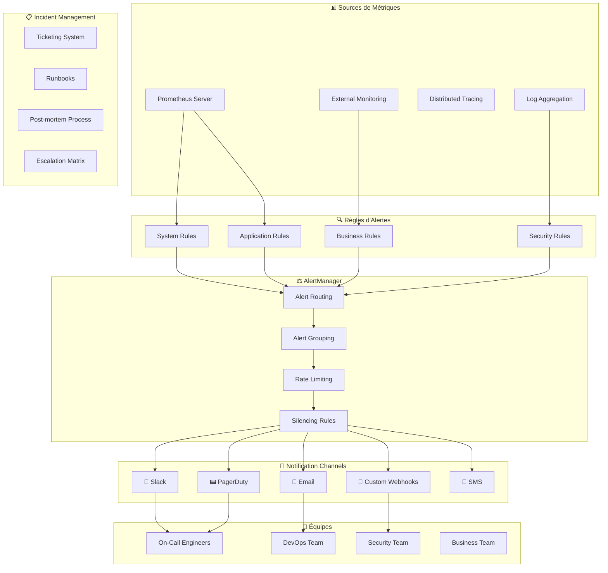

# 🚨 Guide des Alertes - Veza Platform

## 🎯 Objectif

Ce guide détaille la configuration complète du système d'alerting pour la plateforme Veza, incluant la définition des seuils, la hiérarchisation, l'escalation et la gestion des incidents.

## 🏗️ Architecture d'alerting



## 🚨 Hiérarchie des alertes

### 🔴 P1 - Critique (Immédiat)

**Critères** :
- Service complètement indisponible
- Perte de données
- Faille de sécurité majeure
- SLA critique non respecté

**Temps de réponse** : **< 5 minutes**  
**Escalation** : **< 15 minutes**  
**Notification** : PagerDuty + SMS + Slack

#### Exemples d'alertes P1

```yaml
# Service complètement down
- alert: ServiceDown
  expr: up == 0
  for: 30s
  labels:
    severity: critical
    priority: P1
  annotations:
    summary: "🔴 SERVICE DOWN: {{ $labels.job }} instance {{ $labels.instance }}"
    description: |
      Service {{ $labels.job }} instance {{ $labels.instance }} has been down for more than 30 seconds.
      Impact: Complete service unavailability
      Runbook: https://runbooks.veza.com/service-down
    pagerduty_severity: critical

# Taux d'erreur critique
- alert: CriticalErrorRate
  expr: rate(http_requests_total{status=~"5.."}[5m]) / rate(http_requests_total[5m]) > 0.20
  for: 2m
  labels:
    severity: critical
    priority: P1
  annotations:
    summary: "🔴 CRITICAL ERROR RATE: {{ $value | humanizePercentage }} on {{ $labels.instance }}"
    description: |
      Error rate is {{ $value | humanizePercentage }} for more than 2 minutes
      Current threshold: >20%
      Impact: Major service degradation
      Runbook: https://runbooks.veza.com/high-error-rate

# Base de données inaccessible
- alert: DatabaseDown
  expr: pg_up == 0
  for: 1m
  labels:
    severity: critical
    priority: P1
  annotations:
    summary: "🔴 DATABASE DOWN: PostgreSQL instance {{ $labels.instance }}"
    description: |
      PostgreSQL database is unreachable for more than 1 minute
      Impact: Complete application failure
      Runbook: https://runbooks.veza.com/database-down
```

### 🟡 P2 - Important (< 30 minutes)

**Critères** :
- Dégradation notable de performance
- Composant non-critique indisponible
- Approche des limites de capacité
- Erreurs sporadiques

**Temps de réponse** : **< 30 minutes**  
**Escalation** : **< 2 heures**  
**Notification** : Slack + Email

#### Exemples d'alertes P2

```yaml
# Latence élevée
- alert: HighLatency
  expr: histogram_quantile(0.95, rate(http_request_duration_seconds_bucket[5m])) > 0.5
  for: 5m
  labels:
    severity: warning
    priority: P2
  annotations:
    summary: "🟡 HIGH LATENCY: P95 {{ $value }}s on {{ $labels.instance }}"
    description: |
      95th percentile latency is {{ $value }}s for more than 5 minutes
      Target: <200ms, Warning: >500ms
      Impact: User experience degradation

# Utilisation mémoire élevée
- alert: HighMemoryUsage
  expr: (1 - (node_memory_MemAvailable_bytes / node_memory_MemTotal_bytes)) * 100 > 85
  for: 5m
  labels:
    severity: warning
    priority: P2
  annotations:
    summary: "🟡 HIGH MEMORY: {{ $value }}% on {{ $labels.instance }}"
    description: |
      Memory usage is {{ $value }}% for more than 5 minutes
      Warning threshold: 85%
      Critical threshold: 95%

# Connexions base de données élevées
- alert: HighDatabaseConnections
  expr: sum(pg_stat_activity_count) / pg_settings_max_connections * 100 > 80
  for: 3m
  labels:
    severity: warning
    priority: P2
  annotations:
    summary: "🟡 HIGH DB CONNECTIONS: {{ $value }}% of max connections"
    description: |
      Database connections at {{ $value }}% of maximum capacity
      Current: {{ $value }}% of {{ pg_settings_max_connections }}
      Warning threshold: 80%
```

### 🔵 P3 - Information (< 4 heures)

**Critères** :
- Maintenance préventive requise
- Tendances à surveiller
- Optimisations possibles
- Alertes de capacité

**Temps de réponse** : **< 4 heures**  
**Escalation** : **< 24 heures**  
**Notification** : Slack uniquement

#### Exemples d'alertes P3

```yaml
# Espace disque warning
- alert: DiskSpaceWarning
  expr: (1 - (node_filesystem_avail_bytes / node_filesystem_size_bytes)) * 100 > 80
  for: 10m
  labels:
    severity: info
    priority: P3
  annotations:
    summary: "🔵 DISK SPACE WARNING: {{ $value }}% on {{ $labels.mountpoint }}"
    description: |
      Disk usage is {{ $value }}% on {{ $labels.mountpoint }}
      Warning threshold: 80%
      Critical threshold: 90%
      Time to full: {{ predict_linear(node_filesystem_avail_bytes[6h], 24*3600) }}

# SSL certificat expire bientôt
- alert: SSLCertificateExpiry
  expr: (x509_cert_expiry - time()) / 86400 < 30
  for: 1h
  labels:
    severity: info
    priority: P3
  annotations:
    summary: "🔵 SSL CERTIFICATE EXPIRY: {{ $value }} days remaining"
    description: |
      SSL certificate for {{ $labels.subject }} expires in {{ $value }} days
      Certificate: {{ $labels.subject }}
      Issuer: {{ $labels.issuer }}
```

## 📋 Configuration AlertManager

### 🔧 Fichier de configuration principal

```yaml
# alertmanager.yml
global:
  smtp_smarthost: 'smtp.veza.com:587'
  smtp_from: 'alerts@veza.com'
  smtp_auth_username: 'alerts@veza.com'
  smtp_auth_password: '${SMTP_PASSWORD}'
  
  slack_api_url: '${SLACK_WEBHOOK_URL}'
  pagerduty_url: 'https://events.pagerduty.com/v2/enqueue'

# Templates pour les messages
templates:
  - '/etc/alertmanager/templates/*.tmpl'

# Routing des alertes
route:
  group_by: ['alertname', 'cluster', 'service']
  group_wait: 30s
  group_interval: 5m
  repeat_interval: 12h
  receiver: 'default'
  
  routes:
  # Alertes critiques P1
  - match:
      priority: P1
    receiver: 'pagerduty-critical'
    group_wait: 10s
    group_interval: 2m
    repeat_interval: 5m
    
  # Alertes importantes P2  
  - match:
      priority: P2
    receiver: 'slack-warnings'
    group_wait: 1m
    group_interval: 5m
    repeat_interval: 2h
    
  # Alertes info P3
  - match:
      priority: P3
    receiver: 'slack-info'
    group_wait: 5m
    group_interval: 15m
    repeat_interval: 24h
    
  # Alertes sécurité
  - match:
      category: security
    receiver: 'security-team'
    group_wait: 30s
    repeat_interval: 1h

# Définition des receivers
receivers:
# PagerDuty pour alertes critiques
- name: 'pagerduty-critical'
  pagerduty_configs:
  - service_key: '${PAGERDUTY_SERVICE_KEY}'
    description: '{{ range .Alerts }}{{ .Annotations.summary }}{{ end }}'
    details:
      firing: '{{ .Alerts.Firing | len }}'
      resolved: '{{ .Alerts.Resolved | len }}'
      environment: '{{ .CommonLabels.environment }}'
  
  slack_configs:
  - channel: '#alerts-critical'
    title: '🔴 CRITICAL ALERT'
    text: |
      {{ range .Alerts }}
      *Alert:* {{ .Annotations.summary }}
      *Description:* {{ .Annotations.description }}
      *Runbook:* {{ .Annotations.runbook_url }}
      {{ end }}
    color: danger

# Slack pour alertes warnings
- name: 'slack-warnings'
  slack_configs:
  - channel: '#alerts-warnings'
    title: '🟡 WARNING ALERT'
    text: |
      {{ range .Alerts }}
      *Alert:* {{ .Annotations.summary }}
      *Description:* {{ .Annotations.description }}
      {{ end }}
    color: warning

# Slack pour alertes info
- name: 'slack-info'
  slack_configs:
  - channel: '#alerts-info'
    title: '🔵 INFO ALERT'
    text: |
      {{ range .Alerts }}
      *Alert:* {{ .Annotations.summary }}
      *Description:* {{ .Annotations.description }}
      {{ end }}
    color: good

# Équipe sécurité
- name: 'security-team'
  email_configs:
  - to: 'security@veza.com'
    subject: '🔒 SECURITY ALERT: {{ .GroupLabels.alertname }}'
    body: |
      {{ range .Alerts }}
      Alert: {{ .Annotations.summary }}
      Description: {{ .Annotations.description }}
      Time: {{ .StartsAt }}
      Labels: {{ .Labels }}
      {{ end }}
  
  slack_configs:
  - channel: '#security-alerts'
    title: '🔒 SECURITY ALERT'
    text: |
      {{ range .Alerts }}
      *Alert:* {{ .Annotations.summary }}
      *Severity:* {{ .Labels.severity }}
      *Time:* {{ .StartsAt }}
      {{ end }}
    color: danger

# Default receiver
- name: 'default'
  slack_configs:
  - channel: '#alerts-general'
    title: 'Alert'
    text: '{{ range .Alerts }}{{ .Annotations.summary }}{{ end }}'

# Règles de silencing
inhibit_rules:
- source_match:
    severity: 'critical'
  target_match:
    severity: 'warning'
  equal: ['alertname', 'instance']
```

### 📱 Templates de notification

#### Template Slack

```go
// slack.tmpl
{{ define "slack.title" }}
{{ if eq .Status "firing" }}🔥{{ else }}✅{{ end }} {{ .GroupLabels.alertname }}
{{ end }}

{{ define "slack.text" }}
{{ if .CommonAnnotations.summary }}
*Summary:* {{ .CommonAnnotations.summary }}
{{ end }}

{{ if .CommonAnnotations.description }}
*Description:* {{ .CommonAnnotations.description }}
{{ end }}

*Environment:* {{ .CommonLabels.environment | default "unknown" }}
*Service:* {{ .CommonLabels.service | default "unknown" }}

{{ if .CommonAnnotations.runbook_url }}
*Runbook:* {{ .CommonAnnotations.runbook_url }}
{{ end }}

*Firing Alerts:* {{ len .Alerts.Firing }}
*Resolved Alerts:* {{ len .Alerts.Resolved }}

{{ range .Alerts }}
{{ if .Labels.instance }}*Instance:* {{ .Labels.instance }}{{ end }}
{{ if .StartsAt }}*Started:* {{ .StartsAt | date "2006-01-02 15:04:05" }}{{ end }}
{{ end }}
{{ end }}
```

#### Template Email

```html
<!-- email.tmpl -->
{{ define "email.subject" }}
[{{ .Status | toUpper }}] {{ .GroupLabels.alertname }} - {{ .CommonLabels.environment }}
{{ end }}

{{ define "email.html" }}
<!DOCTYPE html>
<html>
<head>
    <style>
        .alert-critical { background-color: #ffebee; border-left: 5px solid #f44336; }
        .alert-warning { background-color: #fff3e0; border-left: 5px solid #ff9800; }
        .alert-info { background-color: #e3f2fd; border-left: 5px solid #2196f3; }
        .alert-box { padding: 15px; margin: 10px 0; font-family: Arial, sans-serif; }
    </style>
</head>
<body>
    <h2>Alert Notification</h2>
    
    {{ range .Alerts }}
    <div class="alert-box alert-{{ .Labels.severity }}">
        <h3>{{ .Annotations.summary }}</h3>
        <p><strong>Description:</strong> {{ .Annotations.description }}</p>
        <p><strong>Severity:</strong> {{ .Labels.severity }}</p>
        <p><strong>Priority:</strong> {{ .Labels.priority }}</p>
        <p><strong>Instance:</strong> {{ .Labels.instance }}</p>
        <p><strong>Started:</strong> {{ .StartsAt | date "2006-01-02 15:04:05 UTC" }}</p>
        
        {{ if .Annotations.runbook_url }}
        <p><strong>Runbook:</strong> <a href="{{ .Annotations.runbook_url }}">{{ .Annotations.runbook_url }}</a></p>
        {{ end }}
    </div>
    {{ end }}
    
    <hr>
    <p><small>This alert was generated by the Veza monitoring system.</small></p>
</body>
</html>
{{ end }}
```

## 🔧 Gestion des alertes

### 🤫 Silencing (Mise en sourdine)

#### Via interface web AlertManager

```bash
# URL: http://alertmanager.veza.com:9093/#/silences

# Créer un silence programmé
curl -X POST http://alertmanager:9093/api/v1/silences \
  -H "Content-Type: application/json" \
  -d '{
    "matchers": [
      {
        "name": "alertname",
        "value": "HighMemoryUsage",
        "isRegex": false
      },
      {
        "name": "instance", 
        "value": "backend-api-1",
        "isRegex": false
      }
    ],
    "startsAt": "2024-01-15T10:00:00Z",
    "endsAt": "2024-01-15T12:00:00Z",
    "createdBy": "devops-team",
    "comment": "Maintenance prévue - upgrade mémoire"
  }'
```

#### Via CLI (amtool)

```bash
# Installer amtool
go install github.com/prometheus/alertmanager/cmd/amtool@latest

# Configuration
export ALERTMANAGER_URL=http://alertmanager.veza.com:9093

# Lister les alertes actives
amtool alert query

# Créer un silence
amtool silence add \
  alertname=HighCPUUsage \
  instance=web-server-1 \
  --duration=2h \
  --comment="Maintenance CPU upgrade"

# Lister les silences
amtool silence query

# Supprimer un silence
amtool silence expire <silence-id>
```

### 🔄 Escalation automatique

#### Configuration escalation PagerDuty

```yaml
# Escalation policy in PagerDuty
escalation_policy:
  name: "Veza Production Escalation"
  escalation_rules:
  - escalation_delay_in_minutes: 0
    targets:
    - type: "user"
      id: "primary-oncall"
  
  - escalation_delay_in_minutes: 15
    targets:
    - type: "user" 
      id: "secondary-oncall"
  
  - escalation_delay_in_minutes: 30
    targets:
    - type: "schedule"
      id: "manager-schedule"
  
  - escalation_delay_in_minutes: 60
    targets:
    - type: "user"
      id: "cto"
```

#### Script d'escalation custom

```bash
#!/bin/bash
# escalation.sh

ALERT_NAME="$1"
SEVERITY="$2" 
DURATION="$3"

case "$SEVERITY" in
  "critical")
    if [ "$DURATION" -gt 15 ]; then
      # Escalade vers manager après 15min
      curl -X POST "$SLACK_WEBHOOK_MANAGER" \
        -d "{\"text\":\"🚨 ESCALATION: $ALERT_NAME non résolu après 15min\"}"
    fi
    
    if [ "$DURATION" -gt 30 ]; then
      # Escalade vers CTO après 30min
      curl -X POST "$PAGERDUTY_CTO_ENDPOINT" \
        -d "{\"incident_key\":\"$ALERT_NAME\",\"event_type\":\"trigger\"}"
    fi
    ;;
  
  "warning")
    if [ "$DURATION" -gt 120 ]; then
      # Notification manager après 2h pour warnings
      echo "Warning $ALERT_NAME active depuis 2h" | mail -s "Alert Escalation" manager@veza.com
    fi
    ;;
esac
```

## 📊 Métriques d'alerting

### 🔍 Monitoring du système d'alerting

```prometheus
# Nombre d'alertes par statut
prometheus_notifications_total{state="firing"}
prometheus_notifications_total{state="resolved"}

# Latence des notifications
alertmanager_notification_latency_seconds

# Taux de succès des notifications
rate(alertmanager_notifications_total{state="success"}[5m])

# Nombre de silences actifs
alertmanager_silences

# Durée moyenne de résolution des alertes
avg_over_time(
  (time() - alertmanager_alerts_received_time) 
  [resolution_time_range]
)
```

### 📈 Dashboard AlertManager

**Panels principaux** :
- Alertes actives par priorité
- Temps de résolution moyen
- Taux de succès des notifications
- Volume d'alertes par heure
- Top 10 des alertes les plus fréquentes
- Escalations par équipe

## 🔧 Runbooks et procédures

### 📖 Structure des runbooks

```markdown
# Runbook: [Alert Name]

## 🎯 Résumé
Description courte du problème et impact

## 🚨 Sévérité: [P1/P2/P3]

## ⏰ Temps de réponse attendu: [X minutes]

## 🔍 Investigation initiale

### Vérifications rapides (< 2 min)
1. [ ] Vérifier status des services: `kubectl get pods`
2. [ ] Vérifier métriques dans Grafana: [lien direct]
3. [ ] Vérifier logs récents: [commande]

### Diagnostics approfondis
1. [ ] Analyser les métriques détaillées
2. [ ] Corréler avec autres alertes
3. [ ] Vérifier infrastructure sous-jacente

## 🛠️ Actions de résolution

### Résolution rapide (< 5 min)
1. [ ] Redémarrer le service: `kubectl rollout restart deployment/[service]`
2. [ ] Vider le cache: `redis-cli FLUSHDB`
3. [ ] Vérifier configuration

### Résolution avancée
1. [ ] Analyser les logs détaillés
2. [ ] Vérifier les dépendances
3. [ ] Contacter l'équipe de développement

## 📞 Escalation
- **15 min** : Manager on-call
- **30 min** : Équipe architecture  
- **60 min** : CTO

## 📚 Liens utiles
- [Grafana Dashboard](http://grafana.veza.com/d/[dashboard-id])
- [Logs Kibana](http://kibana.veza.com/[query])
- [Documentation technique](http://docs.veza.com/[section])

## 📝 Post-incident
- [ ] Mettre à jour ce runbook si nécessaire
- [ ] Créer un post-mortem si incident majeur
- [ ] Identifier améliorations préventives
```

### 🚀 Exemples de runbooks

#### Service Down

```bash
#!/bin/bash
# runbook-service-down.sh

echo "🔍 RUNBOOK: Service Down Investigation"
echo "========================================"

SERVICE="$1"
NAMESPACE="${2:-default}"

# 1. Vérifications rapides
echo "1. Checking pod status..."
kubectl get pods -n "$NAMESPACE" -l app="$SERVICE"

echo "2. Checking recent events..."
kubectl get events -n "$NAMESPACE" --sort-by='.lastTimestamp' | tail -10

echo "3. Checking service endpoints..."
kubectl get endpoints -n "$NAMESPACE" "$SERVICE"

# 2. Logs récents
echo "4. Recent logs (last 50 lines)..."
kubectl logs -n "$NAMESPACE" -l app="$SERVICE" --tail=50

# 3. Actions correctives automatiques
echo "5. Attempting automatic recovery..."
echo "Restarting deployment..."
kubectl rollout restart deployment/"$SERVICE" -n "$NAMESPACE"

echo "6. Waiting for deployment to be ready..."
kubectl rollout status deployment/"$SERVICE" -n "$NAMESPACE" --timeout=300s

if [ $? -eq 0 ]; then
    echo "✅ Service recovered successfully"
else
    echo "❌ Automatic recovery failed - manual intervention required"
    echo "📞 Escalating to on-call engineer"
fi
```

## 📚 Documentation et formation

### 🎓 Formation équipe

#### Module 1 : Bases de l'alerting
- Philosophie du monitoring
- Types d'alertes et priorités
- Tools et interfaces

#### Module 2 : Gestion des incidents
- Processus de réponse
- Utilisation des runbooks
- Communication pendant incidents

#### Module 3 : Outils avancés
- Configuration AlertManager
- Création de nouvelles alertes
- Optimisation et tuning

### 📖 Documentation continue

- **Weekly reviews** : Analyse des alertes de la semaine
- **Monthly tuning** : Optimisation des seuils
- **Quarterly training** : Formation équipe élargie
- **Annual review** : Révision complète du système

---

## 🔗 Ressources

### 🛠️ Outils
- **[Prometheus](https://prometheus.io/docs/alerting/overview/)** : Documentation alerting
- **[AlertManager](https://prometheus.io/docs/alerting/latest/alertmanager/)** : Configuration
- **[PagerDuty](https://developer.pagerduty.com/)** : API Integration
- **[Slack](https://api.slack.com/messaging/webhooks)** : Webhooks

### 📚 Liens utiles
- **[Monitoring Setup](../../guides/monitoring-setup.md)** : Configuration monitoring
- **[Metrics Guide](../metrics/metrics-overview.md)** : Guide métriques
- **[Runbooks Repository](../../guides/runbooks/)** : Collection runbooks
- **[Incident Response](../../guides/incident-response.md)** : Gestion incidents

---

**📝 Dernière mise à jour** : $(date)  
**👨‍💻 Maintenu par** : Équipe DevOps Veza  
**🔄 Version** : 1.0.0  
**📧 Contact** : devops@veza.com 