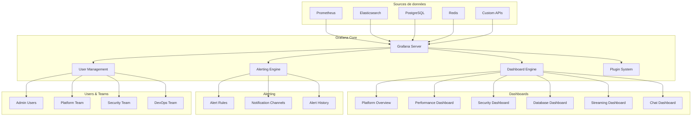

# Grafana Veza - Documentation Complète

## Vue d'ensemble

Grafana est l'outil de visualisation principal de Veza, fournissant des dashboards en temps réel pour surveiller les performances, la disponibilité et la santé de la plateforme.

---

## Architecture Grafana



---

## Configuration Grafana

### Configuration principale

```ini
# monitoring/grafana/grafana.ini
[server]
protocol = http
http_port = 3000
domain = grafana.veza.app
root_url = https://grafana.veza.app/
serve_from_sub_path = false

[database]
type = postgres
host = postgres:5432
name = grafana
user = grafana
password = YOUR_GRAFANA_PASSWORD
ssl_mode = require

[security]
admin_user = admin
admin_password = YOUR_ADMIN_PASSWORD
secret_key = YOUR_SECRET_KEY
cookie_secure = true
cookie_samesite = strict
allow_embedding = false

[users]
allow_sign_up = false
allow_org_create = false
auto_assign_org_role = Viewer

[auth.anonymous]
enabled = false

[auth.basic]
enabled = true

[auth.proxy]
enabled = true
header_name = X-Forwarded-User
header_property = email
auto_sign_up = true

[smtp]
enabled = true
host = smtp.gmail.com:587
user = alerts@veza.app
password = YOUR_SMTP_PASSWORD
from_address = alerts@veza.app
from_name = Veza Alerts

[alerting]
enabled = true
execute_alerts = true
evaluation_timeout_seconds = 30
notification_timeout_seconds = 30
max_attempts = 3

[unified_alerting]
enabled = true

[metrics]
enabled = true
interval_seconds = 10

[log]
mode = console
level = info
```

### Configuration des sources de données

```yaml
# monitoring/grafana/datasources.yml
apiVersion: 1

datasources:
  # Prometheus
  - name: Prometheus
    type: prometheus
    access: proxy
    url: http://prometheus:9090
    isDefault: true
    editable: true
    jsonData:
      timeInterval: "15s"
      queryTimeout: "60s"
      httpMethod: "POST"
    secureJsonData:
      basicAuthPassword: ""

  # Elasticsearch
  - name: Elasticsearch
    type: elasticsearch
    access: proxy
    url: http://elasticsearch:9200
    database: "k8s-*"
    jsonData:
      timeField: "@timestamp"
      esVersion: 8.8.0
      maxConcurrentShardRequests: 5
      logMessageField: message
      logLevelField: level
    secureJsonData:
      basicAuthPassword: ""

  # PostgreSQL
  - name: PostgreSQL
    type: postgres
    access: proxy
    url: postgres:5432
    database: veza
    user: grafana
    jsonData:
      sslmode: "require"
      maxOpenConns: 100
      maxIdleConns: 100
      connMaxLifetime: 14400
    secureJsonData:
      password: "YOUR_POSTGRES_PASSWORD"

  # Redis
  - name: Redis
    type: redis-datasource
    access: proxy
    url: redis:6379
    jsonData:
      poolSize: 5
      timeout: 10
    secureJsonData:
      password: "YOUR_REDIS_PASSWORD"

  # InfluxDB (optionnel)
  - name: InfluxDB
    type: influxdb
    access: proxy
    url: http://influxdb:8086
    database: veza_metrics
    jsonData:
      version: Flux
      organization: veza
      defaultBucket: veza_metrics
    secureJsonData:
      token: "YOUR_INFLUXDB_TOKEN"
```

---

## Dashboards principaux

### Dashboard de vue d'ensemble

```json
{
  "dashboard": {
    "id": null,
    "title": "Veza Platform Overview",
    "tags": ["veza", "platform", "overview"],
    "timezone": "browser",
    "panels": [
      {
        "id": 1,
        "title": "Service Status",
        "type": "stat",
        "targets": [
          {
            "expr": "up",
            "legendFormat": "{{job}}"
          }
        ],
        "fieldConfig": {
          "defaults": {
            "color": {
              "mode": "thresholds"
            },
            "thresholds": {
              "steps": [
                {"color": "red", "value": null},
                {"color": "green", "value": 1}
              ]
            }
          }
        },
        "gridPos": {"h": 4, "w": 6, "x": 0, "y": 0}
      },
      {
        "id": 2,
        "title": "HTTP Request Rate",
        "type": "graph",
        "targets": [
          {
            "expr": "rate(http_requests_total[5m])",
            "legendFormat": "{{method}} {{endpoint}}"
          }
        ],
        "gridPos": {"h": 8, "w": 12, "x": 0, "y": 4}
      },
      {
        "id": 3,
        "title": "Response Time P95",
        "type": "graph",
        "targets": [
          {
            "expr": "histogram_quantile(0.95, rate(http_request_duration_seconds_bucket[5m]))",
            "legendFormat": "{{method}} {{endpoint}}"
          }
        ],
        "gridPos": {"h": 8, "w": 12, "x": 12, "y": 4}
      },
      {
        "id": 4,
        "title": "Error Rate",
        "type": "graph",
        "targets": [
          {
            "expr": "rate(http_requests_total{status_code=~\"5..\"}[5m]) / rate(http_requests_total[5m]) * 100",
            "legendFormat": "Error Rate %"
          }
        ],
        "gridPos": {"h": 8, "w": 12, "x": 0, "y": 12}
      },
      {
        "id": 5,
        "title": "Active Users",
        "type": "stat",
        "targets": [
          {
            "expr": "chat_connections_active + stream_sessions_active",
            "legendFormat": "Total Active Users"
          }
        ],
        "gridPos": {"h": 4, "w": 6, "x": 12, "y": 12}
      },
      {
        "id": 6,
        "title": "System Resources",
        "type": "row",
        "gridPos": {"h": 1, "w": 24, "x": 0, "y": 16}
      },
      {
        "id": 7,
        "title": "CPU Usage",
        "type": "graph",
        "targets": [
          {
            "expr": "100 - (avg by(instance) (irate(node_cpu_seconds_total{mode=\"idle\"}[5m])) * 100)",
            "legendFormat": "{{instance}}"
          }
        ],
        "gridPos": {"h": 8, "w": 8, "x": 0, "y": 17}
      },
      {
        "id": 8,
        "title": "Memory Usage",
        "type": "graph",
        "targets": [
          {
            "expr": "(node_memory_MemTotal_bytes - node_memory_MemAvailable_bytes) / node_memory_MemTotal_bytes * 100",
            "legendFormat": "{{instance}}"
          }
        ],
        "gridPos": {"h": 8, "w": 8, "x": 8, "y": 17}
      },
      {
        "id": 9,
        "title": "Disk Usage",
        "type": "graph",
        "targets": [
          {
            "expr": "(node_filesystem_size_bytes - node_filesystem_free_bytes) / node_filesystem_size_bytes * 100",
            "legendFormat": "{{instance}} {{mountpoint}}"
          }
        ],
        "gridPos": {"h": 8, "w": 8, "x": 16, "y": 17}
      }
    ],
    "time": {
      "from": "now-1h",
      "to": "now"
    },
    "refresh": "10s",
    "schemaVersion": 27,
    "version": 1
  }
}
```

### Dashboard de performance

```json
{
  "dashboard": {
    "id": null,
    "title": "Veza Performance Dashboard",
    "tags": ["veza", "performance"],
    "panels": [
      {
        "id": 1,
        "title": "Application Performance",
        "type": "row",
        "gridPos": {"h": 1, "w": 24, "x": 0, "y": 0}
      },
      {
        "id": 2,
        "title": "Response Time Distribution",
        "type": "heatmap",
        "targets": [
          {
            "expr": "sum(rate(http_request_duration_seconds_bucket[5m])) by (le, endpoint)",
            "format": "heatmap"
          }
        ],
        "gridPos": {"h": 8, "w": 12, "x": 0, "y": 1}
      },
      {
        "id": 3,
        "title": "Throughput by Endpoint",
        "type": "graph",
        "targets": [
          {
            "expr": "rate(http_requests_total[5m])",
            "legendFormat": "{{endpoint}}"
          }
        ],
        "gridPos": {"h": 8, "w": 12, "x": 12, "y": 1}
      },
      {
        "id": 4,
        "title": "Database Performance",
        "type": "row",
        "gridPos": {"h": 1, "w": 24, "x": 0, "y": 9}
      },
      {
        "id": 5,
        "title": "Query Duration P95",
        "type": "graph",
        "targets": [
          {
            "expr": "histogram_quantile(0.95, rate(database_query_duration_seconds_bucket[5m]))",
            "legendFormat": "{{operation}} {{table}}"
          }
        ],
        "gridPos": {"h": 8, "w": 12, "x": 0, "y": 10}
      },
      {
        "id": 6,
        "title": "Active Connections",
        "type": "graph",
        "targets": [
          {
            "expr": "pg_stat_activity_count",
            "legendFormat": "Active Connections"
          }
        ],
        "gridPos": {"h": 8, "w": 12, "x": 12, "y": 10}
      },
      {
        "id": 7,
        "title": "Cache Performance",
        "type": "row",
        "gridPos": {"h": 1, "w": 24, "x": 0, "y": 18}
      },
      {
        "id": 8,
        "title": "Cache Hit Rate",
        "type": "graph",
        "targets": [
          {
            "expr": "rate(cache_hits_total[5m]) / (rate(cache_hits_total[5m]) + rate(cache_misses_total[5m])) * 100",
            "legendFormat": "{{cache_type}}"
          }
        ],
        "gridPos": {"h": 8, "w": 12, "x": 0, "y": 19}
      },
      {
        "id": 9,
        "title": "Cache Operations",
        "type": "graph",
        "targets": [
          {
            "expr": "rate(cache_hits_total[5m])",
            "legendFormat": "Hits - {{cache_type}}"
          },
          {
            "expr": "rate(cache_misses_total[5m])",
            "legendFormat": "Misses - {{cache_type}}"
          }
        ],
        "gridPos": {"h": 8, "w": 12, "x": 12, "y": 19}
      }
    ]
  }
}
```

### Dashboard de sécurité

```json
{
  "dashboard": {
    "id": null,
    "title": "Veza Security Dashboard",
    "tags": ["veza", "security"],
    "panels": [
      {
        "id": 1,
        "title": "Authentication Activity",
        "type": "row",
        "gridPos": {"h": 1, "w": 24, "x": 0, "y": 0}
      },
      {
        "id": 2,
        "title": "Login Attempts",
        "type": "graph",
        "targets": [
          {
            "expr": "rate(auth_attempts_total[5m])",
            "legendFormat": "{{method}} - {{success}}"
          }
        ],
        "gridPos": {"h": 8, "w": 12, "x": 0, "y": 1}
      },
      {
        "id": 3,
        "title": "Failed Login Rate",
        "type": "graph",
        "targets": [
          {
            "expr": "rate(auth_attempts_total{success=\"false\"}[5m])",
            "legendFormat": "Failed Logins/sec"
          }
        ],
        "gridPos": {"h": 8, "w": 12, "x": 12, "y": 1}
      },
      {
        "id": 4,
        "title": "Token Validations",
        "type": "graph",
        "targets": [
          {
            "expr": "rate(auth_token_validations_total[5m])",
            "legendFormat": "{{valid}}"
          }
        ],
        "gridPos": {"h": 8, "w": 12, "x": 0, "y": 9}
      },
      {
        "id": 5,
        "title": "Security Events",
        "type": "row",
        "gridPos": {"h": 1, "w": 24, "x": 0, "y": 17}
      },
      {
        "id": 6,
        "title": "Security Errors",
        "type": "graph",
        "targets": [
          {
            "expr": "rate(errors_total{error_type=~\"security.*\"}[5m])",
            "legendFormat": "{{error_type}}"
          }
        ],
        "gridPos": {"h": 8, "w": 12, "x": 0, "y": 18}
      },
      {
        "id": 7,
        "title": "Suspicious Activity",
        "type": "table",
        "targets": [
          {
            "expr": "topk(10, rate(auth_attempts_total{success=\"false\"}[5m]))",
            "format": "table"
          }
        ],
        "gridPos": {"h": 8, "w": 12, "x": 12, "y": 18}
      }
    ]
  }
}
```

---

## Alertes Grafana

### Configuration des alertes

```yaml
# monitoring/grafana/alerts.yml
apiVersion: 1

alerting:
  # Alertes de performance
  - name: "High Response Time"
    condition: "A"
    for: "5m"
    frequency: "1m"
    handler: 1
    message: "Response time is too high"
    noDataState: "NoData"
    executionErrorState: "KeepLastState"
    for: "5m"
    frequency: "1m"
    handler: 1
    message: "Response time is too high"
    noDataState: "NoData"
    executionErrorState: "KeepLastState"
    queries:
      - datasourceUid: "prometheus"
        model:
          expr: "histogram_quantile(0.95, rate(http_request_duration_seconds_bucket[5m])) > 1"
          intervalMs: 1000
          maxDataPoints: 100
          refId: "A"
    tags:
      - "performance"
      - "response-time"
    title: "High Response Time"

  # Alertes de disponibilité
  - name: "Service Down"
    condition: "A"
    for: "1m"
    frequency: "30s"
    handler: 1
    message: "Service is down"
    noDataState: "Alerting"
    executionErrorState: "Alerting"
    queries:
      - datasourceUid: "prometheus"
        model:
          expr: "up == 0"
          intervalMs: 1000
          maxDataPoints: 100
          refId: "A"
    tags:
      - "availability"
      - "service-down"
    title: "Service Down"

  # Alertes d'erreur
  - name: "High Error Rate"
    condition: "A"
    for: "2m"
    frequency: "1m"
    handler: 1
    message: "Error rate is too high"
    noDataState: "NoData"
    executionErrorState: "KeepLastState"
    queries:
      - datasourceUid: "prometheus"
        model:
          expr: "rate(http_requests_total{status_code=~\"5..\"}[5m]) / rate(http_requests_total[5m]) > 0.05"
          intervalMs: 1000
          maxDataPoints: 100
          refId: "A"
    tags:
      - "errors"
      - "reliability"
    title: "High Error Rate"
```

### Canaux de notification

```yaml
# monitoring/grafana/notifications.yml
apiVersion: 1

notifications:
  # Slack
  - name: "Slack Critical"
    type: "slack"
    uid: "slack_critical"
    orgId: 1
    isDefault: false
    sendReminder: true
    frequency: "1m"
    settings:
      url: "https://hooks.slack.com/services/YOUR_SLACK_WEBHOOK"
      channel: "#veza-critical"
      username: "Grafana Alerts"
      iconEmoji: ":warning:"
      iconUrl: ""
      title: "🚨 CRITICAL: {{ .AlertName }}"
      text: "{{ .Message }}\n\nDashboard: {{ .DashboardURL }}\nPanel: {{ .PanelName }}"

  # Slack Important
  - name: "Slack Important"
    type: "slack"
    uid: "slack_important"
    orgId: 1
    isDefault: false
    sendReminder: true
    frequency: "5m"
    settings:
      url: "https://hooks.slack.com/services/YOUR_SLACK_WEBHOOK"
      channel: "#veza-alerts"
      username: "Grafana Alerts"
      iconEmoji: ":warning:"
      iconUrl: ""
      title: "⚠️ IMPORTANT: {{ .AlertName }}"
      text: "{{ .Message }}\n\nDashboard: {{ .DashboardURL }}\nPanel: {{ .PanelName }}"

  # Email
  - name: "Email Notifications"
    type: "email"
    uid: "email_notifications"
    orgId: 1
    isDefault: false
    sendReminder: true
    frequency: "1h"
    settings:
      addresses: "oncall@veza.app"
      subject: "Grafana Alert: {{ .AlertName }}"
      body: |
        Alert: {{ .AlertName }}
        Message: {{ .Message }}
        Dashboard: {{ .DashboardURL }}
        Panel: {{ .PanelName }}
        Time: {{ .Time }}

  # PagerDuty
  - name: "PagerDuty Critical"
    type: "pagerduty"
    uid: "pagerduty_critical"
    orgId: 1
    isDefault: false
    sendReminder: true
    frequency: "30m"
    settings:
      integrationKey: "YOUR_PAGERDUTY_INTEGRATION_KEY"
      severity: "critical"
      class: "grafana_alert"
      group: "veza_platform"
      summary: "{{ .AlertName }}: {{ .Message }}"
      description: |
        Alert: {{ .AlertName }}
        Message: {{ .Message }}
        Dashboard: {{ .DashboardURL }}
        Panel: {{ .PanelName }}
        Time: {{ .Time }}
```

---

## Gestion des utilisateurs

### Configuration des rôles

```yaml
# monitoring/grafana/users.yml
apiVersion: 1

users:
  # Administrateurs
  - name: "admin"
    email: "admin@veza.app"
    login: "admin"
    password: "YOUR_ADMIN_PASSWORD"
    isAdmin: true
    orgId: 1

  # Équipe plateforme
  - name: "platform-team"
    email: "platform@veza.app"
    login: "platform"
    password: "YOUR_PLATFORM_PASSWORD"
    isAdmin: false
    orgId: 1
    permissions:
      - "Viewer"
      - "Editor"

  # Équipe sécurité
  - name: "security-team"
    email: "security@veza.app"
    login: "security"
    password: "YOUR_SECURITY_PASSWORD"
    isAdmin: false
    orgId: 1
    permissions:
      - "Viewer"
      - "Editor"
      - "Admin"

  # Équipe DevOps
  - name: "devops-team"
    email: "devops@veza.app"
    login: "devops"
    password: "YOUR_DEVOPS_PASSWORD"
    isAdmin: false
    orgId: 1
    permissions:
      - "Viewer"
      - "Editor"

organizations:
  - name: "Veza Platform"
    id: 1
    users:
      - name: "admin"
        role: "Admin"
      - name: "platform-team"
        role: "Editor"
      - name: "security-team"
        role: "Admin"
      - name: "devops-team"
        role: "Editor"

teams:
  - name: "Platform Team"
    orgId: 1
    members:
      - "platform-team"
    permissions:
      - "Viewer"
      - "Editor"

  - name: "Security Team"
    orgId: 1
    members:
      - "security-team"
    permissions:
      - "Viewer"
      - "Editor"
      - "Admin"

  - name: "DevOps Team"
    orgId: 1
    members:
      - "devops-team"
    permissions:
      - "Viewer"
      - "Editor"
```

---

## Plugins et extensions

### Plugins recommandés

```yaml
# monitoring/grafana/plugins.yml
apiVersion: 1

plugins:
  # Plugins de visualisation
  - name: "grafana-piechart-panel"
    version: "1.6.1"
    type: "panel"

  - name: "grafana-worldmap-panel"
    version: "0.3.3"
    type: "panel"

  - name: "grafana-clock-panel"
    version: "1.2.0"
    type: "panel"

  - name: "grafana-status-panel"
    version: "1.0.0"
    type: "panel"

  # Plugins de datasource
  - name: "grafana-redis-datasource"
    version: "1.4.0"
    type: "datasource"

  - name: "grafana-influxdb-datasource"
    version: "1.0.0"
    type: "datasource"

  # Plugins d'alerting
  - name: "grafana-alertmanager-datasource"
    version: "1.0.0"
    type: "datasource"

  # Plugins de monitoring
  - name: "grafana-kubernetes-app"
    version: "1.0.0"
    type: "app"

  - name: "grafana-elasticsearch-app"
    version: "1.0.0"
    type: "app"
```

---

## Scripts d'automatisation

### Script de sauvegarde

```bash
#!/bin/bash
# monitoring/grafana/backup.sh

set -e

# Configuration
GRAFANA_URL="http://grafana:3000"
GRAFANA_USER="admin"
GRAFANA_PASSWORD="YOUR_ADMIN_PASSWORD"
BACKUP_DIR="/backups/grafana"
DATE=$(date +%Y%m%d_%H%M%S)

# Créer le répertoire de sauvegarde
mkdir -p "$BACKUP_DIR"

# Fonction de sauvegarde des dashboards
backup_dashboards() {
    echo "Sauvegarde des dashboards..."
    
    # Récupérer la liste des dashboards
    dashboards=$(curl -s -u "$GRAFANA_USER:$GRAFANA_PASSWORD" \
        "$GRAFANA_URL/api/search?type=dash-db" | \
        jq -r '.[].uid')
    
    for dashboard in $dashboards; do
        echo "Sauvegarde du dashboard: $dashboard"
        curl -s -u "$GRAFANA_USER:$GRAFANA_PASSWORD" \
            "$GRAFANA_URL/api/dashboards/uid/$dashboard" | \
            jq '.dashboard' > "$BACKUP_DIR/dashboard_${dashboard}_${DATE}.json"
    done
}

# Fonction de sauvegarde des datasources
backup_datasources() {
    echo "Sauvegarde des datasources..."
    
    curl -s -u "$GRAFANA_USER:$GRAFANA_PASSWORD" \
        "$GRAFANA_URL/api/datasources" | \
        jq '.' > "$BACKUP_DIR/datasources_${DATE}.json"
}

# Fonction de sauvegarde des alertes
backup_alerts() {
    echo "Sauvegarde des alertes..."
    
    curl -s -u "$GRAFANA_USER:$GRAFANA_PASSWORD" \
        "$GRAFANA_URL/api/v1/provisioning/alerting/rules" | \
        jq '.' > "$BACKUP_DIR/alerts_${DATE}.json"
}

# Fonction de sauvegarde des utilisateurs
backup_users() {
    echo "Sauvegarde des utilisateurs..."
    
    curl -s -u "$GRAFANA_USER:$GRAFANA_PASSWORD" \
        "$GRAFANA_URL/api/admin/users" | \
        jq '.' > "$BACKUP_DIR/users_${DATE}.json"
}

# Fonction de sauvegarde des organisations
backup_organizations() {
    echo "Sauvegarde des organisations..."
    
    curl -s -u "$GRAFANA_USER:$GRAFANA_PASSWORD" \
        "$GRAFANA_URL/api/orgs" | \
        jq '.' > "$BACKUP_DIR/organizations_${DATE}.json"
}

# Fonction de nettoyage des anciennes sauvegardes
cleanup_old_backups() {
    echo "Nettoyage des anciennes sauvegardes..."
    
    # Supprimer les sauvegardes de plus de 30 jours
    find "$BACKUP_DIR" -name "*.json" -mtime +30 -delete
}

# Fonction principale
main() {
    echo "Début de la sauvegarde Grafana: $(date)"
    
    backup_dashboards
    backup_datasources
    backup_alerts
    backup_users
    backup_organizations
    cleanup_old_backups
    
    echo "Sauvegarde terminée: $(date)"
    echo "Fichiers sauvegardés dans: $BACKUP_DIR"
}

# Exécution
main "$@"
```

### Script de restauration

```bash
#!/bin/bash
# monitoring/grafana/restore.sh

set -e

# Configuration
GRAFANA_URL="http://grafana:3000"
GRAFANA_USER="admin"
GRAFANA_PASSWORD="YOUR_ADMIN_PASSWORD"
BACKUP_DIR="/backups/grafana"
RESTORE_DATE="$1"

if [ -z "$RESTORE_DATE" ]; then
    echo "Usage: $0 <YYYYMMDD_HHMMSS>"
    echo "Exemple: $0 20231201_143000"
    exit 1
fi

# Fonction de restauration des dashboards
restore_dashboards() {
    echo "Restauration des dashboards..."
    
    for dashboard_file in "$BACKUP_DIR"/dashboard_*_${RESTORE_DATE}.json; do
        if [ -f "$dashboard_file" ]; then
            echo "Restauration du dashboard: $dashboard_file"
            curl -s -X POST -u "$GRAFANA_USER:$GRAFANA_PASSWORD" \
                -H "Content-Type: application/json" \
                -d @"$dashboard_file" \
                "$GRAFANA_URL/api/dashboards/db"
        fi
    done
}

# Fonction de restauration des datasources
restore_datasources() {
    echo "Restauration des datasources..."
    
    datasources_file="$BACKUP_DIR/datasources_${RESTORE_DATE}.json"
    if [ -f "$datasources_file" ]; then
        jq -c '.[]' "$datasources_file" | while read -r datasource; do
            echo "Restauration de la datasource: $(echo "$datasource" | jq -r '.name')"
            curl -s -X POST -u "$GRAFANA_USER:$GRAFANA_PASSWORD" \
                -H "Content-Type: application/json" \
                -d "$datasource" \
                "$GRAFANA_URL/api/datasources"
        done
    fi
}

# Fonction de restauration des alertes
restore_alerts() {
    echo "Restauration des alertes..."
    
    alerts_file="$BACKUP_DIR/alerts_${RESTORE_DATE}.json"
    if [ -f "$alerts_file" ]; then
        jq -c '.[]' "$alerts_file" | while read -r alert; do
            echo "Restauration de l'alerte: $(echo "$alert" | jq -r '.title')"
            curl -s -X POST -u "$GRAFANA_USER:$GRAFANA_PASSWORD" \
                -H "Content-Type: application/json" \
                -d "$alert" \
                "$GRAFANA_URL/api/v1/provisioning/alerting/rules"
        done
    fi
}

# Fonction de restauration des utilisateurs
restore_users() {
    echo "Restauration des utilisateurs..."
    
    users_file="$BACKUP_DIR/users_${RESTORE_DATE}.json"
    if [ -f "$users_file" ]; then
        jq -c '.[]' "$users_file" | while read -r user; do
            echo "Restauration de l'utilisateur: $(echo "$user" | jq -r '.login')"
            curl -s -X POST -u "$GRAFANA_USER:$GRAFANA_PASSWORD" \
                -H "Content-Type: application/json" \
                -d "$user" \
                "$GRAFANA_URL/api/admin/users"
        done
    fi
}

# Fonction de restauration des organisations
restore_organizations() {
    echo "Restauration des organisations..."
    
    orgs_file="$BACKUP_DIR/organizations_${RESTORE_DATE}.json"
    if [ -f "$orgs_file" ]; then
        jq -c '.[]' "$orgs_file" | while read -r org; do
            echo "Restauration de l'organisation: $(echo "$org" | jq -r '.name')"
            curl -s -X POST -u "$GRAFANA_USER:$GRAFANA_PASSWORD" \
                -H "Content-Type: application/json" \
                -d "$org" \
                "$GRAFANA_URL/api/orgs"
        done
    fi
}

# Fonction principale
main() {
    echo "Début de la restauration Grafana: $(date)"
    echo "Date de restauration: $RESTORE_DATE"
    
    restore_datasources
    restore_dashboards
    restore_alerts
    restore_users
    restore_organizations
    
    echo "Restauration terminée: $(date)"
}

# Exécution
main "$@"
```

---

## Liens croisés

- [Monitoring principal](../README.md)
- [Alertes](../alerts/README.md)
- [Logging avancé](../logging/README.md)
- [Métriques personnalisées](../metrics/README.md)
- [Tests de performance](../../testing/performance/)
- [Sécurité](../../security/)
- [Déploiement](../../deployment/)

---

## Pour aller plus loin

- [Configuration avancée](./advanced/README.md)
- [Templates de dashboard](./templates/README.md)
- [Plugins personnalisés](./plugins/README.md)
- [Métriques Grafana](./metrics/README.md)
- [FAQ et troubleshooting](../../reference/) 