# Vue d'ensemble des métriques - Veza Platform

Ce document présente les principales métriques exposées par les services de la plateforme Veza (Prometheus, Grafana, etc.).

## Index
- À compléter : ajouter la liste des métriques, dashboards, alertes, etc.

## Navigation
- [Retour au schéma principal](../../diagrams/architecture-overview.md)

# 📊 Métriques et Monitoring - Veza Platform

## 🎯 Vue d'ensemble

Ce document détaille le système de métriques et monitoring de la plateforme Veza, incluant la collecte, l'agrégation, l'analyse et l'alerting des métriques système et business.

## 🏗️ Architecture de monitoring

```mermaid
graph TB
    subgraph "🎯 Services Veza"
        API[Backend API<br/>Go]
        CHAT[Chat Server<br/>Rust]
        STREAM[Stream Server<br/>Rust]
        FRONTEND[Frontend<br/>React]
    end
    
    subgraph "📊 Collecte Métriques"
        PROM_API[Prometheus<br/>Backend API]
        PROM_CHAT[Prometheus<br/>Chat Server]
        PROM_STREAM[Prometheus<br/>Stream Server]
        NODE_EXP[Node Exporter]
        POSTGRES_EXP[PostgreSQL Exporter]
        REDIS_EXP[Redis Exporter]
    end
    
    subgraph "🗄️ Infrastructure"
        POSTGRES[(PostgreSQL)]
        REDIS[(Redis)]
        NATS[NATS]
        NGINX[Nginx/HAProxy]
    end
    
    subgraph "📈 Monitoring Stack"
        PROMETHEUS[🔍 Prometheus<br/>Metrics Collection]
        GRAFANA[📊 Grafana<br/>Visualization]
        ALERTMANAGER[🚨 AlertManager<br/>Alerting]
        JAEGER[🔍 Jaeger<br/>Distributed Tracing]
    end
    
    subgraph "📱 Notifications"
        SLACK[💬 Slack]
        EMAIL[📧 Email]
        PAGERDUTY[📟 PagerDuty]
        WEBHOOK[🔗 Webhooks]
    end
    
    subgraph "📊 Dashboards"
        SYS_DASH[System Dashboard]
        APP_DASH[Application Dashboard]
        BIZ_DASH[Business Dashboard]
        ALERT_DASH[Alerting Dashboard]
    end
    
    %% Services to Metrics Collection
    API --> PROM_API
    CHAT --> PROM_CHAT
    STREAM --> PROM_STREAM
    
    %% Infrastructure to Exporters
    POSTGRES --> POSTGRES_EXP
    REDIS --> REDIS_EXP
    NGINX --> NODE_EXP
    
    %% Metrics Collection to Prometheus
    PROM_API --> PROMETHEUS
    PROM_CHAT --> PROMETHEUS
    PROM_STREAM --> PROMETHEUS
    NODE_EXP --> PROMETHEUS
    POSTGRES_EXP --> PROMETHEUS
    REDIS_EXP --> PROMETHEUS
    
    %% Prometheus to Monitoring Tools
    PROMETHEUS --> GRAFANA
    PROMETHEUS --> ALERTMANAGER
    
    %% Dashboards
    GRAFANA --> SYS_DASH
    GRAFANA --> APP_DASH
    GRAFANA --> BIZ_DASH
    GRAFANA --> ALERT_DASH
    
    %% Alerting
    ALERTMANAGER --> SLACK
    ALERTMANAGER --> EMAIL
    ALERTMANAGER --> PAGERDUTY
    ALERTMANAGER --> WEBHOOK
    
    %% Tracing
    API --> JAEGER
    CHAT --> JAEGER
    STREAM --> JAEGER
```



## 📊 Types de métriques collectées

### 1. 🏃‍♂️ Métriques système

#### 🖥️ Hardware & OS
```prometheus
# CPU
node_cpu_seconds_total
node_load1
node_load5
node_load15

# Mémoire
node_memory_MemTotal_bytes
node_memory_MemAvailable_bytes
node_memory_Buffers_bytes
node_memory_Cached_bytes

# Disque
node_disk_io_time_seconds_total
node_disk_read_bytes_total
node_disk_written_bytes_total
node_filesystem_avail_bytes
node_filesystem_size_bytes

# Réseau
node_network_receive_bytes_total
node_network_transmit_bytes_total
node_network_receive_packets_total
node_network_transmit_packets_total
```

### 2. 🌐 Métriques application

#### 🔧 Backend API (Go)
```go
// Métriques HTTP
http_requests_total{method, path, status}
http_request_duration_seconds{method, path}
http_request_size_bytes{method, path}
http_response_size_bytes{method, path}

// Métriques Business
user_registrations_total
user_logins_total{method}
api_calls_total{endpoint, user_type}
uploads_total{file_type}
uploads_size_bytes{file_type}

// Métriques Infrastructure
database_connections_active
database_connections_idle
database_query_duration_seconds{query_type}
redis_operations_total{operation}
redis_operation_duration_seconds{operation}

// Métriques Runtime Go
go_goroutines
go_threads
go_memstats_alloc_bytes
go_memstats_sys_bytes
go_gc_duration_seconds
```

## 🚨 Configuration des alertes

### 1. 🔴 Alertes critiques (P1)

#### Service Down
```yaml
- alert: ServiceDown
  expr: up == 0
  for: 1m
  labels:
    severity: critical
    priority: P1
  annotations:
    summary: "Service {{ $labels.instance }} is down"
    description: "Service {{ $labels.instance }} has been down for more than 1 minute"
    runbook_url: "https://docs.veza.com/runbooks/service-down"
```

#### High Error Rate
```yaml
- alert: HighErrorRate
  expr: rate(http_requests_total{status=~"5.."}[5m]) / rate(http_requests_total[5m]) > 0.05
  for: 2m
  labels:
    severity: critical
    priority: P1
  annotations:
    summary: "High error rate detected"
    description: "Error rate is {{ $value | humanizePercentage }}"
```

## 📊 Dashboards recommandés

### 1. 🏠 Dashboard système global
- **CPU Usage** : `100 - (avg by (instance) (irate(node_cpu_seconds_total{mode="idle"}[5m])) * 100)`
- **Memory Usage** : `(node_memory_MemTotal_bytes - node_memory_MemAvailable_bytes) / node_memory_MemTotal_bytes * 100`
- **Disk Usage** : `(node_filesystem_size_bytes - node_filesystem_avail_bytes) / node_filesystem_size_bytes * 100`
- **Network I/O** : `rate(node_network_receive_bytes_total[5m])` et `rate(node_network_transmit_bytes_total[5m])`

### 2. 🚀 Dashboard application
- **Request Rate** : `rate(http_requests_total[5m])`
- **Response Time** : `histogram_quantile(0.95, rate(http_request_duration_seconds_bucket[5m]))`
- **Error Rate** : `rate(http_requests_total{status=~"5.."}[5m]) / rate(http_requests_total[5m])`
- **Active Users** : `sum(veza_active_users_total)`

### 3. 💰 Dashboard business
- **User Registrations** : `rate(user_registrations_total[1h])`
- **Streaming Hours** : `sum(veza_streaming_hours_total)`
- **Chat Messages** : `rate(chat_messages_total[5m])`
- **Revenue Metrics** : `sum(veza_revenue_total)`

## 🔧 Configuration Prometheus

### 1. 📝 prometheus.yml
```yaml
global:
  scrape_interval: 15s
  evaluation_interval: 15s

rule_files:
  - "veza_alerts.yml"

scrape_configs:
  - job_name: 'veza-backend-api'
    static_configs:
      - targets: ['localhost:8080']
    metrics_path: '/metrics'
    scrape_interval: 5s

  - job_name: 'veza-chat-server'
    static_configs:
      - targets: ['localhost:8081']
    metrics_path: '/metrics'
    scrape_interval: 5s

  - job_name: 'veza-stream-server'
    static_configs:
      - targets: ['localhost:8082']
    metrics_path: '/metrics'
    scrape_interval: 5s

  - job_name: 'postgres'
    static_configs:
      - targets: ['localhost:9187']

  - job_name: 'redis'
    static_configs:
      - targets: ['localhost:9121']
```

### 2. 🚨 veza_alerts.yml
```yaml
groups:
  - name: veza_alerts
    rules:
      - alert: HighErrorRate
        expr: rate(http_requests_total{status=~"5.."}[5m]) / rate(http_requests_total[5m]) > 0.05
        for: 2m
        labels:
          severity: critical
        annotations:
          summary: "High error rate detected"
          description: "Error rate is {{ $value | humanizePercentage }}"

      - alert: HighResponseTime
        expr: histogram_quantile(0.95, rate(http_request_duration_seconds_bucket[5m])) > 1
        for: 2m
        labels:
          severity: warning
        annotations:
          summary: "High response time detected"
          description: "95th percentile response time is {{ $value }} seconds"

      - alert: DatabaseConnectionsHigh
        expr: postgres_exporter_postgresql_connections > 80
        for: 2m
        labels:
          severity: warning
        annotations:
          summary: "High database connections"
          description: "Database has {{ $value }} active connections"

      - alert: RedisMemoryHigh
        expr: redis_memory_used_bytes / redis_memory_max_bytes > 0.8
        for: 2m
        labels:
          severity: warning
        annotations:
          summary: "High Redis memory usage"
          description: "Redis memory usage is {{ $value | humanizePercentage }}"
```

## 📱 Configuration AlertManager

### 1. 📧 alertmanager.yml
```yaml
global:
  smtp_smarthost: 'localhost:587'
  smtp_from: 'alertmanager@veza.com'
  smtp_auth_username: 'alertmanager'
  smtp_auth_password: 'password'

route:
  group_by: ['alertname']
  group_wait: 10s
  group_interval: 10s
  repeat_interval: 1h
  receiver: 'team-veza'

receivers:
  - name: 'team-veza'
    email_configs:
      - to: 'admin@veza.com'
        send_resolved: true
    slack_configs:
      - api_url: 'https://hooks.slack.com/services/YOUR/SLACK/WEBHOOK'
        channel: '#veza-alerts'
        send_resolved: true
```

## 🔍 Configuration Jaeger

### 1. 📊 jaeger.yml
```yaml
sampling:
  default_strategy:
    type: probabilistic
    param: 0.1

storage:
  type: elasticsearch
  options:
    es:
      server_urls: http://localhost:9200
      index_prefix: jaeger

ingester:
  kafka:
    consumer:
      topic: jaeger-spans
      brokers: localhost:9092
```

## 📊 Métriques custom Veza

### 1. 🎯 Métriques business
```go
// Métriques utilisateurs
veza_active_users_total
veza_registered_users_total
veza_premium_users_total

// Métriques streaming
veza_streams_active_total
veza_streaming_hours_total
veza_stream_viewers_total

// Métriques chat
veza_chat_messages_total
veza_chat_rooms_active_total
veza_chat_users_online_total

// Métriques modération
veza_moderation_signals_total
veza_moderation_actions_total
veza_banned_users_total
```

### 2. 🔧 Métriques techniques
```go
// Métriques performance
veza_api_response_time_p95
veza_api_response_time_p99
veza_database_query_time_avg

// Métriques infrastructure
veza_redis_memory_usage_bytes
veza_postgres_connections_active
veza_nats_messages_per_second

// Métriques erreurs
veza_errors_total{service, error_type}
veza_errors_rate{service, error_type}
```

## 🚀 Bonnes pratiques

### 1. 📊 Naming conventions
- **Métriques système** : `node_*`
- **Métriques application** : `veza_*`
- **Métriques HTTP** : `http_*`
- **Métriques base de données** : `postgres_*`, `redis_*`

### 2. 🏷️ Labels recommandés
```go
// Labels communs
service="backend-api"
environment="production"
version="1.2.3"

// Labels spécifiques
endpoint="/api/v1/users"
method="POST"
status_code="200"
user_type="premium"
```

### 3. 📈 Agrégation
```prometheus
# Moyenne par service
avg by (service) (rate(http_requests_total[5m]))

# Somme par environnement
sum by (environment) (veza_active_users_total)

# Quantile 95%
histogram_quantile(0.95, rate(http_request_duration_seconds_bucket[5m]))
```

---

## 🔗 Liens croisés

- [Architecture Globale](../../architecture/global-architecture.md)
- [Monitoring](../../monitoring/README.md)
- [Alertes](../../monitoring/alerts/alerting-guide.md)
- [Troubleshooting](../../troubleshooting/README.md)

---

## Pour aller plus loin

- [Configuration Avancée](../../guides/advanced-configuration.md)
- [Déploiement](../../deployment/README.md)
- [Sécurité](../../security/README.md)
- [Tests](../../testing/README.md)