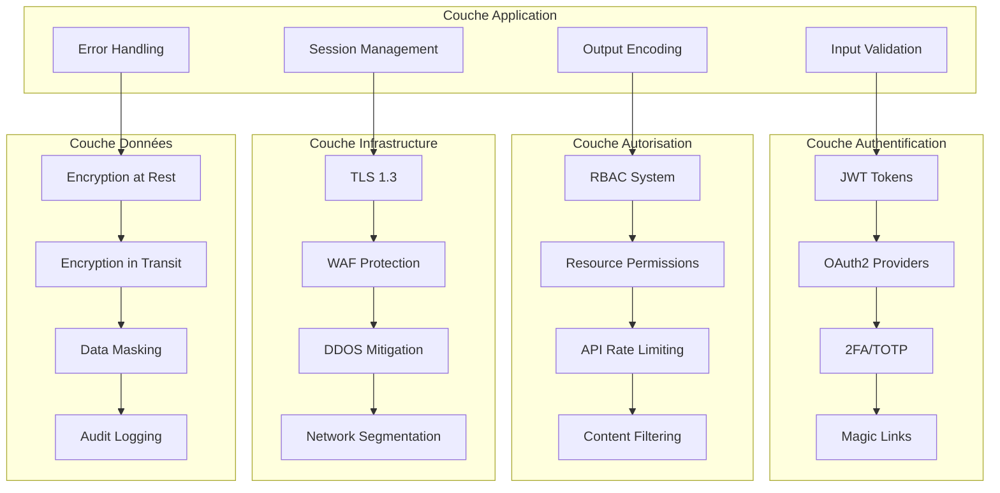
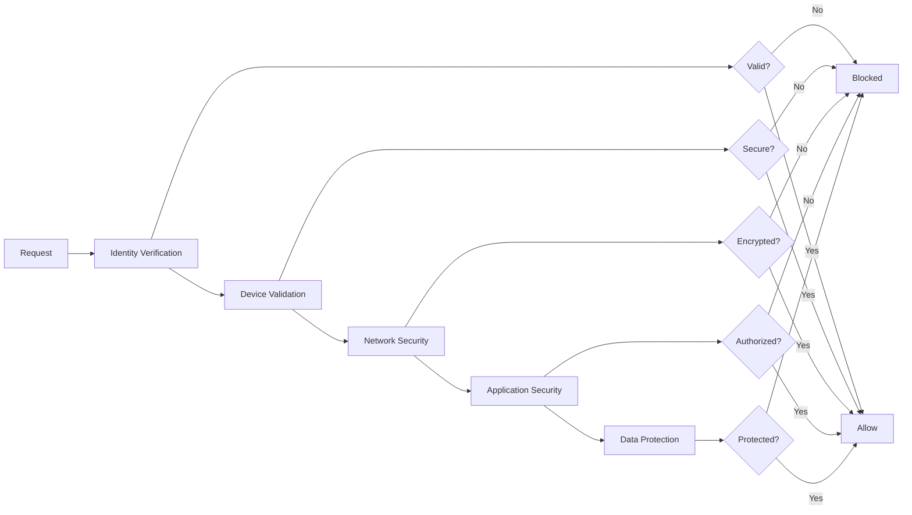
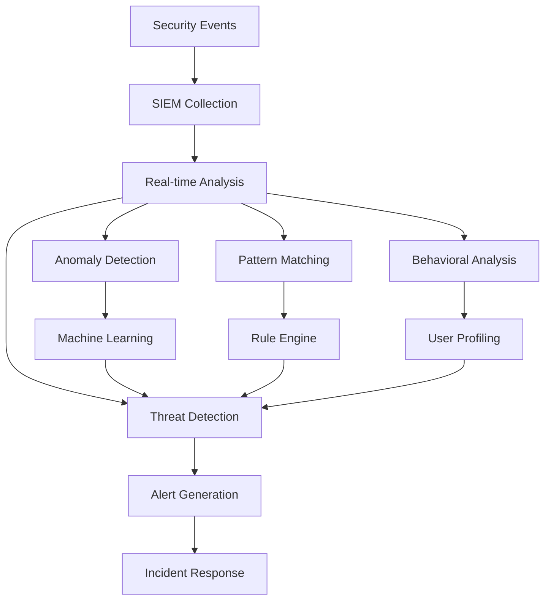
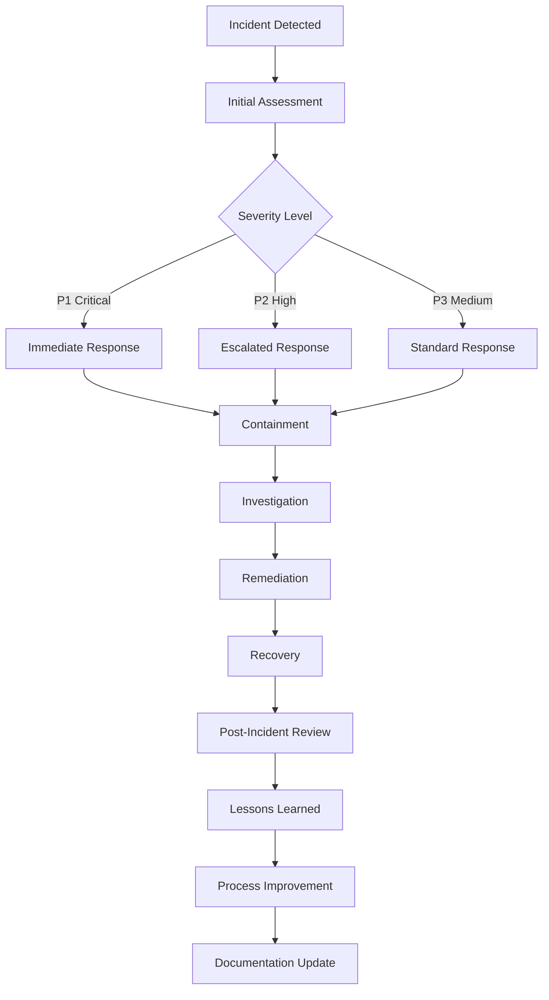

# Sécurité Veza - Documentation Complète

## Vue d'ensemble

La sécurité de la plateforme Veza est conçue selon les principes de **Zero Trust Architecture** avec une approche multi-couches pour protéger les données utilisateur, l'intégrité du système et la confidentialité des communications.

### Architecture de sécurité



## Principes de sécurité

### 1. Zero Trust Architecture

**Principe fondamental :** "Ne jamais faire confiance, toujours vérifier"



### 2. Defense in Depth

**Stratégie multi-couches :**

| Couche | Protection | Technologies |
|--------|------------|--------------|
| **Réseau** | DDoS, WAF | CloudFlare, AWS Shield |
| **Transport** | Chiffrement | TLS 1.3, Certificate Pinning |
| **Application** | Validation | Input sanitization, Output encoding |
| **Authentification** | Identité | JWT, OAuth2, 2FA |
| **Autorisation** | Permissions | RBAC, ABAC, Resource-based |
| **Données** | Chiffrement | AES-256, Key rotation |
| **Audit** | Monitoring | Logs, Alerts, Forensics |

### 3. Privacy by Design

**Intégration de la confidentialité dès la conception :**

- **Minimisation des données** : Collecte limitée au nécessaire
- **Chiffrement par défaut** : Toutes les données sensibles chiffrées
- **Contrôle utilisateur** : Transparence et contrôle des données
- **Rétention limitée** : Suppression automatique des données obsolètes

## Menaces et contre-mesures

### 1. Injection Attacks

**Menaces :** SQL Injection, XSS, Command Injection

**Contre-mesures :**

```go
// Exemple de protection SQL Injection
func GetUserByID(db *sql.DB, userID string) (*User, error) {
    // ❌ VULNÉRABLE
    // query := fmt.Sprintf("SELECT * FROM users WHERE id = %s", userID)
    
    // ✅ SÉCURISÉ
    query := "SELECT * FROM users WHERE id = $1"
    row := db.QueryRow(query, userID)
    
    var user User
    err := row.Scan(&user.ID, &user.Username, &user.Email)
    return &user, err
}

// Protection XSS
func SanitizeHTML(input string) string {
    return html.EscapeString(input)
}

// Validation des entrées
func ValidateEmail(email string) bool {
    emailRegex := regexp.MustCompile(`^[a-zA-Z0-9._%+-]+@[a-zA-Z0-9.-]+\.[a-zA-Z]{2,}$`)
    return emailRegex.MatchString(email)
}
```

### 2. Authentication Bypass

**Menaces :** Session hijacking, Token theft, Brute force

**Contre-mesures :**

```go
// JWT avec rotation automatique
type JWTSecurity struct {
    AccessTokenTTL  time.Duration `json:"access_token_ttl"`
    RefreshTokenTTL time.Duration `json:"refresh_token_ttl"`
    MaxRefreshCount int           `json:"max_refresh_count"`
    TokenRotation   bool          `json:"token_rotation"`
}

// Rate limiting anti-brute force
func RateLimitMiddleware(maxAttempts int, window time.Duration) gin.HandlerFunc {
    return func(c *gin.Context) {
        key := fmt.Sprintf("auth:%s", c.ClientIP())
        attempts, _ := redis.Incr(key).Result()
        
        if attempts == 1 {
            redis.Expire(key, window)
        }
        
        if attempts > int64(maxAttempts) {
            c.JSON(429, gin.H{"error": "Too many attempts"})
            c.Abort()
            return
        }
        
        c.Next()
    }
}
```

### 3. Data Breaches

**Menaces :** Exfiltration, Accès non autorisé, Fuites

**Contre-mesures :**

```go
// Chiffrement des données sensibles
type EncryptedData struct {
    Algorithm string `json:"algorithm"`
    KeyID     string `json:"key_id"`
    Ciphertext string `json:"ciphertext"`
    IV        string `json:"iv"`
}

func EncryptSensitiveData(data []byte, keyID string) (*EncryptedData, error) {
    key := getEncryptionKey(keyID)
    block, err := aes.NewCipher(key)
    if err != nil {
        return nil, err
    }
    
    iv := make([]byte, aes.BlockSize)
    if _, err := io.ReadFull(rand.Reader, iv); err != nil {
        return nil, err
    }
    
    ciphertext := make([]byte, len(data))
    stream := cipher.NewCFBEncrypter(block, iv)
    stream.XORKeyStream(ciphertext, data)
    
    return &EncryptedData{
        Algorithm:  "AES-256-CFB",
        KeyID:      keyID,
        Ciphertext: base64.StdEncoding.EncodeToString(ciphertext),
        IV:         base64.StdEncoding.EncodeToString(iv),
    }, nil
}
```

### 4. DDoS Attacks

**Menaces :** Volume attacks, Application layer attacks

**Contre-mesures :**

```yaml
# Configuration CloudFlare
apiVersion: v1
kind: ConfigMap
metadata:
  name: ddos-protection
data:
  rate_limit_rules: |
    {
      "rules": [
        {
          "expression": "http.request.uri.path contains \"/api/\"",
          "action": "rate_limit",
          "rate_limit": {
            "requests_per_second": 10,
            "period": 60
          }
        }
      ]
    }
  
  waf_rules: |
    {
      "rules": [
        {
          "id": "100000",
          "description": "Block SQL Injection",
          "expression": "http.request.uri.query contains \"'\" or http.request.uri.query contains \"--\"",
          "action": "block"
        }
      ]
    }
```

## Politiques de sécurité

### 1. Politique de mots de passe

**Exigences minimales :**
- **Longueur** : 8 caractères minimum
- **Complexité** : Majuscule + minuscule + chiffre + caractère spécial
- **Historique** : Différent des 5 derniers mots de passe
- **Expiration** : Changement obligatoire tous les 90 jours
- **Entropie** : Score minimum de 50/100

```go
// Validation de mot de passe
func ValidatePassword(password string) (bool, []string) {
    var errors []string
    
    if len(password) < 8 {
        errors = append(errors, "Password must be at least 8 characters")
    }
    
    if !regexp.MustCompile(`[A-Z]`).MatchString(password) {
        errors = append(errors, "Password must contain uppercase letter")
    }
    
    if !regexp.MustCompile(`[a-z]`).MatchString(password) {
        errors = append(errors, "Password must contain lowercase letter")
    }
    
    if !regexp.MustCompile(`[0-9]`).MatchString(password) {
        errors = append(errors, "Password must contain number")
    }
    
    if !regexp.MustCompile(`[!@#$%^&*]`).MatchString(password) {
        errors = append(errors, "Password must contain special character")
    }
    
    // Vérification contre dictionnaire
    if isCommonPassword(password) {
        errors = append(errors, "Password is too common")
    }
    
    return len(errors) == 0, errors
}
```

### 2. Politique de session

**Configuration des sessions :**
- **Durée** : 1 heure pour access token, 7 jours pour refresh token
- **Rotation** : Refresh tokens rotés automatiquement
- **Révocation** : Logout global sur compromission
- **Device tracking** : Limite de 5 appareils simultanés

```go
type SessionConfig struct {
    AccessTokenTTL     time.Duration `json:"access_token_ttl"`
    RefreshTokenTTL    time.Duration `json:"refresh_token_ttl"`
    MaxDevicesPerUser  int           `json:"max_devices_per_user"`
    ForceLogoutOnRisk  bool          `json:"force_logout_on_risk"`
    SessionAuditLog    bool          `json:"session_audit_log"`
}

var DefaultSessionConfig = SessionConfig{
    AccessTokenTTL:    1 * time.Hour,
    RefreshTokenTTL:   7 * 24 * time.Hour,
    MaxDevicesPerUser: 5,
    ForceLogoutOnRisk: true,
    SessionAuditLog:   true,
}
```

### 3. Politique de chiffrement

**Standards de chiffrement :**
- **En transit** : TLS 1.3 obligatoire
- **Au repos** : AES-256-GCM pour données sensibles
- **Clés** : Rotation automatique tous les 90 jours
- **Certificats** : Validation stricte, HSTS activé

```go
// Configuration TLS
type TLSConfig struct {
    MinVersion         uint16   `json:"min_version"`
    CipherSuites       []uint16 `json:"cipher_suites"`
    CurvePreferences   []tls.CurveID `json:"curve_preferences"`
    PreferServerCipher bool     `json:"prefer_server_cipher"`
    SessionTicketsDisabled bool `json:"session_tickets_disabled"`
}

var SecureTLSConfig = &tls.Config{
    MinVersion: tls.VersionTLS13,
    CipherSuites: []uint16{
        tls.TLS_AES_256_GCM_SHA384,
        tls.TLS_CHACHA20_POLY1305_SHA256,
    },
    CurvePreferences: []tls.CurveID{
        tls.X25519,
        tls.CurveP256,
    },
    PreferServerCipher: true,
}
```

## Monitoring et détection

### 1. Système de détection d'intrusion



### 2. Métriques de sécurité

| Métrique | Seuil d'alerte | Action |
|----------|----------------|--------|
| **Failed logins** | >5/minute par IP | Block IP temporaire |
| **Suspicious requests** | >10/minute par user | Account review |
| **Data access anomalies** | >100MB/hour par user | Investigation |
| **API errors** | >1% error rate | Service review |
| **SSL certificate expiry** | &lt;30 days | Renewal alert |

### 3. Alertes de sécurité

```yaml
groups:
  - name: security_alerts
    rules:
      - alert: HighFailedLogins
        expr: rate(auth_failed_logins_total[5m]) > 0.1
        for: 2m
        labels:
          severity: warning
        annotations:
          summary: "High failed login rate detected"
          description: "{{ $value }} failed logins per second"
      
      - alert: SuspiciousActivity
        expr: rate(suspicious_requests_total[5m]) > 0.05
        for: 1m
        labels:
          severity: critical
        annotations:
          summary: "Suspicious activity detected"
          description: "{{ $value }} suspicious requests per second"
      
      - alert: DataBreachAttempt
        expr: rate(data_access_anomalies_total[5m]) > 0
        for: 0m
        labels:
          severity: critical
        annotations:
          summary: "Potential data breach attempt"
          description: "Anomalous data access pattern detected"
```

## Conformité et audit

### 1. RGPD (GDPR) Compliance

**Droits des utilisateurs :**
- **Droit d'accès** : Export des données personnelles
- **Droit de rectification** : Modification des données
- **Droit à l'effacement** : Suppression complète
- **Droit à la portabilité** : Transfert des données
- **Droit d'opposition** : Désinscription des communications

```go
// Implémentation des droits RGPD
type GDPRService struct {
    db *database.DB
    encryptionService *EncryptionService
    auditLogger *AuditLogger
}

func (g *GDPRService) ExportUserData(userID int64) (*UserDataExport, error) {
    // Collecte de toutes les données utilisateur
    userData := &UserDataExport{
        UserID: userID,
        ExportedAt: time.Now(),
    }
    
    // Données de profil
    user, err := g.db.GetUserByID(userID)
    if err != nil {
        return nil, err
    }
    userData.Profile = user
    
    // Historique des connexions
    sessions, err := g.db.GetUserSessions(userID)
    if err != nil {
        return nil, err
    }
    userData.Sessions = sessions
    
    // Données de contenu
    tracks, err := g.db.GetUserTracks(userID)
    if err != nil {
        return nil, err
    }
    userData.Content = tracks
    
    // Messages et conversations
    messages, err := g.db.GetUserMessages(userID)
    if err != nil {
        return nil, err
    }
    userData.Communications = messages
    
    return userData, nil
}

func (g *GDPRService) DeleteUserData(userID int64) error {
    // Suppression en cascade avec audit
    tx, err := g.db.Begin()
    if err != nil {
        return err
    }
    defer tx.Rollback()
    
    // Audit de suppression
    g.auditLogger.LogDataDeletion(userID, "GDPR request")
    
    // Suppression des données
    if err := g.db.DeleteUserContent(userID); err != nil {
        return err
    }
    
    if err := g.db.DeleteUserMessages(userID); err != nil {
        return err
    }
    
    if err := g.db.DeleteUserProfile(userID); err != nil {
        return err
    }
    
    return tx.Commit()
}
```

### 2. SOC 2 Type II

**Contrôles de sécurité :**

| Domaine | Contrôles | Fréquence |
|---------|-----------|-----------|
| **CC1** | Access Control | Continu |
| **CC2** | Change Management | Weekly |
| **CC3** | Risk Assessment | Quarterly |
| **CC4** | Vendor Management | Monthly |
| **CC5** | Asset Management | Monthly |
| **CC6** | Configuration Management | Weekly |
| **CC7** | Incident Response | On-demand |
| **CC8** | Business Continuity | Quarterly |

### 3. Audit Trail

```go
// Système d'audit complet
type AuditEvent struct {
    ID          string                 `json:"id"`
    Timestamp   time.Time              `json:"timestamp"`
    UserID      *int64                 `json:"user_id,omitempty"`
    IPAddress   string                 `json:"ip_address"`
    UserAgent   string                 `json:"user_agent"`
    Action      string                 `json:"action"`
    Resource    string                 `json:"resource"`
    ResourceID  *string                `json:"resource_id,omitempty"`
    Details     map[string]interface{} `json:"details"`
    Success     bool                   `json:"success"`
    Error       *string                `json:"error,omitempty"`
    SessionID   *string                `json:"session_id,omitempty"`
    RequestID   string                 `json:"request_id"`
}

func (a *AuditLogger) LogSecurityEvent(ctx context.Context, event *AuditEvent) error {
    // Enrichissement automatique
    event.ID = uuid.New().String()
    event.Timestamp = time.Now()
    event.IPAddress = getClientIP(ctx)
    event.UserAgent = getUserAgent(ctx)
    event.RequestID = getRequestID(ctx)
    
    // Persistance immuable
    return a.db.InsertAuditEvent(event)
}
```

## Tests de sécurité

### 1. Tests automatisés

```go
// Tests de sécurité automatisés
func TestSecurityFeatures(t *testing.T) {
    t.Run("SQL Injection Protection", func(t *testing.T) {
        maliciousInputs := []string{
            "'; DROP TABLE users; --",
            "' OR '1'='1",
            "'; INSERT INTO users VALUES ('hacker', 'password'); --",
        }
        
        for _, input := range maliciousInputs {
            result, err := GetUserByID(db, input)
            assert.Error(t, err, "Should reject SQL injection: %s", input)
            assert.Nil(t, result)
        }
    })
    
    t.Run("XSS Protection", func(t *testing.T) {
        maliciousScripts := []string{
            "<script>alert('xss')</script>",
            "javascript:alert('xss')",
            "",
        }
        
        for _, script := range maliciousScripts {
            sanitized := SanitizeHTML(script)
            assert.NotContains(t, sanitized, "<script>")
            assert.NotContains(t, sanitized, "javascript:")
        }
    })
    
    t.Run("Password Strength", func(t *testing.T) {
        weakPasswords := []string{
            "password",
            "123456",
            "qwerty",
            "abc123",
        }
        
        for _, password := range weakPasswords {
            valid, _ := ValidatePassword(password)
            assert.False(t, valid, "Should reject weak password: %s", password)
        }
    })
}
```

### 2. Tests de pénétration

**Scénarios de test :**

1. **Authentication bypass**
2. **Privilege escalation**
3. **Data exfiltration**
4. **Session hijacking**
5. **API abuse**

**Outils utilisés :**
- OWASP ZAP
- Burp Suite
- Nmap
- Metasploit

### 3. Code review de sécurité

**Checklist obligatoire :**

- [ ] Validation des entrées utilisateur
- [ ] Échappement des sorties
- [ ] Gestion sécurisée des erreurs
- [ ] Chiffrement des données sensibles
- [ ] Logs d'audit appropriés
- [ ] Tests de sécurité inclus

## Réponse aux incidents

### 1. Plan de réponse



### 2. Équipe de réponse

| Rôle | Responsabilités | Contact |
|------|----------------|---------|
| **Incident Commander** | Coordination générale | security@veza.app |
| **Technical Lead** | Analyse technique | tech-lead@veza.app |
| **Legal Advisor** | Conformité et notifications | legal@veza.app |
| **Communications** | Communication externe | comms@veza.app |

### 3. Procédures d'urgence

**En cas de compromission :**

1. **Isolation** : Déconnexion immédiate des systèmes affectés
2. **Préservation** : Sauvegarde des logs et preuves
3. **Notification** : Alerte équipe de sécurité
4. **Investigation** : Analyse forensique
5. **Remédiation** : Correction des vulnérabilités
6. **Communication** : Notification des parties prenantes

## Formation et sensibilisation

### 1. Programme de formation

**Modules obligatoires :**
- **Sécurité de base** : Mots de passe, phishing
- **Protection des données** : RGPD, confidentialité
- **Sécurité du code** : Bonnes pratiques de développement
- **Incident response** : Procédures d'urgence

### 2. Tests de phishing

**Campagnes trimestrielles :**
- Simulation d'attaques de phishing
- Mesure du taux de clic
- Formation ciblée selon les résultats

### 3. Culture de sécurité

**Pratiques encouragées :**
- Signalement des vulnérabilités
- Code review de sécurité
- Tests de pénétration internes
- Partage de bonnes pratiques

## Ressources et références

### 1. Standards de sécurité

- **OWASP Top 10** : Vulnérabilités web critiques
- **NIST Cybersecurity Framework** : Cadre de cybersécurité
- **ISO 27001** : Management de la sécurité de l'information
- **SOC 2** : Contrôles de sécurité et disponibilité

### 2. Outils de sécurité

- **Static Analysis** : SonarQube, Semgrep
- **Dynamic Analysis** : OWASP ZAP, Burp Suite
- **Dependency Scanning** : Snyk, Dependabot
- **Container Security** : Trivy, Clair

### 3. Contacts d'urgence

| Type | Contact | Disponibilité |
|------|---------|---------------|
| **Security Team** | security@veza.app | 24/7 |
| **Bug Bounty** | security@veza.app | 24/7 |
| **Legal** | legal@veza.app | Business hours |
| **PR Crisis** | comms@veza.app | 24/7 |

Cette documentation de sécurité fournit un cadre complet pour protéger la plateforme Veza contre les menaces modernes tout en maintenant la conformité aux réglementations en vigueur. 