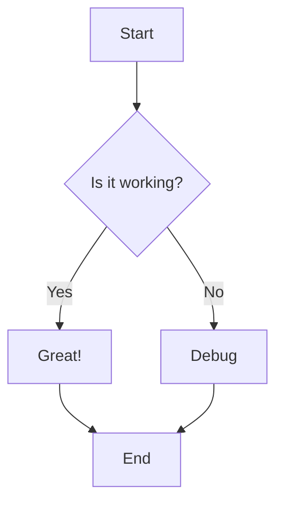
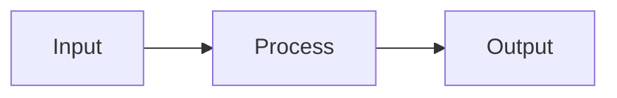
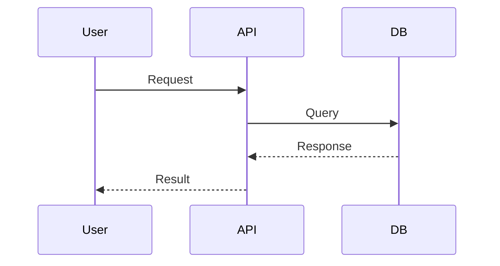

# Test des Diagrammes Mermaid

## Diagramme Simple

```mermaid
graph TD
    A[Start] --> B{Is it working?}
    B -->|Yes| C[Great!]
    B -->|No| D[Debug]
    C --> E[End]
    D --> E
```

## Diagramme de Flux

```mermaid
flowchart LR
    A[Input] --> B[Process]
    B --> C[Output]
```

## Diagramme de Séquence

```mermaid
sequenceDiagram
    participant User
    participant API
    participant DB
    
    User->>API: Request
    API->>DB: Query
    DB-->>API: Response
    API-->>User: Result
```

---

**Test** : Si vous voyez des diagrammes au lieu de texte, Mermaid fonctionne ! 