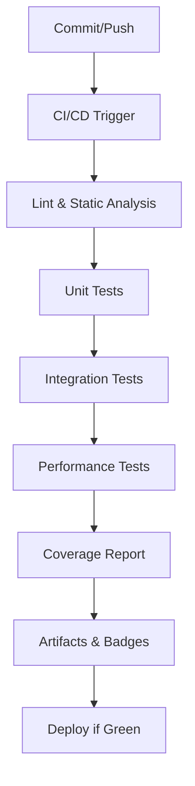

# Guide Exhaustif des Tests – Veza

## Objectif

Ce dossier centralise la stratégie de test de la plateforme Veza (backend Go, chat Rust, frontend JS/TS). Il garantit la robustesse, la sécurité et la performance du système via des tests unitaires, d'intégration et de performance, selon les règles de qualité les plus strictes.

---

## Pipeline de test – Vue d'ensemble



---

## Conventions de nommage et d'organisation

- **Unitaires** : `*_test.go`, `*_spec.rs`, `.test.js/ts` dans le même dossier que le code testé.
- **Intégration** : Dossiers dédiés (`integration/`), scripts de bout en bout, mocks de services externes.
- **Performance** : Dossiers dédiés (`performance/`), benchmarks, stress tests, scénarios réels.
- **Nommage** : Précis, reflétant le module/fonction testé, ex : `user_repository_test.go`, `auth_flow.rs`, `api_user.test.ts`.
- **Organisation** :
  - `unit/` : tests isolés, mocks, stubs
  - `integration/` : tests multi-composants, bases de données, API
  - `performance/` : benchmarks, stress, charge

---

## Outils utilisés

- **Go** : `go test`, `testify`, `mockery`, `benchstat`, `golangci-lint`
- **Rust** : `cargo test`, `criterion`, `mockall`, `tarpaulin`
- **JS/TS** : `jest`, `supertest`, `msw`, `c8`, `eslint`
- **CI/CD** : GitHub Actions, Docker Compose, Makefile, scripts custom
- **Reporting** : Codecov, SonarQube, Badges GitHub

---

## Stratégies de couverture et de mocks

- **Couverture** : Objectif >90% sur le cœur métier, >80% global. Rapports générés à chaque build.
- **Mocks** : Utilisation systématique pour les dépendances externes (DB, API, cache, email, etc.).
- **Edge cases** : Tests pour chaque cas limite, erreurs, entrées invalides, timeouts, race conditions.
- **Erreurs** : Vérification systématique des erreurs retournées, logs, et gestion des exceptions.

---

## Métriques de test

| Métrique                | Objectif         | Outil         |
|-------------------------|------------------|---------------|
| Temps d'exécution       | < 5 min CI       | CI/CD, bench  |
| Couverture code         | > 90% core       | Codecov       |
| Taux de succès          | 100%             | CI/CD         |
| Flakiness               | < 1%             | FlakyBot      |
| Temps de setup/teardown | < 1s             | Benchmarks    |

---

## Bonnes pratiques

- Isoler chaque test, pas d'état partagé
- Nettoyer les ressources après chaque test
- Utiliser des fixtures reproductibles
- Documenter chaque test complexe (JSDoc/TSDoc)
- Prioriser les tests critiques (auth, sécurité, transactions)
- Automatiser la vérification des edge cases
- Intégrer les tests dans le pipeline CI/CD

---

## Pièges courants

- Tests dépendants de l'ordre d'exécution
- Mocks non synchronisés avec les interfaces réelles
- Oubli de tester les erreurs et exceptions
- Benchmarks non représentatifs de la production
- Couverture élevée mais logique métier non testée

---

## Liens croisés

- [Tests unitaires](./unit/README.md)
- [Tests d'intégration](./integration/README.md)
- [Tests de performance](./performance/README.md)
- [API backend](../api/)
- [Modèles de données](../database/)
- [Sécurité](../security/)
- [Déploiement](../deployment/)

---

## Exemples

### Go – Test unitaire
```go
func TestValidateEmail(t *testing.T) {
    valid := ValidateEmail("user@veza.app")
    assert.True(t, valid)
    invalid := ValidateEmail("bad-email")
    assert.False(t, invalid)
}
```

### Rust – Test d'intégration
```rust
#[tokio::test]
async fn test_chat_message_flow() {
    let client = TestClient::new().await;
    let resp = client.send_message("hello").await;
    assert_eq!(resp.status(), 200);
}
```

### JS – Test API
```js
test('GET /api/user/profile', async () => {
  const res = await request(app).get('/api/user/profile').set('Authorization', 'Bearer token');
  expect(res.status).toBe(200);
  expect(res.body).toHaveProperty('email');
});
```

---

## Pour aller plus loin

- [Guide tests unitaires](./unit/README.md)
- [Guide tests d'intégration](./integration/README.md)
- [Guide tests de performance](./performance/README.md)
- [Stratégie CI/CD](../deployment/ci-cd/)
- [FAQ et troubleshooting](../reference/README.md) 