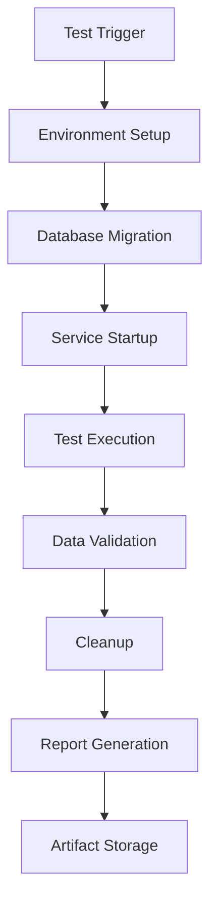
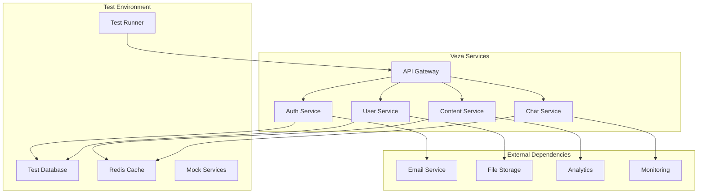

# Tests d'intégration - Veza Platform

Ce dossier regroupe la documentation et les exemples de tests d'intégration pour chaque service.

## Index
- À compléter : ajouter la documentation sur les scénarios, outils, etc.

## Navigation
- [Retour au schéma principal](../../diagrams/architecture-overview.md)

## Objectif

Les tests d'intégration vérifient l'interaction entre plusieurs composants de la plateforme Veza (API, base de données, cache, services externes). Ils valident les flux complets et détectent les problèmes d'intégration avant la production.

---

## Pipeline des tests d'intégration



---

## Architecture des tests d'intégration



---

## Conventions et organisation

### Structure des tests
```
veza-backend-api/
├── tests/
│   ├── integration/
│   │   ├── auth/
│   │   │   ├── login_flow_test.go
│   │   │   ├── registration_flow_test.go
│   │   │   └── password_reset_test.go
│   │   ├── user/
│   │   │   ├── profile_management_test.go
│   │   │   └── user_preferences_test.go
│   │   ├── content/
│   │   │   ├── track_upload_test.go
│   │   │   └── playlist_management_test.go
│   │   └── chat/
│   │       ├── message_flow_test.go
│   │       └── room_management_test.go
│   └── fixtures/
│       ├── users.json
│       ├── tracks.json
│       └── chat_rooms.json
```

### Conventions de nommage
- **Fichiers** : `*_integration_test.go`, `*_e2e_test.go`
- **Fonctions** : `Test[Feature]_[Scenario]`, `Test[Service]_[Workflow]`
- **Fixtures** : `fixtures_[entity].json`, `test_data_[scenario].sql`

---

## Configuration de l'environnement de test

### Docker Compose pour tests
```yaml
# docker-compose.test.yml
version: '3.8'
services:
  test-db:
    image: postgres:15
    environment:
      POSTGRES_DB: veza_test
      POSTGRES_USER: test_user
      POSTGRES_PASSWORD: test_password
    ports:
      - "5433:5432"
    volumes:
      - ./tests/fixtures:/docker-entrypoint-initdb.d

  test-redis:
    image: redis:7-alpine
    ports:
      - "6380:6379"

  test-api:
    build:
      context: .
      dockerfile: Dockerfile.test
    environment:
      DB_HOST: test-db
      REDIS_HOST: test-redis
      ENV: test
    depends_on:
      - test-db
      - test-redis
    ports:
      - "8081:8080"
```

### Configuration Go
```go
// tests/integration/setup.go
package integration

import (
    "database/sql"
    "net/http/httptest"
    "testing"
    "github.com/gin-gonic/gin"
    "github.com/veza/backend/internal/api"
    "github.com/veza/backend/internal/database"
)

type TestSuite struct {
    DB     *sql.DB
    Server *httptest.Server
    Router *gin.Engine
    Client *http.Client
}

func (suite *TestSuite) SetupSuite() {
    // Configuration de la base de données de test
    suite.DB = database.NewTestConnection()
    
    // Migration de la base de données
    database.RunMigrations(suite.DB, "test")
    
    // Configuration du serveur de test
    suite.Router = gin.New()
    api.SetupRoutes(suite.Router)
    suite.Server = httptest.NewServer(suite.Router)
    
    // Configuration du client HTTP
    suite.Client = &http.Client{
        Timeout: 30 * time.Second,
    }
}

func (suite *TestSuite) TearDownSuite() {
    suite.Server.Close()
    suite.DB.Close()
}

func (suite *TestSuite) SetupTest() {
    // Nettoyage de la base de données avant chaque test
    suite.cleanupDatabase()
    
    // Insertion des données de test
    suite.loadTestData()
}

func (suite *TestSuite) TearDownTest() {
    // Nettoyage après chaque test
    suite.cleanupDatabase()
}
```

---

## Tests d'intégration par domaine

### 1. Tests d'authentification

```go
// tests/integration/auth/login_flow_test.go
package auth

import (
    "encoding/json"
    "net/http"
    "net/http/httptest"
    "strings"
    "testing"
    "github.com/stretchr/testify/assert"
    "github.com/stretchr/testify/suite"
)

type LoginFlowTestSuite struct {
    TestSuite
}

func (suite *LoginFlowTestSuite) TestLoginFlow_Success() {
    // Arrange - Créer un utilisateur de test
    user := suite.createTestUser("test@veza.app", "password123")
    
    // Act - Tentative de connexion
    loginData := map[string]interface{}{
        "email":    "test@veza.app",
        "password": "password123",
    }
    
    jsonData, _ := json.Marshal(loginData)
    req := httptest.NewRequest("POST", "/api/auth/login", strings.NewReader(string(jsonData)))
    req.Header.Set("Content-Type", "application/json")
    
    w := httptest.NewRecorder()
    suite.Router.ServeHTTP(w, req)
    
    // Assert
    assert.Equal(suite.T(), http.StatusOK, w.Code)
    
    var response map[string]interface{}
    json.Unmarshal(w.Body.Bytes(), &response)
    
    assert.Contains(suite.T(), response, "access_token")
    assert.Contains(suite.T(), response, "refresh_token")
    assert.Contains(suite.T(), response, "user")
    
    // Vérifier que l'utilisateur est connecté
    userID := response["user"].(map[string]interface{})["id"].(float64)
    assert.Equal(suite.T(), float64(user.ID), userID)
}

func (suite *LoginFlowTestSuite) TestLoginFlow_InvalidCredentials() {
    // Arrange
    suite.createTestUser("test@veza.app", "password123")
    
    // Act
    loginData := map[string]interface{}{
        "email":    "test@veza.app",
        "password": "wrongpassword",
    }
    
    jsonData, _ := json.Marshal(loginData)
    req := httptest.NewRequest("POST", "/api/auth/login", strings.NewReader(string(jsonData)))
    req.Header.Set("Content-Type", "application/json")
    
    w := httptest.NewRecorder()
    suite.Router.ServeHTTP(w, req)
    
    // Assert
    assert.Equal(suite.T(), http.StatusUnauthorized, w.Code)
    
    var response map[string]interface{}
    json.Unmarshal(w.Body.Bytes(), &response)
    assert.Contains(suite.T(), response["error"], "invalid credentials")
}

func (suite *LoginFlowTestSuite) TestLoginFlow_RateLimit() {
    // Arrange
    suite.createTestUser("test@veza.app", "password123")
    
    // Act - Tentatives multiples
    for i := 0; i < 6; i++ {
        loginData := map[string]interface{}{
            "email":    "test@veza.app",
            "password": "wrongpassword",
        }
        
        jsonData, _ := json.Marshal(loginData)
        req := httptest.NewRequest("POST", "/api/auth/login", strings.NewReader(string(jsonData)))
        req.Header.Set("Content-Type", "application/json")
        
        w := httptest.NewRecorder()
        suite.Router.ServeHTTP(w, req)
        
        if i < 5 {
            assert.Equal(suite.T(), http.StatusUnauthorized, w.Code)
        } else {
            // 6ème tentative - rate limit
            assert.Equal(suite.T(), http.StatusTooManyRequests, w.Code)
        }
    }
}

func (suite *LoginFlowTestSuite) TestLoginFlow_With2FA() {
    // Arrange
    user := suite.createTestUserWith2FA("test@veza.app", "password123")
    
    // Act - Première étape (email/password)
    loginData := map[string]interface{}{
        "email":    "test@veza.app",
        "password": "password123",
    }
    
    jsonData, _ := json.Marshal(loginData)
    req := httptest.NewRequest("POST", "/api/auth/login", strings.NewReader(string(jsonData)))
    req.Header.Set("Content-Type", "application/json")
    
    w := httptest.NewRecorder()
    suite.Router.ServeHTTP(w, req)
    
    // Assert - Demande de code 2FA
    assert.Equal(suite.T(), http.StatusOK, w.Code)
    
    var response map[string]interface{}
    json.Unmarshal(w.Body.Bytes(), &response)
    assert.Equal(suite.T(), "2fa_required", response["status"])
    
    // Act - Deuxième étape (code 2FA)
    twoFAData := map[string]interface{}{
        "email": "test@veza.app",
        "code":  "123456", // Code de test
    }
    
    jsonData, _ = json.Marshal(twoFAData)
    req = httptest.NewRequest("POST", "/api/auth/2fa", strings.NewReader(string(jsonData)))
    req.Header.Set("Content-Type", "application/json")
    
    w = httptest.NewRecorder()
    suite.Router.ServeHTTP(w, req)
    
    // Assert - Connexion réussie
    assert.Equal(suite.T(), http.StatusOK, w.Code)
}

func TestLoginFlowTestSuite(t *testing.T) {
    suite.Run(t, new(LoginFlowTestSuite))
}
```

### 2. Tests de gestion des utilisateurs

```go
// tests/integration/user/profile_management_test.go
package user

import (
    "encoding/json"
    "net/http"
    "net/http/httptest"
    "strings"
    "testing"
    "github.com/stretchr/testify/assert"
    "github.com/stretchr/testify/suite"
)

type ProfileManagementTestSuite struct {
    TestSuite
    authToken string
    userID    int64
}

func (suite *ProfileManagementTestSuite) SetupTest() {
    suite.TestSuite.SetupTest()
    
    // Créer un utilisateur et obtenir un token d'authentification
    user := suite.createTestUser("test@veza.app", "password123")
    suite.userID = user.ID
    
    token, err := suite.loginUser("test@veza.app", "password123")
    assert.NoError(suite.T(), err)
    suite.authToken = token
}

func (suite *ProfileManagementTestSuite) TestGetProfile_Success() {
    // Act
    req := httptest.NewRequest("GET", "/api/user/profile", nil)
    req.Header.Set("Authorization", "Bearer "+suite.authToken)
    
    w := httptest.NewRecorder()
    suite.Router.ServeHTTP(w, req)
    
    // Assert
    assert.Equal(suite.T(), http.StatusOK, w.Code)
    
    var response map[string]interface{}
    json.Unmarshal(w.Body.Bytes(), &response)
    
    assert.Equal(suite.T(), "test@veza.app", response["email"])
    assert.Equal(suite.T(), float64(suite.userID), response["id"])
}

func (suite *ProfileManagementTestSuite) TestUpdateProfile_Success() {
    // Arrange
    updateData := map[string]interface{}{
        "username": "newusername",
        "bio":      "New bio",
        "location": "Paris, France",
    }
    
    // Act
    jsonData, _ := json.Marshal(updateData)
    req := httptest.NewRequest("PUT", "/api/user/profile", strings.NewReader(string(jsonData)))
    req.Header.Set("Content-Type", "application/json")
    req.Header.Set("Authorization", "Bearer "+suite.authToken)
    
    w := httptest.NewRecorder()
    suite.Router.ServeHTTP(w, req)
    
    // Assert
    assert.Equal(suite.T(), http.StatusOK, w.Code)
    
    var response map[string]interface{}
    json.Unmarshal(w.Body.Bytes(), &response)
    
    assert.Equal(suite.T(), "newusername", response["username"])
    assert.Equal(suite.T(), "New bio", response["bio"])
    assert.Equal(suite.T(), "Paris, France", response["location"])
    
    // Vérifier en base de données
    updatedUser := suite.getUserFromDB(suite.userID)
    assert.Equal(suite.T(), "newusername", updatedUser.Username)
    assert.Equal(suite.T(), "New bio", updatedUser.Bio)
}

func (suite *ProfileManagementTestSuite) TestUpdateProfile_ValidationError() {
    // Arrange
    updateData := map[string]interface{}{
        "username": "", // Username vide
        "email":    "invalid-email",
    }
    
    // Act
    jsonData, _ := json.Marshal(updateData)
    req := httptest.NewRequest("PUT", "/api/user/profile", strings.NewReader(string(jsonData)))
    req.Header.Set("Content-Type", "application/json")
    req.Header.Set("Authorization", "Bearer "+suite.authToken)
    
    w := httptest.NewRecorder()
    suite.Router.ServeHTTP(w, req)
    
    // Assert
    assert.Equal(suite.T(), http.StatusBadRequest, w.Code)
    
    var response map[string]interface{}
    json.Unmarshal(w.Body.Bytes(), &response)
    assert.Contains(suite.T(), response["error"], "username required")
    assert.Contains(suite.T(), response["error"], "invalid email")
}

func (suite *ProfileManagementTestSuite) TestDeleteAccount_Success() {
    // Act
    req := httptest.NewRequest("DELETE", "/api/user/account", nil)
    req.Header.Set("Authorization", "Bearer "+suite.authToken)
    
    w := httptest.NewRecorder()
    suite.Router.ServeHTTP(w, req)
    
    // Assert
    assert.Equal(suite.T(), http.StatusOK, w.Code)
    
    // Vérifier que l'utilisateur est supprimé
    user := suite.getUserFromDB(suite.userID)
    assert.Nil(suite.T(), user)
    
    // Vérifier que le token n'est plus valide
    req = httptest.NewRequest("GET", "/api/user/profile", nil)
    req.Header.Set("Authorization", "Bearer "+suite.authToken)
    
    w = httptest.NewRecorder()
    suite.Router.ServeHTTP(w, req)
    
    assert.Equal(suite.T(), http.StatusUnauthorized, w.Code)
}

func TestProfileManagementTestSuite(t *testing.T) {
    suite.Run(t, new(ProfileManagementTestSuite))
}
```

### 3. Tests de gestion du contenu

```go
// tests/integration/content/track_upload_test.go
package content

import (
    "bytes"
    "encoding/json"
    "mime/multipart"
    "net/http"
    "net/http/httptest"
    "os"
    "path/filepath"
    "testing"
    "github.com/stretchr/testify/assert"
    "github.com/stretchr/testify/suite"
)

type TrackUploadTestSuite struct {
    TestSuite
    authToken string
    userID    int64
}

func (suite *TrackUploadTestSuite) SetupTest() {
    suite.TestSuite.SetupTest()
    
    user := suite.createTestUser("creator@veza.app", "password123")
    suite.userID = user.ID
    
    token, err := suite.loginUser("creator@veza.app", "password123")
    assert.NoError(suite.T(), err)
    suite.authToken = token
}

func (suite *TrackUploadTestSuite) TestUploadTrack_Success() {
    // Arrange
    trackData := map[string]string{
        "title":       "Test Track",
        "artist":      "Test Artist",
        "genre":       "Electronic",
        "description": "A test track for integration testing",
    }
    
    // Créer un fichier audio de test
    audioFile := suite.createTestAudioFile("test_track.mp3")
    defer os.Remove(audioFile.Name())
    
    // Act
    body := &bytes.Buffer{}
    writer := multipart.NewWriter(body)
    
    // Ajouter les métadonnées
    for key, value := range trackData {
        writer.WriteField(key, value)
    }
    
    // Ajouter le fichier audio
    part, _ := writer.CreateFormFile("audio", "test_track.mp3")
    audioContent, _ := os.ReadFile(audioFile.Name())
    part.Write(audioContent)
    
    writer.Close()
    
    req := httptest.NewRequest("POST", "/api/content/tracks", body)
    req.Header.Set("Content-Type", writer.FormDataContentType())
    req.Header.Set("Authorization", "Bearer "+suite.authToken)
    
    w := httptest.NewRecorder()
    suite.Router.ServeHTTP(w, req)
    
    // Assert
    assert.Equal(suite.T(), http.StatusCreated, w.Code)
    
    var response map[string]interface{}
    json.Unmarshal(w.Body.Bytes(), &response)
    
    assert.Contains(suite.T(), response, "id")
    assert.Equal(suite.T(), "Test Track", response["title"])
    assert.Equal(suite.T(), "Test Artist", response["artist"])
    assert.Equal(suite.T(), "Electronic", response["genre"])
    
    // Vérifier en base de données
    trackID := int64(response["id"].(float64))
    track := suite.getTrackFromDB(trackID)
    assert.NotNil(suite.T(), track)
    assert.Equal(suite.T(), "Test Track", track.Title)
    assert.Equal(suite.T(), suite.userID, track.UserID)
}

func (suite *TrackUploadTestSuite) TestUploadTrack_InvalidFile() {
    // Arrange
    trackData := map[string]string{
        "title":  "Test Track",
        "artist": "Test Artist",
    }
    
    // Créer un fichier invalide
    invalidFile := suite.createTestTextFile("invalid.txt")
    defer os.Remove(invalidFile.Name())
    
    // Act
    body := &bytes.Buffer{}
    writer := multipart.NewWriter(body)
    
    for key, value := range trackData {
        writer.WriteField(key, value)
    }
    
    part, _ := writer.CreateFormFile("audio", "invalid.txt")
    fileContent, _ := os.ReadFile(invalidFile.Name())
    part.Write(fileContent)
    
    writer.Close()
    
    req := httptest.NewRequest("POST", "/api/content/tracks", body)
    req.Header.Set("Content-Type", writer.FormDataContentType())
    req.Header.Set("Authorization", "Bearer "+suite.authToken)
    
    w := httptest.NewRecorder()
    suite.Router.ServeHTTP(w, req)
    
    // Assert
    assert.Equal(suite.T(), http.StatusBadRequest, w.Code)
    
    var response map[string]interface{}
    json.Unmarshal(w.Body.Bytes(), &response)
    assert.Contains(suite.T(), response["error"], "invalid file format")
}

func (suite *TrackUploadTestSuite) TestUploadTrack_FileTooLarge() {
    // Arrange
    trackData := map[string]string{
        "title":  "Test Track",
        "artist": "Test Artist",
    }
    
    // Créer un fichier trop volumineux
    largeFile := suite.createLargeTestFile("large_track.mp3", 100*1024*1024) // 100MB
    defer os.Remove(largeFile.Name())
    
    // Act
    body := &bytes.Buffer{}
    writer := multipart.NewWriter(body)
    
    for key, value := range trackData {
        writer.WriteField(key, value)
    }
    
    part, _ := writer.CreateFormFile("audio", "large_track.mp3")
    fileContent, _ := os.ReadFile(largeFile.Name())
    part.Write(fileContent)
    
    writer.Close()
    
    req := httptest.NewRequest("POST", "/api/content/tracks", body)
    req.Header.Set("Content-Type", writer.FormDataContentType())
    req.Header.Set("Authorization", "Bearer "+suite.authToken)
    
    w := httptest.NewRecorder()
    suite.Router.ServeHTTP(w, req)
    
    // Assert
    assert.Equal(suite.T(), http.StatusBadRequest, w.Code)
    
    var response map[string]interface{}
    json.Unmarshal(w.Body.Bytes(), &response)
    assert.Contains(suite.T(), response["error"], "file too large")
}

func (suite *TrackUploadTestSuite) TestUploadTrack_Unauthorized() {
    // Act - Sans token d'authentification
    req := httptest.NewRequest("POST", "/api/content/tracks", nil)
    
    w := httptest.NewRecorder()
    suite.Router.ServeHTTP(w, req)
    
    // Assert
    assert.Equal(suite.T(), http.StatusUnauthorized, w.Code)
}

func TestTrackUploadTestSuite(t *testing.T) {
    suite.Run(t, new(TrackUploadTestSuite))
}
```

### 4. Tests de chat en temps réel

```go
// tests/integration/chat/message_flow_test.go
package chat

import (
    "encoding/json"
    "net/http"
    "net/http/httptest"
    "net/url"
    "strings"
    "testing"
    "time"
    "github.com/gorilla/websocket"
    "github.com/stretchr/testify/assert"
    "github.com/stretchr/testify/suite"
)

type MessageFlowTestSuite struct {
    TestSuite
    authToken string
    userID    int64
    roomID    string
}

func (suite *MessageFlowTestSuite) SetupTest() {
    suite.TestSuite.SetupTest()
    
    user := suite.createTestUser("chatter@veza.app", "password123")
    suite.userID = user.ID
    
    token, err := suite.loginUser("chatter@veza.app", "password123")
    assert.NoError(suite.T(), err)
    suite.authToken = token
    
    // Créer une salle de chat
    room := suite.createTestChatRoom("Test Room", suite.userID)
    suite.roomID = room.ID
}

func (suite *MessageFlowTestSuite) TestWebSocketConnection_Success() {
    // Arrange
    u := url.URL{Scheme: "ws", Host: suite.Server.URL[7:], Path: "/ws/chat"}
    q := u.Query()
    q.Set("token", suite.authToken)
    q.Set("room_id", suite.roomID)
    u.RawQuery = q.Encode()
    
    // Act
    conn, _, err := websocket.DefaultDialer.Dial(u.String(), nil)
    assert.NoError(suite.T(), err)
    defer conn.Close()
    
    // Assert - Vérifier la connexion
    conn.SetReadDeadline(time.Now().Add(5 * time.Second))
    
    var message map[string]interface{}
    err = conn.ReadJSON(&message)
    assert.NoError(suite.T(), err)
    assert.Equal(suite.T(), "connected", message["type"])
}

func (suite *MessageFlowTestSuite) TestSendMessage_Success() {
    // Arrange
    u := url.URL{Scheme: "ws", Host: suite.Server.URL[7:], Path: "/ws/chat"}
    q := u.Query()
    q.Set("token", suite.authToken)
    q.Set("room_id", suite.roomID)
    u.RawQuery = q.Encode()
    
    conn, _, err := websocket.DefaultDialer.Dial(u.String(), nil)
    assert.NoError(suite.T(), err)
    defer conn.Close()
    
    // Attendre la connexion
    var connectMsg map[string]interface{}
    conn.ReadJSON(&connectMsg)
    
    // Act - Envoyer un message
    message := map[string]interface{}{
        "type":    "message",
        "content": "Hello, world!",
        "room_id": suite.roomID,
    }
    
    err = conn.WriteJSON(message)
    assert.NoError(suite.T(), err)
    
    // Assert - Vérifier la réception
    conn.SetReadDeadline(time.Now().Add(5 * time.Second))
    
    var response map[string]interface{}
    err = conn.ReadJSON(&response)
    assert.NoError(suite.T(), err)
    
    assert.Equal(suite.T(), "message", response["type"])
    assert.Equal(suite.T(), "Hello, world!", response["content"])
    assert.Equal(suite.T(), float64(suite.userID), response["user_id"])
    
    // Vérifier en base de données
    messages := suite.getMessagesFromDB(suite.roomID)
    assert.Len(suite.T(), messages, 1)
    assert.Equal(suite.T(), "Hello, world!", messages[0].Content)
}

func (suite *MessageFlowTestSuite) TestSendMessage_Unauthorized() {
    // Arrange
    u := url.URL{Scheme: "ws", Host: suite.Server.URL[7:], Path: "/ws/chat"}
    q := u.Query()
    q.Set("token", "invalid_token")
    q.Set("room_id", suite.roomID)
    u.RawQuery = q.Encode()
    
    // Act
    _, _, err := websocket.DefaultDialer.Dial(u.String(), nil)
    
    // Assert
    assert.Error(suite.T(), err)
}

func (suite *MessageFlowTestSuite) TestSendMessage_InvalidRoom() {
    // Arrange
    u := url.URL{Scheme: "ws", Host: suite.Server.URL[7:], Path: "/ws/chat"}
    q := u.Query()
    q.Set("token", suite.authToken)
    q.Set("room_id", "invalid_room")
    u.RawQuery = q.Encode()
    
    // Act
    _, _, err := websocket.DefaultDialer.Dial(u.String(), nil)
    
    // Assert
    assert.Error(suite.T(), err)
}

func (suite *MessageFlowTestSuite) TestTypingIndicator() {
    // Arrange
    u := url.URL{Scheme: "ws", Host: suite.Server.URL[7:], Path: "/ws/chat"}
    q := u.Query()
    q.Set("token", suite.authToken)
    q.Set("room_id", suite.roomID)
    u.RawQuery = q.Encode()
    
    conn, _, err := websocket.DefaultDialer.Dial(u.String(), nil)
    assert.NoError(suite.T(), err)
    defer conn.Close()
    
    // Attendre la connexion
    var connectMsg map[string]interface{}
    conn.ReadJSON(&connectMsg)
    
    // Act - Envoyer un indicateur de frappe
    typingMsg := map[string]interface{}{
        "type":    "typing",
        "room_id": suite.roomID,
        "is_typing": true,
    }
    
    err = conn.WriteJSON(typingMsg)
    assert.NoError(suite.T(), err)
    
    // Assert - Vérifier la diffusion
    conn.SetReadDeadline(time.Now().Add(5 * time.Second))
    
    var response map[string]interface{}
    err = conn.ReadJSON(&response)
    assert.NoError(suite.T(), err)
    
    assert.Equal(suite.T(), "typing", response["type"])
    assert.Equal(suite.T(), true, response["is_typing"])
    assert.Equal(suite.T(), float64(suite.userID), response["user_id"])
}

func TestMessageFlowTestSuite(t *testing.T) {
    suite.Run(t, new(MessageFlowTestSuite))
}
```

---

## Tests de performance d'intégration

```go
// tests/integration/performance/load_test.go
package performance

import (
    "net/http"
    "net/http/httptest"
    "sync"
    "testing"
    "time"
    "github.com/stretchr/testify/assert"
    "github.com/stretchr/testify/suite"
)

type LoadTestSuite struct {
    TestSuite
}

func (suite *LoadTestSuite) TestConcurrentUserLogin() {
    // Arrange
    numUsers := 100
    var wg sync.WaitGroup
    results := make(chan bool, numUsers)
    
    // Act - Connexions simultanées
    start := time.Now()
    
    for i := 0; i < numUsers; i++ {
        wg.Add(1)
        go func(userID int) {
            defer wg.Done()
            
            email := fmt.Sprintf("user%d@veza.app", userID)
            password := "password123"
            
            suite.createTestUser(email, password)
            
            loginData := map[string]interface{}{
                "email":    email,
                "password": password,
            }
            
            jsonData, _ := json.Marshal(loginData)
            req := httptest.NewRequest("POST", "/api/auth/login", strings.NewReader(string(jsonData)))
            req.Header.Set("Content-Type", "application/json")
            
            w := httptest.NewRecorder()
            suite.Router.ServeHTTP(w, req)
            
            results <- w.Code == http.StatusOK
        }(i)
    }
    
    wg.Wait()
    close(results)
    
    duration := time.Since(start)
    
    // Assert
    successCount := 0
    for success := range results {
        if success {
            successCount++
        }
    }
    
    assert.Equal(suite.T(), numUsers, successCount, "All logins should succeed")
    assert.Less(suite.T(), duration, 10*time.Second, "Should complete within 10 seconds")
}

func (suite *LoadTestSuite) TestDatabaseConnectionPool() {
    // Arrange
    numConnections := 50
    var wg sync.WaitGroup
    results := make(chan bool, numConnections)
    
    // Act - Requêtes simultanées
    start := time.Now()
    
    for i := 0; i < numConnections; i++ {
        wg.Add(1)
        go func() {
            defer wg.Done()
            
            // Simuler une requête de base de données
            user := suite.createTestUser(fmt.Sprintf("user%d@veza.app", i), "password123")
            
            req := httptest.NewRequest("GET", fmt.Sprintf("/api/user/%d", user.ID), nil)
            req.Header.Set("Authorization", "Bearer "+suite.authToken)
            
            w := httptest.NewRecorder()
            suite.Router.ServeHTTP(w, req)
            
            results <- w.Code == http.StatusOK
        }()
    }
    
    wg.Wait()
    close(results)
    
    duration := time.Since(start)
    
    // Assert
    successCount := 0
    for success := range results {
        if success {
            successCount++
        }
    }
    
    assert.Equal(suite.T(), numConnections, successCount, "All requests should succeed")
    assert.Less(suite.T(), duration, 5*time.Second, "Should complete within 5 seconds")
}

func TestLoadTestSuite(t *testing.T) {
    suite.Run(t, new(LoadTestSuite))
}
```

---

## Métriques et monitoring

### Métriques de test
```go
type TestMetrics struct {
    Duration    time.Duration `json:"duration"`
    SuccessRate float64       `json:"success_rate"`
    ErrorCount  int           `json:"error_count"`
    Throughput  float64       `json:"throughput"` // requests/second
}

func (suite *TestSuite) recordTestMetrics(testName string, metrics TestMetrics) {
    // Enregistrement des métriques
    suite.metrics[testName] = metrics
    
    // Vérification des seuils
    assert.Greater(suite.T(), metrics.SuccessRate, 0.95, "Success rate should be > 95%")
    assert.Less(suite.T(), metrics.Duration, 30*time.Second, "Test should complete within 30 seconds")
}
```

### Configuration de monitoring
```yaml
# prometheus.yml
global:
  scrape_interval: 15s

scrape_configs:
  - job_name: 'veza-integration-tests'
    static_configs:
      - targets: ['localhost:8081']
    metrics_path: '/metrics'
    scrape_interval: 5s
```

---

## Bonnes pratiques

### 1. Isolation des tests
```go
func (suite *TestSuite) cleanupDatabase() {
    // Nettoyage complet de la base de données
    tables := []string{"users", "tracks", "playlists", "chat_messages", "chat_rooms"}
    for _, table := range tables {
        suite.DB.Exec("TRUNCATE TABLE " + table + " CASCADE")
    }
}
```

### 2. Fixtures reproductibles
```go
func (suite *TestSuite) loadTestData() {
    // Chargement des données de test depuis des fichiers JSON
    fixtures := []string{"users", "tracks", "chat_rooms"}
    for _, fixture := range fixtures {
        data := suite.loadFixture(fixture + ".json")
        suite.insertFixtureData(fixture, data)
    }
}
```

### 3. Gestion des timeouts
```go
func (suite *TestSuite) SetupSuite() {
    // Configuration des timeouts
    suite.Client.Timeout = 30 * time.Second
    suite.DB.SetConnMaxLifetime(5 * time.Minute)
    suite.DB.SetMaxOpenConns(10)
}
```

---

## Pièges courants

### 1. Tests dépendants
```go
// ❌ Mauvais - Tests dépendants
func TestUserFlow_Bad(t *testing.T) {
    // Test 1
    user := createUser()
    // Test 2 dépend du résultat du test 1
    updateUser(user.ID)
}

// ✅ Bon - Tests isolés
func TestUserFlow_Good(t *testing.T) {
    // Chaque test crée ses propres données
    user := createTestUser()
    updateTestUser(user.ID)
}
```

### 2. Nettoyage insuffisant
```go
// ❌ Mauvais - Pas de nettoyage
func TestUserCreation_Bad(t *testing.T) {
    createUser()
    // Pas de nettoyage
}

// ✅ Bon - Nettoyage systématique
func TestUserCreation_Good(t *testing.T) {
    defer cleanupDatabase()
    createUser()
}
```

### 3. Assertions insuffisantes
```go
// ❌ Mauvais - Assertions faibles
func TestAPI_Bad(t *testing.T) {
    resp := makeRequest()
    assert.Equal(t, 200, resp.Code) // Pas assez spécifique
}

// ✅ Bon - Assertions complètes
func TestAPI_Good(t *testing.T) {
    resp := makeRequest()
    assert.Equal(t, 200, resp.Code)
    
    var data map[string]interface{}
    json.Unmarshal(resp.Body.Bytes(), &data)
    assert.Contains(t, data, "id")
    assert.Contains(t, data, "email")
}
```

---

## Liens croisés

- [Tests unitaires](../unit/README.md)
- [Tests de performance](../performance/README.md)
- [API backend](../../api/)
- [Base de données](../../database/)
- [Sécurité](../../security/)
- [Déploiement](../../deployment/)
- [CI/CD](../../deployment/ci-cd/)

---

## Pour aller plus loin

- [Guide des tests unitaires](../unit/README.md)
- [Guide des tests de performance](../performance/README.md)
- [Documentation API](../../api/)
- [Stratégie CI/CD](../../deployment/ci-cd/)
- [FAQ et troubleshooting](../../reference/) 