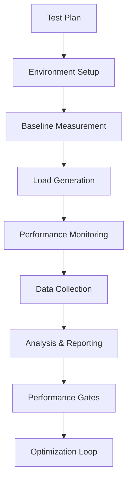
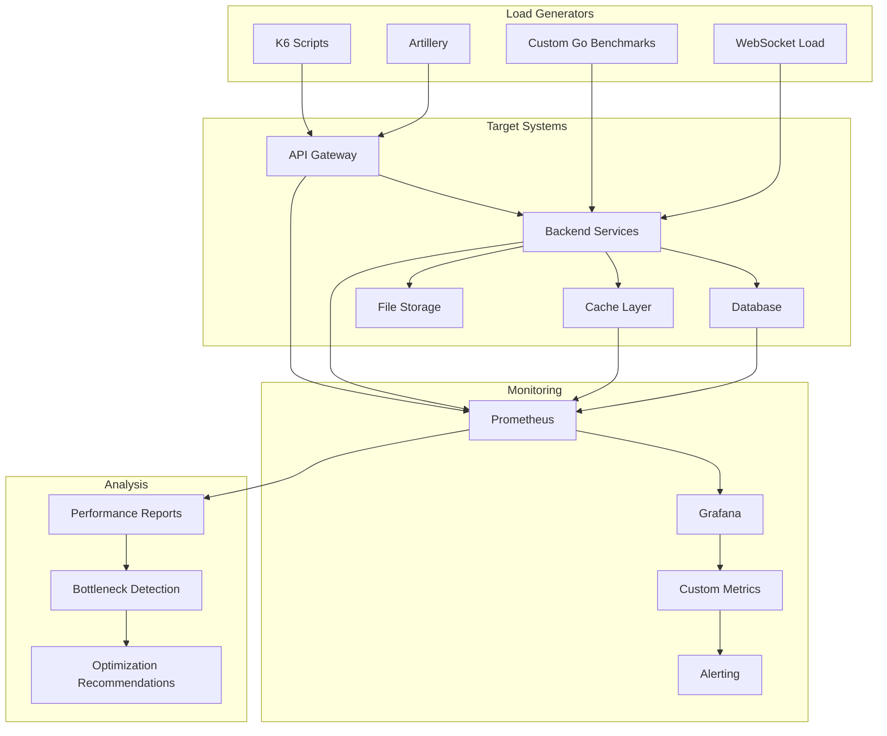

# Tests de performance - Veza Platform

Ce dossier regroupe la documentation et les exemples de tests de performance (load, stress, etc.).

## Index
- À compléter : ajouter la documentation sur les outils, scripts, etc.

## Navigation
- [Retour au schéma principal](../../diagrams/architecture-overview.md)

## Objectif

Les tests de performance évaluent la capacité de la plateforme Veza à gérer la charge, les temps de réponse et la scalabilité sous différentes conditions. Ils garantissent que le système répond aux exigences de performance en production.

---

## Pipeline des tests de performance



---

## Architecture des tests de performance



---

## Types de tests de performance

### 1. Tests de charge (Load Testing)
```go
// tests/performance/load/api_load_test.go
package load

import (
    "net/http"
    "net/http/httptest"
    "sync"
    "testing"
    "time"
    "github.com/stretchr/testify/assert"
    "github.com/stretchr/testify/suite"
)

type APILoadTestSuite struct {
    TestSuite
}

func (suite *APILoadTestSuite) TestConcurrentUserRequests() {
    // Configuration
    numUsers := 1000
    duration := 5 * time.Minute
    rampUpTime := 30 * time.Second
    
    // Métriques
    var (
        totalRequests int64
        successfulRequests int64
        failedRequests int64
        responseTimes []time.Duration
        mu sync.Mutex
    )
    
    // Génération de charge
    start := time.Now()
    var wg sync.WaitGroup
    
    for i := 0; i < numUsers; i++ {
        wg.Add(1)
        go func(userID int) {
            defer wg.Done()
            
            // Ramp-up progressif
            time.Sleep(time.Duration(i) * rampUpTime / time.Duration(numUsers))
            
            // Boucle de requêtes
            for time.Since(start) < duration {
                reqStart := time.Now()
                
                // Requête API
                req := httptest.NewRequest("GET", "/api/user/profile", nil)
                req.Header.Set("Authorization", "Bearer "+suite.getUserToken(userID))
                
                w := httptest.NewRecorder()
                suite.Router.ServeHTTP(w, req)
                
                responseTime := time.Since(reqStart)
                
                mu.Lock()
                totalRequests++
                if w.Code == http.StatusOK {
                    successfulRequests++
                } else {
                    failedRequests++
                }
                responseTimes = append(responseTimes, responseTime)
                mu.Unlock()
                
                // Intervalle entre requêtes
                time.Sleep(100 * time.Millisecond)
            }
        }(i)
    }
    
    wg.Wait()
    testDuration := time.Since(start)
    
    // Calcul des métriques
    successRate := float64(successfulRequests) / float64(totalRequests) * 100
    avgResponseTime := suite.calculateAverageResponseTime(responseTimes)
    p95ResponseTime := suite.calculatePercentile(responseTimes, 95)
    p99ResponseTime := suite.calculatePercentile(responseTimes, 99)
    throughput := float64(totalRequests) / testDuration.Seconds()
    
    // Assertions
    assert.Greater(suite.T(), successRate, 95.0, "Success rate should be > 95%")
    assert.Less(suite.T(), avgResponseTime, 200*time.Millisecond, "Average response time should be < 200ms")
    assert.Less(suite.T(), p95ResponseTime, 500*time.Millisecond, "P95 response time should be < 500ms")
    assert.Less(suite.T(), p99ResponseTime, 1000*time.Millisecond, "P99 response time should be < 1s")
    assert.Greater(suite.T(), throughput, 100.0, "Throughput should be > 100 req/s")
    
    // Log des métriques
    suite.logPerformanceMetrics("concurrent_user_requests", map[string]interface{}{
        "total_requests":      totalRequests,
        "successful_requests": successfulRequests,
        "failed_requests":     failedRequests,
        "success_rate":        successRate,
        "avg_response_time":   avgResponseTime,
        "p95_response_time":   p95ResponseTime,
        "p99_response_time":   p99ResponseTime,
        "throughput":          throughput,
        "test_duration":       testDuration,
    })
}

func (suite *APILoadTestSuite) TestDatabaseConnectionPool() {
    // Test de la pool de connexions
    numConnections := 100
    var wg sync.WaitGroup
    results := make(chan time.Duration, numConnections)
    
    start := time.Now()
    
    for i := 0; i < numConnections; i++ {
        wg.Add(1)
        go func() {
            defer wg.Done()
            
            // Simuler une requête de base de données
            reqStart := time.Now()
            
            // Requête complexe
            rows, err := suite.DB.Query(`
                SELECT u.id, u.email, u.username, 
                       COUNT(t.id) as track_count,
                       COUNT(p.id) as playlist_count
                FROM users u
                LEFT JOIN tracks t ON u.id = t.user_id
                LEFT JOIN playlists p ON u.id = p.user_id
                WHERE u.created_at > $1
                GROUP BY u.id
                ORDER BY u.created_at DESC
                LIMIT 100
            `, time.Now().AddDate(0, 0, -30))
            
            if err == nil {
                rows.Close()
            }
            
            results <- time.Since(reqStart)
        }()
    }
    
    wg.Wait()
    close(results)
    
    // Calcul des métriques
    var responseTimes []time.Duration
    for responseTime := range results {
        responseTimes = append(responseTimes, responseTime)
    }
    
    avgResponseTime := suite.calculateAverageResponseTime(responseTimes)
    p95ResponseTime := suite.calculatePercentile(responseTimes, 95)
    
    // Assertions
    assert.Less(suite.T(), avgResponseTime, 50*time.Millisecond, "DB query avg time should be < 50ms")
    assert.Less(suite.T(), p95ResponseTime, 200*time.Millisecond, "DB query P95 time should be < 200ms")
}
```

### 2. Tests de stress (Stress Testing)
```go
// tests/performance/stress/stress_test.go
package stress

import (
    "testing"
    "time"
    "github.com/stretchr/testify/assert"
    "github.com/stretchr/testify/suite"
)

type StressTestSuite struct {
    TestSuite
}

func (suite *StressTestSuite) TestSystemUnderStress() {
    // Configuration du stress test
    initialLoad := 100
    maxLoad := 1000
    stepSize := 50
    stepDuration := 30 * time.Second
    
    var (
        breakingPoint int
        maxThroughput float64
        errorThreshold = 5.0 // 5% d'erreurs
    )
    
    // Test progressif
    for load := initialLoad; load <= maxLoad; load += stepSize {
        start := time.Now()
        
        // Génération de charge
        metrics := suite.generateLoad(load, stepDuration)
        
        // Vérification des métriques
        if metrics.ErrorRate > errorThreshold {
            breakingPoint = load
            break
        }
        
        if metrics.Throughput > maxThroughput {
            maxThroughput = metrics.Throughput
        }
        
        // Pause entre les étapes
        time.Sleep(10 * time.Second)
    }
    
    // Assertions
    assert.Greater(suite.T(), breakingPoint, 500, "System should handle at least 500 concurrent users")
    assert.Greater(suite.T(), maxThroughput, 200.0, "Max throughput should be > 200 req/s")
    
    suite.logStressTestResults(breakingPoint, maxThroughput)
}

func (suite *StressTestSuite) TestMemoryLeakDetection() {
    // Test de détection de fuites mémoire
    initialMemory := suite.getMemoryUsage()
    
    // Génération de charge prolongée
    duration := 10 * time.Minute
    load := 500
    
    start := time.Now()
    for time.Since(start) < duration {
        suite.generateLoad(load, 1*time.Minute)
        
        // Vérification de la mémoire toutes les minutes
        currentMemory := suite.getMemoryUsage()
        memoryIncrease := currentMemory - initialMemory
        
        // Assertion - pas de fuite mémoire significative
        assert.Less(suite.T(), memoryIncrease, 100*1024*1024, "Memory increase should be < 100MB")
        
        time.Sleep(1 * time.Minute)
    }
}

func (suite *StressTestSuite) TestDatabaseConnectionExhaustion() {
    // Test de saturation des connexions DB
    maxConnections := 100
    testConnections := 150
    
    var wg sync.WaitGroup
    results := make(chan bool, testConnections)
    
    for i := 0; i < testConnections; i++ {
        wg.Add(1)
        go func() {
            defer wg.Done()
            
            // Tentative de connexion
            db, err := sql.Open("postgres", suite.DBConfig)
            if err != nil {
                results <- false
                return
            }
            defer db.Close()
            
            // Test de requête
            err = db.Ping()
            results <- err == nil
        }()
    }
    
    wg.Wait()
    close(results)
    
    // Calcul du taux de succès
    successfulConnections := 0
    for success := range results {
        if success {
            successfulConnections++
        }
    }
    
    successRate := float64(successfulConnections) / float64(testConnections) * 100
    
    // Assertions
    assert.Greater(suite.T(), successRate, 90.0, "Connection success rate should be > 90%")
}
```

### 3. Tests de scalabilité (Scalability Testing)
```go
// tests/performance/scalability/scalability_test.go
package scalability

import (
    "testing"
    "time"
    "github.com/stretchr/testify/assert"
    "github.com/stretchr/testify/suite"
)

type ScalabilityTestSuite struct {
    TestSuite
}

func (suite *ScalabilityTestSuite) TestHorizontalScaling() {
    // Test de scalabilité horizontale
    scalingFactors := []int{1, 2, 4, 8}
    baseLoad := 100
    
    var scalingMetrics []ScalingMetric
    
    for _, factor := range scalingFactors {
        // Configuration avec N instances
        suite.configureInstances(factor)
        
        // Test avec charge proportionnelle
        load := baseLoad * factor
        metrics := suite.generateLoad(load, 2*time.Minute)
        
        scalingMetrics = append(scalingMetrics, ScalingMetric{
            Instances:    factor,
            Load:         load,
            Throughput:   metrics.Throughput,
            ResponseTime: metrics.AvgResponseTime,
            ErrorRate:    metrics.ErrorRate,
        })
    }
    
    // Analyse de scalabilité
    suite.analyzeScalingEfficiency(scalingMetrics)
    
    // Assertions
    for i := 1; i < len(scalingMetrics); i++ {
        current := scalingMetrics[i]
        previous := scalingMetrics[i-1]
        
        // Vérification de la scalabilité linéaire
        expectedThroughput := previous.Throughput * float64(current.Instances) / float64(previous.Instances)
        actualThroughput := current.Throughput
        
        efficiency := actualThroughput / expectedThroughput
        
        assert.Greater(suite.T(), efficiency, 0.8, "Scaling efficiency should be > 80%")
        assert.Less(suite.T(), current.ErrorRate, 5.0, "Error rate should be < 5%")
    }
}

func (suite *ScalabilityTestSuite) TestDatabaseScaling() {
    // Test de scalabilité de la base de données
    testScenarios := []struct {
        name           string
        readReplicas   int
        writeLoad      int
        readLoad       int
        expectedLatency time.Duration
    }{
        {"Single DB", 0, 100, 500, 50 * time.Millisecond},
        {"1 Read Replica", 1, 100, 1000, 30 * time.Millisecond},
        {"2 Read Replicas", 2, 100, 1500, 25 * time.Millisecond},
        {"3 Read Replicas", 3, 100, 2000, 20 * time.Millisecond},
    }
    
    for _, scenario := range testScenarios {
        suite.T().Run(scenario.name, func(t *testing.T) {
            // Configuration des réplicas
            suite.configureDatabaseReplicas(scenario.readReplicas)
            
            // Test de charge mixte (lecture/écriture)
            metrics := suite.generateMixedLoad(scenario.writeLoad, scenario.readLoad, 2*time.Minute)
            
            // Assertions
            assert.Less(t, metrics.AvgResponseTime, scenario.expectedLatency)
            assert.Less(t, metrics.ErrorRate, 2.0)
            assert.Greater(t, metrics.Throughput, float64(scenario.readLoad+scenario.writeLoad)/120.0)
        })
    }
}
```

### 4. Tests de benchmark
```go
// tests/performance/benchmark/benchmark_test.go
package benchmark

import (
    "testing"
    "github.com/stretchr/testify/assert"
)

func BenchmarkUserAuthentication(b *testing.B) {
    // Benchmark de l'authentification
    b.ResetTimer()
    
    for i := 0; i < b.N; i++ {
        // Test d'authentification
        user := createTestUser("benchmark@veza.app", "password123")
        
        start := time.Now()
        token, err := authenticateUser("benchmark@veza.app", "password123")
        duration := time.Since(start)
        
        assert.NoError(b, err)
        assert.NotEmpty(b, token)
        
        // Enregistrement des métriques
        b.ReportMetric(duration.Milliseconds(), "ms")
    }
}

func BenchmarkDatabaseQueries(b *testing.B) {
    // Benchmark des requêtes de base de données
    b.ResetTimer()
    
    for i := 0; i < b.N; i++ {
        start := time.Now()
        
        // Requête complexe
        rows, err := db.Query(`
            SELECT u.id, u.email, u.username,
                   COUNT(t.id) as track_count,
                   COUNT(p.id) as playlist_count,
                   AVG(t.duration) as avg_track_duration
            FROM users u
            LEFT JOIN tracks t ON u.id = t.user_id
            LEFT JOIN playlists p ON u.id = p.user_id
            WHERE u.created_at > $1
            GROUP BY u.id
            ORDER BY u.created_at DESC
            LIMIT 50
        `, time.Now().AddDate(0, 0, -30))
        
        duration := time.Since(start)
        
        if err == nil {
            rows.Close()
        }
        
        b.ReportMetric(duration.Milliseconds(), "ms")
    }
}

func BenchmarkFileUpload(b *testing.B) {
    // Benchmark du téléchargement de fichiers
    testFiles := []struct {
        name     string
        size     int64
        expected time.Duration
    }{
        {"small.mp3", 1024 * 1024, 100 * time.Millisecond},      // 1MB
        {"medium.mp3", 10 * 1024 * 1024, 500 * time.Millisecond}, // 10MB
        {"large.mp3", 100 * 1024 * 1024, 2 * time.Second},        // 100MB
    }
    
    for _, file := range testFiles {
        b.Run(file.name, func(b *testing.B) {
            b.ResetTimer()
            
            for i := 0; i < b.N; i++ {
                start := time.Now()
                
                // Simulation du téléchargement
                err := uploadTestFile(file.name, file.size)
                duration := time.Since(start)
                
                assert.NoError(b, err)
                assert.Less(b, duration, file.expected)
                
                b.ReportMetric(duration.Milliseconds(), "ms")
            }
        })
    }
}
```

---

## Outils de monitoring

### Configuration Prometheus
```yaml
# prometheus.yml
global:
  scrape_interval: 15s
  evaluation_interval: 15s

rule_files:
  - "performance_rules.yml"

scrape_configs:
  - job_name: 'veza-api'
    static_configs:
      - targets: ['localhost:8080']
    metrics_path: '/metrics'
    scrape_interval: 5s

  - job_name: 'veza-database'
    static_configs:
      - targets: ['localhost:5432']
    metrics_path: '/metrics'
    scrape_interval: 10s

  - job_name: 'veza-cache'
    static_configs:
      - targets: ['localhost:6379']
    metrics_path: '/metrics'
    scrape_interval: 10s
```

### Règles d'alerte
```yaml
# performance_rules.yml
groups:
  - name: performance_alerts
    rules:
      - alert: HighResponseTime
        expr: histogram_quantile(0.95, rate(http_request_duration_seconds_bucket[5m])) > 0.5
        for: 2m
        labels:
          severity: warning
        annotations:
          summary: "High response time detected"
          description: "P95 response time is {{ $value }}s"
      
      - alert: HighErrorRate
        expr: rate(http_requests_total{status=~"5.."}[5m]) / rate(http_requests_total[5m]) > 0.05
        for: 1m
        labels:
          severity: critical
        annotations:
          summary: "High error rate detected"
          description: "Error rate is {{ $value }}%"
      
      - alert: DatabaseSlowQueries
        expr: histogram_quantile(0.95, rate(db_query_duration_seconds_bucket[5m])) > 0.2
        for: 2m
        labels:
          severity: warning
        annotations:
          summary: "Slow database queries detected"
          description: "P95 query time is {{ $value }}s"
```

---

## Métriques de performance

### Métriques clés
```go
type PerformanceMetrics struct {
    // Métriques de réponse
    AvgResponseTime   time.Duration `json:"avg_response_time"`
    P50ResponseTime   time.Duration `json:"p50_response_time"`
    P95ResponseTime   time.Duration `json:"p95_response_time"`
    P99ResponseTime   time.Duration `json:"p99_response_time"`
    
    // Métriques de débit
    Throughput        float64 `json:"throughput"`        // req/s
    MaxThroughput     float64 `json:"max_throughput"`    // req/s
    ConcurrentUsers   int     `json:"concurrent_users"`
    
    // Métriques d'erreur
    TotalRequests     int64   `json:"total_requests"`
    SuccessfulRequests int64  `json:"successful_requests"`
    FailedRequests    int64   `json:"failed_requests"`
    ErrorRate         float64 `json:"error_rate"`        // %
    
    // Métriques système
    CPUUsage          float64 `json:"cpu_usage"`         // %
    MemoryUsage       float64 `json:"memory_usage"`      // MB
    DiskIO            float64 `json:"disk_io"`           // MB/s
    NetworkIO         float64 `json:"network_io"`        // MB/s
    
    // Métriques de base de données
    DBConnections     int     `json:"db_connections"`
    DBAvgQueryTime    time.Duration `json:"db_avg_query_time"`
    DBSlowQueries     int64   `json:"db_slow_queries"`
    
    // Métriques de cache
    CacheHitRate      float64 `json:"cache_hit_rate"`    // %
    CacheSize         int64   `json:"cache_size"`        // MB
    CacheEvictions    int64   `json:"cache_evictions"`
}

func (suite *PerformanceTestSuite) collectMetrics() PerformanceMetrics {
    return PerformanceMetrics{
        AvgResponseTime:   suite.calculateAverageResponseTime(suite.responseTimes),
        P50ResponseTime:   suite.calculatePercentile(suite.responseTimes, 50),
        P95ResponseTime:   suite.calculatePercentile(suite.responseTimes, 95),
        P99ResponseTime:   suite.calculatePercentile(suite.responseTimes, 99),
        Throughput:        suite.calculateThroughput(),
        MaxThroughput:     suite.maxThroughput,
        ConcurrentUsers:   suite.currentLoad,
        TotalRequests:     suite.totalRequests,
        SuccessfulRequests: suite.successfulRequests,
        FailedRequests:    suite.failedRequests,
        ErrorRate:         float64(suite.failedRequests) / float64(suite.totalRequests) * 100,
        CPUUsage:          suite.getCPUUsage(),
        MemoryUsage:       suite.getMemoryUsage(),
        DiskIO:            suite.getDiskIO(),
        NetworkIO:         suite.getNetworkIO(),
        DBConnections:     suite.getDBConnections(),
        DBAvgQueryTime:    suite.getDBAvgQueryTime(),
        DBSlowQueries:     suite.getDBSlowQueries(),
        CacheHitRate:      suite.getCacheHitRate(),
        CacheSize:         suite.getCacheSize(),
        CacheEvictions:    suite.getCacheEvictions(),
    }
}
```

---

## Seuils de performance

### Objectifs de performance
```yaml
# performance_targets.yml
targets:
  api:
    response_time:
      avg: 200ms
      p95: 500ms
      p99: 1000ms
    throughput:
      min: 100 req/s
      target: 500 req/s
    error_rate:
      max: 1%
  
  database:
    query_time:
      avg: 50ms
      p95: 200ms
      p99: 500ms
    connections:
      max: 100
    slow_queries:
      max: 1%
  
  cache:
    hit_rate:
      min: 80%
    response_time:
      avg: 10ms
      p95: 50ms
  
  file_upload:
    small_file: 100ms
    medium_file: 500ms
    large_file: 2000ms
  
  websocket:
    connection_time: 100ms
    message_latency: 50ms
    concurrent_connections: 1000
```

---

## Bonnes pratiques

### 1. Isolation des tests
```go
func (suite *PerformanceTestSuite) SetupTest() {
    // Nettoyage complet avant chaque test
    suite.cleanupTestData()
    suite.resetMetrics()
    suite.clearCaches()
    
    // Configuration de l'environnement de test
    suite.configureTestEnvironment()
}
```

### 2. Données de test réalistes
```go
func (suite *PerformanceTestSuite) generateRealisticData() {
    // Génération de données de test réalistes
    users := suite.generateUsers(1000)
    tracks := suite.generateTracks(5000)
    playlists := suite.generatePlaylists(2000)
    messages := suite.generateMessages(10000)
    
    // Insertion en base
    suite.insertTestData(users, tracks, playlists, messages)
}
```

### 3. Monitoring en temps réel
```go
func (suite *PerformanceTestSuite) monitorTest() {
    ticker := time.NewTicker(1 * time.Second)
    defer ticker.Stop()
    
    for range ticker.C {
        metrics := suite.collectCurrentMetrics()
        suite.logMetrics(metrics)
        
        // Vérification des seuils
        if metrics.ErrorRate > 5.0 {
            suite.T().Logf("High error rate detected: %.2f%%", metrics.ErrorRate)
        }
        
        if metrics.AvgResponseTime > 500*time.Millisecond {
            suite.T().Logf("High response time detected: %v", metrics.AvgResponseTime)
        }
    }
}
```

---

## Pièges courants

### 1. Tests non représentatifs
```go
// ❌ Mauvais - Données non réalistes
func TestPerformance_Bad(t *testing.T) {
    // Test avec des données minimales
    user := &User{Email: "test@test.com"}
    // ...
}

// ✅ Bon - Données réalistes
func TestPerformance_Good(t *testing.T) {
    // Test avec des données représentatives
    users := generateRealisticUsers(1000)
    tracks := generateRealisticTracks(5000)
    // ...
}
```

### 2. Monitoring insuffisant
```go
// ❌ Mauvais - Pas de monitoring
func TestLoad_Bad(t *testing.T) {
    // Test sans monitoring
    generateLoad(100)
}

// ✅ Bon - Monitoring complet
func TestLoad_Good(t *testing.T) {
    // Test avec monitoring
    go monitorSystem()
    metrics := generateLoad(100)
    assertMetrics(metrics)
}
```

### 3. Tests non reproductibles
```go
// ❌ Mauvais - Variables non contrôlées
func TestPerformance_Bad(t *testing.T) {
    // Test dépendant de l'environnement
    time.Sleep(1 * time.Second)
    // ...
}

// ✅ Bon - Tests reproductibles
func TestPerformance_Good(t *testing.T) {
    // Test avec conditions contrôlées
    suite.setupControlledEnvironment()
    defer suite.cleanup()
    // ...
}
```

---

## Liens croisés

- [Tests unitaires](../unit/README.md)
- [Tests d'intégration](../integration/README.md)
- [API backend](../../api/)
- [Base de données](../../database/)
- [Monitoring](../../monitoring/)
- [Déploiement](../../deployment/)
- [CI/CD](../../deployment/ci-cd/)

---

## Pour aller plus loin

- [Guide des tests unitaires](../unit/README.md)
- [Guide des tests d'intégration](../integration/README.md)
- [Documentation API](../../api/)
- [Stratégie de monitoring](../../monitoring/)
- [Guide CI/CD](../../deployment/ci-cd/)
- [FAQ et troubleshooting](../../reference/) 