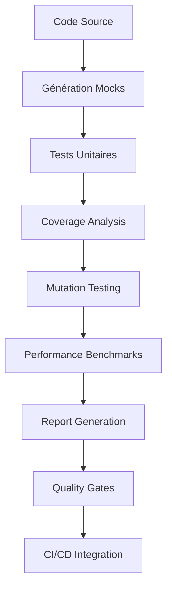

# Tests Unitaires - Veza Platform

Ce dossier regroupe la documentation et les exemples de tests unitaires pour chaque service.

## Index
- À compléter : ajouter la documentation sur les frameworks, la couverture, etc.

## Navigation
- [Retour au schéma principal](../../diagrams/architecture-overview.md)

## Objectif

Les tests unitaires isolent et vérifient le comportement de chaque composant individuel (fonction, méthode, classe) de la plateforme Veza. Ils garantissent la fiabilité du code, facilitent la refactorisation et servent de documentation vivante.

---

## Pipeline des tests unitaires



---

## Conventions et organisation

### Structure des fichiers
```
veza-backend-api/
├── internal/
│   ├── auth/
│   │   ├── service.go
│   │   ├── service_test.go
│   │   └── mocks/
│   └── user/
│       ├── repository.go
│       ├── repository_test.go
│       └── mocks/
```

### Conventions de nommage
- **Fichiers** : `*_test.go`, `*_spec.rs`, `*.test.js/ts`
- **Fonctions** : `Test[FunctionName]`, `test_[function_name]`, `describe('[Component]')`
- **Cas de test** : `Test[FunctionName]_[Scenario]`, `test_[function_name]_[scenario]`
- **Mocks** : `Mock[InterfaceName]`, `mock_[interface_name]`

---

## Outils et frameworks

### Go
```go
import (
    "testing"
    "github.com/stretchr/testify/assert"
    "github.com/stretchr/testify/mock"
    "github.com/stretchr/testify/suite"
    "github.com/vektra/mockery/v2/pkg/mocks"
)

// Test suite
type UserServiceTestSuite struct {
    suite.Suite
    mockRepo *mocks.UserRepository
    service  *UserService
}

func (suite *UserServiceTestSuite) SetupTest() {
    suite.mockRepo = new(mocks.UserRepository)
    suite.service = NewUserService(suite.mockRepo)
}
```

### Rust
```rust
use tokio::test;
use mockall::predicate::*;
use mockall::mock;

mock! {
    UserRepository {}
    impl UserRepository {
        fn get_user(&self, id: i64) -> Result<User, Error>;
    }
}

#[tokio::test]
async fn test_get_user_success() {
    let mut mock = MockUserRepository::new();
    mock.expect_get_user()
        .with(eq(1))
        .times(1)
        .returning(|_| Ok(User::new(1, "test")));
}
```

### JavaScript/TypeScript
```typescript
import { describe, it, expect, beforeEach, jest } from '@jest/globals';
import { UserService } from '../services/UserService';
import { MockUserRepository } from '../mocks/UserRepository';

describe('UserService', () => {
    let service: UserService;
    let mockRepo: MockUserRepository;

    beforeEach(() => {
        mockRepo = new MockUserRepository();
        service = new UserService(mockRepo);
    });
});
```

---

## Stratégies de test

### 1. Tests de fonctionnalité normale
```go
func TestUserService_CreateUser_Success(t *testing.T) {
    // Arrange
    mockRepo := new(mocks.UserRepository)
    service := NewUserService(mockRepo)
    
    user := &User{
        Email:    "test@veza.app",
        Username: "testuser",
    }
    
    mockRepo.On("Create", mock.AnythingOfType("*User")).Return(user, nil)
    
    // Act
    result, err := service.CreateUser(user)
    
    // Assert
    assert.NoError(t, err)
    assert.Equal(t, user.Email, result.Email)
    assert.Equal(t, user.Username, result.Username)
    mockRepo.AssertExpectations(t)
}
```

### 2. Tests d'erreurs et edge cases
```go
func TestUserService_CreateUser_ValidationError(t *testing.T) {
    // Arrange
    mockRepo := new(mocks.UserRepository)
    service := NewUserService(mockRepo)
    
    invalidUser := &User{
        Email:    "invalid-email",
        Username: "",
    }
    
    // Act
    result, err := service.CreateUser(invalidUser)
    
    // Assert
    assert.Error(t, err)
    assert.Nil(t, result)
    assert.Contains(t, err.Error(), "invalid email")
    assert.Contains(t, err.Error(), "username required")
}

func TestUserService_CreateUser_DatabaseError(t *testing.T) {
    // Arrange
    mockRepo := new(mocks.UserRepository)
    service := NewUserService(mockRepo)
    
    user := &User{
        Email:    "test@veza.app",
        Username: "testuser",
    }
    
    dbError := errors.New("database connection failed")
    mockRepo.On("Create", mock.AnythingOfType("*User")).Return(nil, dbError)
    
    // Act
    result, err := service.CreateUser(user)
    
    // Assert
    assert.Error(t, err)
    assert.Nil(t, result)
    assert.Equal(t, dbError, err)
}
```

### 3. Tests de performance
```go
func BenchmarkUserService_CreateUser(b *testing.B) {
    mockRepo := new(mocks.UserRepository)
    service := NewUserService(mockRepo)
    
    user := &User{
        Email:    "benchmark@veza.app",
        Username: "benchmark",
    }
    
    mockRepo.On("Create", mock.AnythingOfType("*User")).Return(user, nil)
    
    b.ResetTimer()
    for i := 0; i < b.N; i++ {
        service.CreateUser(user)
    }
}
```

---

## Mocks et stubs

### Génération automatique des mocks
```bash
# Go - Mockery
mockery --dir=internal/auth --name=UserRepository --output=internal/auth/mocks

# Rust - Mockall
# Ajouter #[automock] aux traits

# TypeScript - Jest
# Configuration automatique dans jest.config.js
```

### Exemples de mocks complexes
```go
// Mock avec comportement conditionnel
func TestUserService_GetUserWithCache(t *testing.T) {
    mockRepo := new(mocks.UserRepository)
    mockCache := new(mocks.CacheService)
    service := NewUserService(mockRepo, mockCache)
    
    userID := int64(1)
    user := &User{ID: userID, Email: "test@veza.app"}
    
    // Mock cache miss
    mockCache.On("Get", fmt.Sprintf("user:%d", userID)).Return(nil, errors.New("not found"))
    mockRepo.On("GetByID", userID).Return(user, nil)
    mockCache.On("Set", fmt.Sprintf("user:%d", userID), user, time.Hour).Return(nil)
    
    result, err := service.GetUser(userID)
    
    assert.NoError(t, err)
    assert.Equal(t, user, result)
    mockCache.AssertExpectations(t)
    mockRepo.AssertExpectations(t)
}
```

---

## Tests de sécurité

### Validation des entrées
```go
func TestUserService_CreateUser_SecurityValidation(t *testing.T) {
    testCases := []struct {
        name        string
        email       string
        username    string
        expectError bool
        errorMsg    string
    }{
        {"SQL Injection", "'; DROP TABLE users; --", "user", true, "invalid email"},
        {"XSS Attempt", "user<script>alert('xss')</script>@veza.app", "user", true, "invalid email"},
        {"Empty Email", "", "user", true, "email required"},
        {"Invalid Email Format", "not-an-email", "user", true, "invalid email format"},
        {"Username Too Long", "test@veza.app", strings.Repeat("a", 101), true, "username too long"},
    }
    
    for _, tc := range testCases {
        t.Run(tc.name, func(t *testing.T) {
            mockRepo := new(mocks.UserRepository)
            service := NewUserService(mockRepo)
            
            user := &User{
                Email:    tc.email,
                Username: tc.username,
            }
            
            result, err := service.CreateUser(user)
            
            if tc.expectError {
                assert.Error(t, err)
                assert.Contains(t, err.Error(), tc.errorMsg)
                assert.Nil(t, result)
            } else {
                assert.NoError(t, err)
                assert.NotNil(t, result)
            }
        })
    }
}
```

### Tests de chiffrement
```go
func TestPasswordService_HashPassword(t *testing.T) {
    service := NewPasswordService()
    
    password := "securePassword123"
    hash, err := service.HashPassword(password)
    
    assert.NoError(t, err)
    assert.NotEqual(t, password, hash)
    assert.True(t, service.VerifyPassword(password, hash))
    assert.False(t, service.VerifyPassword("wrongPassword", hash))
}

func TestPasswordService_VerifyPassword_TimingAttack(t *testing.T) {
    service := NewPasswordService()
    password := "testPassword"
    hash, _ := service.HashPassword(password)
    
    // Test timing attack resistance
    start := time.Now()
    service.VerifyPassword("wrongPassword", hash)
    wrongTime := time.Since(start)
    
    start = time.Now()
    service.VerifyPassword(password, hash)
    correctTime := time.Since(start)
    
    // Les temps doivent être similaires (différence < 1ms)
    timeDiff := math.Abs(float64(wrongTime - correctTime))
    assert.Less(t, timeDiff, float64(time.Millisecond))
}
```

---

## Tests de concurrence

### Race conditions
```go
func TestUserService_UpdateUser_Concurrent(t *testing.T) {
    mockRepo := new(mocks.UserRepository)
    service := NewUserService(mockRepo)
    
    user := &User{ID: 1, Email: "test@veza.app"}
    
    // Simuler des mises à jour concurrentes
    var wg sync.WaitGroup
    numGoroutines := 10
    
    for i := 0; i < numGoroutines; i++ {
        wg.Add(1)
        go func(id int) {
            defer wg.Done()
            
            mockRepo.On("Update", mock.AnythingOfType("*User")).Return(user, nil)
            _, err := service.UpdateUser(user)
            assert.NoError(t, err)
        }(i)
    }
    
    wg.Wait()
    mockRepo.AssertNumberOfCalls(t, "Update", numGoroutines)
}
```

### Tests de deadlock
```go
func TestUserService_DeadlockDetection(t *testing.T) {
    mockRepo := new(mocks.UserRepository)
    service := NewUserService(mockRepo)
    
    // Simuler un deadlock potentiel
    done := make(chan bool)
    
    go func() {
        defer close(done)
        user := &User{ID: 1}
        mockRepo.On("Update", mock.AnythingOfType("*User")).Return(user, nil)
        service.UpdateUser(user)
    }()
    
    // Timeout après 5 secondes
    select {
    case <-done:
        // Test réussi
    case <-time.After(5 * time.Second):
        t.Fatal("Potential deadlock detected")
    }
}
```

---

## Métriques et couverture

### Configuration de couverture
```go
// go test -cover -coverprofile=coverage.out
// go tool cover -html=coverage.out -o coverage.html

func TestCoverage_UserService(t *testing.T) {
    // Vérification de la couverture minimale
    coverage := getCoverage("UserService")
    assert.GreaterOrEqual(t, coverage, 90.0, "Coverage should be >= 90%")
}
```

### Métriques de qualité
```yaml
# .codecov.yml
coverage:
  precision: 2
  round: down
  range: "80...100"
  status:
    project:
      default:
        target: 90%
        threshold: 5%
    patch:
      default:
        target: 90%
        threshold: 5%
```

---

## Tests de mutation

### Configuration
```go
// go test -mutate ./...

func TestMutation_UserValidation(t *testing.T) {
    // Tests qui échouent quand la logique est mutée
    testCases := []struct {
        email    string
        expected bool
    }{
        {"valid@veza.app", true},
        {"invalid-email", false},
        {"", false},
        {"test@", false},
    }
    
    for _, tc := range testCases {
        t.Run(tc.email, func(t *testing.T) {
            result := ValidateEmail(tc.email)
            assert.Equal(t, tc.expected, result)
        })
    }
}
```

---

## Bonnes pratiques

### 1. Isolation des tests
```go
func TestUserService_Isolated(t *testing.T) {
    // Chaque test doit être indépendant
    t.Parallel() // Exécution parallèle si possible
    
    // Setup unique pour ce test
    mockRepo := new(mocks.UserRepository)
    service := NewUserService(mockRepo)
    
    // Test spécifique
    // ...
    
    // Cleanup automatique via defer si nécessaire
}
```

### 2. Tests table-driven
```go
func TestUserService_CreateUser_TableDriven(t *testing.T) {
    testCases := []struct {
        name        string
        input       *User
        mockSetup   func(*mocks.UserRepository)
        expected    *User
        expectError bool
    }{
        {
            name: "valid user",
            input: &User{Email: "test@veza.app", Username: "test"},
            mockSetup: func(m *mocks.UserRepository) {
                m.On("Create", mock.AnythingOfType("*User")).Return(&User{ID: 1}, nil)
            },
            expected:    &User{ID: 1},
            expectError: false,
        },
        // Plus de cas...
    }
    
    for _, tc := range testCases {
        t.Run(tc.name, func(t *testing.T) {
            mockRepo := new(mocks.UserRepository)
            tc.mockSetup(mockRepo)
            service := NewUserService(mockRepo)
            
            result, err := service.CreateUser(tc.input)
            
            if tc.expectError {
                assert.Error(t, err)
                assert.Nil(t, result)
            } else {
                assert.NoError(t, err)
                assert.Equal(t, tc.expected, result)
            }
        })
    }
}
```

### 3. Tests de régression
```go
func TestUserService_Regression_Issue123(t *testing.T) {
    // Test spécifique pour un bug corrigé
    mockRepo := new(mocks.UserRepository)
    service := NewUserService(mockRepo)
    
    // Reproduction du bug original
    user := &User{Email: "bug@veza.app"}
    mockRepo.On("Create", mock.AnythingOfType("*User")).Return(nil, errors.New("duplicate key"))
    
    result, err := service.CreateUser(user)
    
    // Vérification que le bug est corrigé
    assert.Error(t, err)
    assert.Contains(t, err.Error(), "user already exists")
    assert.Nil(t, result)
}
```

---

## Pièges courants

### 1. Tests flaky
```go
// ❌ Mauvais - dépendant du temps
func TestUserService_Bad(t *testing.T) {
    time.Sleep(100 * time.Millisecond) // Flaky!
    // ...
}

// ✅ Bon - utilisation de mocks
func TestUserService_Good(t *testing.T) {
    mockRepo := new(mocks.UserRepository)
    mockRepo.On("Create", mock.Anything).Return(nil, nil)
    // ...
}
```

### 2. Tests non isolés
```go
// ❌ Mauvais - état partagé
var globalUser *User

func TestUserService_Bad(t *testing.T) {
    globalUser = &User{Email: "test@veza.app"}
    // ...
}

// ✅ Bon - isolation
func TestUserService_Good(t *testing.T) {
    user := &User{Email: "test@veza.app"}
    // ...
}
```

### 3. Assertions insuffisantes
```go
// ❌ Mauvais - assertion faible
func TestUserService_Bad(t *testing.T) {
    result, err := service.CreateUser(user)
    assert.NoError(t, err) // Pas assez spécifique
}

// ✅ Bon - assertions complètes
func TestUserService_Good(t *testing.T) {
    result, err := service.CreateUser(user)
    assert.NoError(t, err)
    assert.NotNil(t, result)
    assert.Equal(t, user.Email, result.Email)
    assert.NotZero(t, result.ID)
    assert.NotZero(t, result.CreatedAt)
}
```

---

## Liens croisés

- [Tests d'intégration](../integration/README.md)
- [Tests de performance](../performance/README.md)
- [API backend](../../api/)
- [Modèles de données](../../database/)
- [Sécurité](../../security/)
- [Déploiement](../../deployment/)
- [CI/CD](../../deployment/ci-cd/)

---

## Exemples complets

### Service d'authentification
```go
package auth_test

import (
    "testing"
    "time"
    "github.com/stretchr/testify/assert"
    "github.com/stretchr/testify/mock"
    "github.com/veza/backend/internal/auth"
    "github.com/veza/backend/internal/auth/mocks"
)

type AuthServiceTestSuite struct {
    suite.Suite
    mockRepo    *mocks.UserRepository
    mockCache   *mocks.CacheService
    mockJWT     *mocks.JWTService
    service     *auth.Service
}

func (suite *AuthServiceTestSuite) SetupTest() {
    suite.mockRepo = new(mocks.UserRepository)
    suite.mockCache = new(mocks.CacheService)
    suite.mockJWT = new(mocks.JWTService)
    suite.service = auth.NewService(suite.mockRepo, suite.mockCache, suite.mockJWT)
}

func (suite *AuthServiceTestSuite) TestLogin_Success() {
    // Arrange
    email := "test@veza.app"
    password := "securePassword123"
    user := &auth.User{
        ID:       1,
        Email:    email,
        Password: "$2a$12$hashedPassword",
    }
    
    suite.mockRepo.On("GetByEmail", email).Return(user, nil)
    suite.mockJWT.On("GenerateTokens", user.ID).Return(&auth.TokenPair{
        AccessToken:  "access_token",
        RefreshToken: "refresh_token",
    }, nil)
    
    // Act
    result, err := suite.service.Login(email, password)
    
    // Assert
    suite.NoError(err)
    suite.NotNil(result)
    suite.Equal("access_token", result.AccessToken)
    suite.Equal("refresh_token", result.RefreshToken)
    suite.mockRepo.AssertExpectations(suite.T())
    suite.mockJWT.AssertExpectations(suite.T())
}

func (suite *AuthServiceTestSuite) TestLogin_InvalidPassword() {
    // Arrange
    email := "test@veza.app"
    password := "wrongPassword"
    user := &auth.User{
        ID:       1,
        Email:    email,
        Password: "$2a$12$hashedPassword",
    }
    
    suite.mockRepo.On("GetByEmail", email).Return(user, nil)
    
    // Act
    result, err := suite.service.Login(email, password)
    
    // Assert
    suite.Error(err)
    suite.Nil(result)
    suite.Contains(err.Error(), "invalid credentials")
}

func (suite *AuthServiceTestSuite) TestLogin_UserNotFound() {
    // Arrange
    email := "nonexistent@veza.app"
    password := "password"
    
    suite.mockRepo.On("GetByEmail", email).Return(nil, auth.ErrUserNotFound)
    
    // Act
    result, err := suite.service.Login(email, password)
    
    // Assert
    suite.Error(err)
    suite.Nil(result)
    suite.Equal(auth.ErrUserNotFound, err)
}

func (suite *AuthServiceTestSuite) TestLogin_RateLimitExceeded() {
    // Arrange
    email := "test@veza.app"
    password := "password"
    
    suite.mockCache.On("Get", "login_attempts:"+email).Return("5", nil)
    
    // Act
    result, err := suite.service.Login(email, password)
    
    // Assert
    suite.Error(err)
    suite.Nil(result)
    suite.Contains(err.Error(), "too many attempts")
}

func (suite *AuthServiceTestSuite) TestRefreshToken_Success() {
    // Arrange
    refreshToken := "valid_refresh_token"
    userID := int64(1)
    
    suite.mockJWT.On("ValidateToken", refreshToken).Return(&auth.Claims{
        UserID: userID,
        Exp:    time.Now().Add(time.Hour).Unix(),
    }, nil)
    suite.mockJWT.On("GenerateTokens", userID).Return(&auth.TokenPair{
        AccessToken:  "new_access_token",
        RefreshToken: "new_refresh_token",
    }, nil)
    
    // Act
    result, err := suite.service.RefreshToken(refreshToken)
    
    // Assert
    suite.NoError(err)
    suite.NotNil(result)
    suite.Equal("new_access_token", result.AccessToken)
    suite.Equal("new_refresh_token", result.RefreshToken)
}

func (suite *AuthServiceTestSuite) TestRefreshToken_Expired() {
    // Arrange
    refreshToken := "expired_refresh_token"
    
    suite.mockJWT.On("ValidateToken", refreshToken).Return(nil, auth.ErrTokenExpired)
    
    // Act
    result, err := suite.service.RefreshToken(refreshToken)
    
    // Assert
    suite.Error(err)
    suite.Nil(result)
    suite.Equal(auth.ErrTokenExpired, err)
}

func (suite *AuthServiceTestSuite) TestLogout_Success() {
    // Arrange
    userID := int64(1)
    sessionID := "session_123"
    
    suite.mockCache.On("Del", "session:"+sessionID).Return(nil)
    suite.mockCache.On("SRem", fmt.Sprintf("user_sessions:%d", userID), sessionID).Return(nil)
    
    // Act
    err := suite.service.Logout(userID, sessionID)
    
    // Assert
    suite.NoError(err)
    suite.mockCache.AssertExpectations(suite.T())
}

func (suite *AuthServiceTestSuite) TestValidateSession_Success() {
    // Arrange
    sessionID := "valid_session"
    userID := int64(1)
    
    sessionData := &auth.Session{
        ID:        sessionID,
        UserID:    userID,
        IsActive:  true,
        LastUsed:  time.Now(),
    }
    
    suite.mockCache.On("Get", "session:"+sessionID).Return(sessionData, nil)
    
    // Act
    session, err := suite.service.ValidateSession(sessionID)
    
    // Assert
    suite.NoError(err)
    suite.NotNil(session)
    suite.Equal(userID, session.UserID)
    suite.True(session.IsActive)
}

func (suite *AuthServiceTestSuite) TestValidateSession_NotFound() {
    // Arrange
    sessionID := "nonexistent_session"
    
    suite.mockCache.On("Get", "session:"+sessionID).Return(nil, auth.ErrSessionNotFound)
    
    // Act
    session, err := suite.service.ValidateSession(sessionID)
    
    // Assert
    suite.Error(err)
    suite.Nil(session)
    suite.Equal(auth.ErrSessionNotFound, err)
}

func (suite *AuthServiceTestSuite) TestValidateSession_Expired() {
    // Arrange
    sessionID := "expired_session"
    
    sessionData := &auth.Session{
        ID:        sessionID,
        UserID:    1,
        IsActive:  false,
        LastUsed:  time.Now().Add(-24 * time.Hour),
    }
    
    suite.mockCache.On("Get", "session:"+sessionID).Return(sessionData, nil)
    
    // Act
    session, err := suite.service.ValidateSession(sessionID)
    
    // Assert
    suite.Error(err)
    suite.Nil(session)
    suite.Equal(auth.ErrSessionExpired, err)
}

func TestAuthServiceTestSuite(t *testing.T) {
    suite.Run(t, new(AuthServiceTestSuite))
}
```

---

## Pour aller plus loin

- [Tests d'intégration](../integration/README.md)
- [Tests de performance](../performance/README.md)
- [Guide CI/CD](../../deployment/ci-cd/)
- [Documentation API](../../api/)
- [FAQ et troubleshooting](../../reference/) 