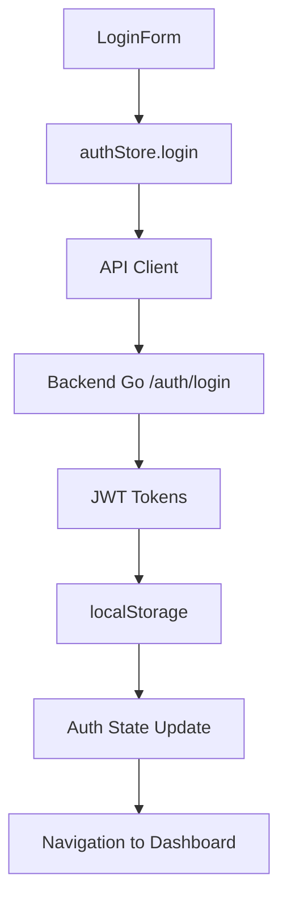
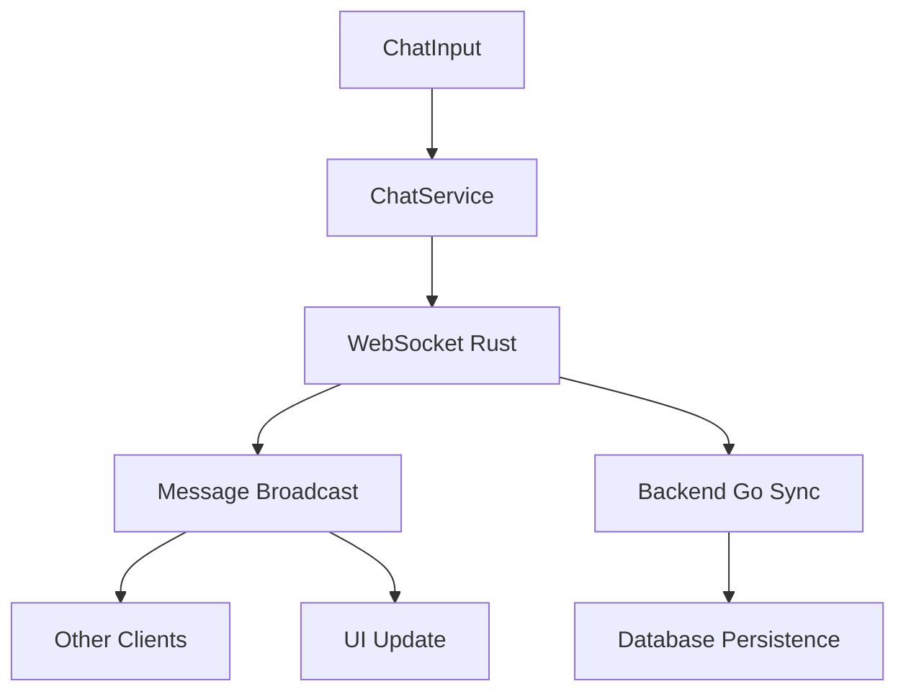
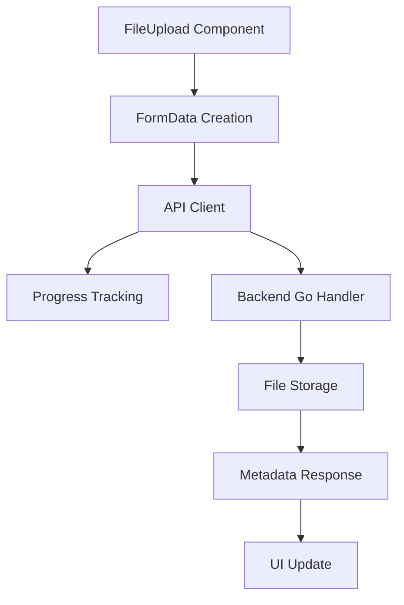

# Architecture - Vue d'ensemble

## Introduction

L'application Talas est un frontend React moderne construit avec TypeScript, utilisant une architecture modulaire et évolutive. Elle intègre plusieurs services backend pour offrir une expérience collaborative complète.

## Stack Technologique

### Frontend Core
- **React 18** - Framework UI avec hooks et Suspense
- **TypeScript** - Typage statique pour la robustesse
- **Vite** - Build tool rapide avec HMR
- **Tailwind CSS** - Framework CSS utilitaire
- **shadcn/ui** - Composants UI modernes et accessibles

### State Management
- **Zustand** - Gestionnaire d'état global léger
- **React Hook Form** - Gestion des formulaires
- **React Query (optionnel)** - Cache et synchronisation des données

### Routing & Navigation
- **React Router DOM v7** - Routing client-side
- **Lazy Loading** - Chargement différé des composants

### Styling & UI
- **Framer Motion** - Animations fluides
- **Lucide React** - Icônes cohérentes
- **Radix UI** - Primitives UI accessibles

### Testing
- **Vitest** - Tests unitaires
- **Playwright** - Tests end-to-end
- **Testing Library** - Utilitaires de test React

## Architecture en Couches

### 1. App Layer (`/src/app/`)
**Responsabilité** : Configuration globale, routing, et providers

```
/src/app/
├── pages/           # Pages principales
├── providers/       # Providers React Context
├── Router.tsx       # Configuration du routing
├── routes.tsx       # Définition des routes
├── Layout.tsx       # Layout global
└── ProtectedRoute.tsx # Garde d'authentification
```

**Intégration Backend** :
- Point d'entrée pour l'initialisation des services
- Configuration des intercepteurs API
- Gestion du state d'authentification global

### 2. Feature Layer (`/src/features/`)
**Responsabilité** : Modules métier encapsulés

Chaque feature suit la même structure :

```
/src/features/{feature}/
├── components/      # Composants spécifiques
├── hooks/          # Hooks personnalisés
├── pages/          # Pages du module
├── services/       # Services API
├── store/          # State management local
├── types.ts        # Types TypeScript
└── schemas/        # Validation (Zod)
```

#### Features Principales :

**🔐 Auth** (`/src/features/auth/`)
- Authentification JWT
- Gestion des sessions
- Guards de route
- **Backend Integration** : `/auth/login`, `/auth/register`, `/auth/refresh`

**💬 Chat** (`/src/features/chat/`)
- Chat en temps réel
- Messages directs
- Salles de discussion
- **Backend Integration** : WebSocket Rust + API Go pour persistance

**📦 Products** (`/src/features/products/`)
- CRUD des produits
- Filtrage et recherche
- Upload d'images
- **Backend Integration** : API REST Go `/api/v1/products`

**🎵 Tracks** (`/src/features/tracks/`)
- Upload de pistes audio
- Lecteur audio intégré
- Playlists
- **Backend Integration** : Streaming Rust + API Go pour metadata

**👤 Profile** (`/src/features/profile/`)
- Gestion du profil utilisateur
- Paramètres
- **Backend Integration** : API REST Go `/api/v1/users`

### 3. Shared Layer (`/src/shared/`)
**Responsabilité** : Code réutilisable à travers l'application

```
/src/shared/
├── api/            # Clients API et configuration
├── components/     # Composants UI partagés
├── hooks/          # Hooks réutilisables
├── lib/            # Utilitaires et helpers
├── services/       # Services transversaux
├── stores/         # State global (Zustand)
└── utils/          # Fonctions utilitaires
```

## Flux de Données

### 1. Authentification Flow



### 2. Chat Real-time Flow



### 3. File Upload Flow



## Patterns de Conception

### 1. Service Layer Pattern
Chaque feature a ses services encapsulés :

```typescript
// Pattern standard pour les services
class FeatureService {
  private apiClient: ApiClient;
  
  constructor() {
    this.apiClient = ApiClient.getInstance();
  }
  
  async getData(): Promise<Data[]> {
    return this.apiClient.get('/endpoint');
  }
}
```

### 2. Repository Pattern
Pour l'abstraction des données :

```typescript
interface IRepository<T> {
  getAll(filters?: Filters): Promise<T[]>;
  getById(id: string): Promise<T>;
  create(data: CreateData): Promise<T>;
  update(id: string, data: UpdateData): Promise<T>;
  delete(id: string): Promise<void>;
}
```

### 3. Observer Pattern
Via Zustand pour le state management :

```typescript
interface Store {
  data: T[];
  isLoading: boolean;
  error: string | null;
  
  // Actions
  fetchData: () => Promise<void>;
  addItem: (item: T) => void;
  updateItem: (id: string, updates: Partial<T>) => void;
}
```

## Gestion des Erreurs

### 1. API Error Handling

```typescript
// Intercepteur global pour les erreurs
apiClient.interceptors.response.use(
  (response) => response,
  (error) => {
    if (error.response?.status === 401) {
      authStore.logout();
      router.push('/login');
    }
    return Promise.reject(error);
  }
);
```

### 2. Error Boundaries

```typescript
// Composant ErrorBoundary pour les erreurs React
<ErrorBoundary fallback={<ErrorFallback />}>
  <FeatureComponent />
</ErrorBoundary>
```

### 3. Toast Notifications

```typescript
// Notifications centralisées
const { toast } = useToast();

try {
  await action();
  toast({ title: 'Succès', type: 'success' });
} catch (error) {
  toast({ title: 'Erreur', description: error.message, type: 'error' });
}
```

## Optimisations Performance

### 1. Code Splitting
- Lazy loading des routes principales
- Chunks séparés par feature
- Dynamic imports pour les composants lourds

### 2. Memoization
- `React.memo` pour les composants purs
- `useMemo`/`useCallback` pour les calculs coûteux
- Optimisation des re-renders

### 3. Bundle Optimization
- Tree shaking automatique avec Vite
- Compression gzip/brotli
- Asset optimization

## Sécurité

### 1. Authentification
- JWT stockés en localStorage (avec refresh strategy)
- Automatic token refresh
- Route guards pour les pages protégées

### 2. Validation
- Validation côté client avec Zod
- Sanitization des inputs
- CSP headers (configuré côté serveur)

### 3. WebSocket Security
- Token-based authentication pour les WS
- Message validation
- Rate limiting (côté serveur)

## Intégration Backend

### Variables d'Environnement Requises

```env
# API Backend Go
VITE_API_URL=http://localhost:8080
VITE_API_BASE_URL=http://localhost:8080/api/v1

# WebSocket Chat Rust
VITE_WS_CHAT_URL=ws://localhost:8081/ws

# WebSocket Streaming Rust  
VITE_WS_STREAM_URL=ws://localhost:8082/ws

# Configuration
VITE_APP_NAME=Talas
VITE_DEBUG=true
```

### CORS Configuration Backend

```go
// Configuration CORS requise sur le backend Go
func setupCORS(c *gin.Context) {
    c.Header("Access-Control-Allow-Origin", "http://localhost:5173")
    c.Header("Access-Control-Allow-Credentials", "true")
    c.Header("Access-Control-Allow-Headers", "Content-Type, Content-Length, Accept-Encoding, X-CSRF-Token, Authorization, accept, origin, Cache-Control, X-Requested-With")
    c.Header("Access-Control-Allow-Methods", "POST, OPTIONS, GET, PUT, DELETE, PATCH")
}
```

## Monitoring & Debugging

### 1. Development Tools
- React DevTools
- Zustand DevTools
- Network inspector pour les API calls

### 2. Error Tracking
- Console logging avec niveaux
- Error boundaries avec reporting
- Performance monitoring

### 3. Testing Strategy
- Unit tests pour les services et hooks
- Integration tests pour les features
- E2E tests pour les user flows critiques

---

Cette architecture garantit la maintenabilité, la scalabilité et une intégration fluide avec les services backend Go et Rust. 